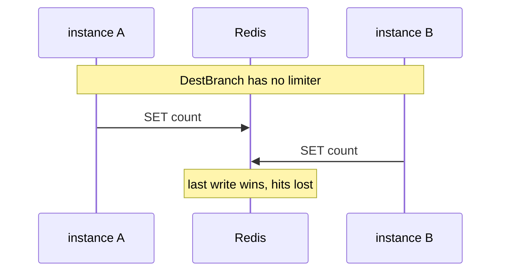

Developer review: in progress — 2026-09-11T17:09:17Z

[sgsi-dev-ticket-status:2026-09-11-kong-window-limiter]

## What this changes
**Operators.** CI `test` job starts Redis 7 and Dragonfly v1.40.2 as service containers and sets `RATELIMIT_LIVE_REDIS` / `RATELIMIT_LIVE_DRAGONFLY`. Live limiter tests skip locally without those env vars or under `-short`.

**Admin users.** None.

**Developers.** New `ratelimit/` package: inject SimpleRedis, `Take`/`Allow` sliding-window admit, exact `sync_rate=0` vs buffered EVAL flush, `Sleep`/`Wake`/`Close` for reclaim hooks. README row replaces leaky `bucket/`.

**End users.** None.

## Motivation
Middleware authors need a shared Kong-style sliding-window hit counter on Redis or Dragonfly. On `master` there is no limiter and README still plans a leaky bucket, so each middleware would copy window math or ship the wrong algorithm.

Without this PR, two Traefik instances cannot share one Redis window through a first-party Take, and live proof of exact vs buffered sharing on both engines does not exist in this repo.

## Merge readiness
Seven-axis review applied on the limiter; CI on this head is still running. Archive and the ready PR title remain.

Priority: P3 — missing library and proof on DestBranch; no current operator or end-user harm.

Reviewed head: e5a370d
Owner decision: None.

## Review scores
| Measure | Result | What it means |
| --- | --- | --- |
| Overall readiness | 3/6 | CI on e5a370d is still in progress |
| CI proof | 3/6 | Lint, Test, Integration in progress https://github.com/david-garcia-garcia/traefik-middleware-utilities/actions/runs/34626032093 |
| Local tests proof | N/A | Remote PR; CI covers |
| Review resolution | 6/6 | No open PR comments |

## Verification
| Check | Result | Evidence |
| --- | --- | --- |
| Branch | 2026-09-11-kong-window-limiter pushed | git push e5a370d |
| OpenSpec | add-ratelimit-sliding-window | openspec/changes/add-ratelimit-sliding-window/ |
| Pull request | https://github.com/david-garcia-garcia/traefik-middleware-utilities/pull/5 | GitHub #5 |
| CI | build 34626032093 in progress https://github.com/david-garcia-garcia/traefik-middleware-utilities/actions/runs/34626032093 | GitHub Actions |
| Local tests | passed | go test ./... (live skipped without engines) |
| PR comments | no comments | comments: none |

## Specs
- [std_go_ratelimit_sliding-take](https://github.com/david-garcia-garcia/traefik-middleware-utilities/blob/2026-09-11-kong-window-limiter/openspec/changes/add-ratelimit-sliding-window/proposal.md) — added
- [std_go_ratelimit_sync-flush](https://github.com/david-garcia-garcia/traefik-middleware-utilities/blob/2026-09-11-kong-window-limiter/openspec/changes/add-ratelimit-sliding-window/proposal.md) — added

## Deviations from the ask
None.

## Follow-up issues
None.

## How this fits together
Local ticket `2026-09-11-kong-window-limiter` → branch of the same name → stub PR #5 → CI run 34626032093 on e5a370d.

## Explore Decisions
| Question | Rank | Decision | By |
| --- | --- | --- | --- |
| Exact Redis key scheme for current vs previous window counters? | additive asked | assumed — `{opaqueKey}:{windowStartUnix}` and previous start; TTL 2×window. Caller prefixes. | explore |
| Does the flush timer register through reclaim.Table or Sleep/Wake/Close on the limiter? | additive asked | assumed — methods on the limiter; caller wires reclaim.Hooks. Limiter does not import reclaim. | explore |
| How do live tests discover Redis/Dragonfly addrs in CI while keeping -short skip locally? | additive asked | assumed — `RATELIMIT_LIVE_REDIS` / `RATELIMIT_LIVE_DRAGONFLY`; skip on short or empty; CI test job service containers set both. | explore |
| Does one limiter instance own a SimpleRedis client, or do callers inject shared clients? | additive asked | assumed — inject `*simpleredis.SimpleRedis`. Limiter.Close does not close the client. | explore |
| Do denied Takes still increment the counter? | additive asked | assumed — increment first, allow iff estimated ≤ limit. Denied hits still count. | explore |
| What does usage in the Take/Allow return mean? | additive asked | assumed — `estimated float64` after this Take. | explore |
| May exact mode Get the previous window even though the ticket listed Eval/Incr/Expire only? | additive asked | assumed — Get/MGet for previous (miss=0). Counter updates stay Incr/Eval. | explore |
| Ship a Pester/Traefik plugin for the limiter in this change? | additive incidental | assumed — skip. Direct go test live + Yaegi live are the proof. | explore |

## Before merge
- [ ] Wait for CI on e5a370d
- [ ] Archive OpenSpec change into main specs
- [ ] Drop WIP from PR title when review is complete

## Findings
None.

## Axis review
[Standards](https://github.com/david-garcia-garcia/traefik-middleware-utilities/blob/2026-09-11-kong-window-limiter/devstate/2026/09/2026-09-11-kong-window-limiter/codereview_standards.md) — 7 total, 0 pending, 5 completed, 2 skipped
[Nitpicks](https://github.com/david-garcia-garcia/traefik-middleware-utilities/blob/2026-09-11-kong-window-limiter/devstate/2026/09/2026-09-11-kong-window-limiter/codereview_nitpicks.md) — 2 total, 0 pending, 2 completed
[Spec](https://github.com/david-garcia-garcia/traefik-middleware-utilities/blob/2026-09-11-kong-window-limiter/devstate/2026/09/2026-09-11-kong-window-limiter/codereview_spec.md) — 3 total, 0 pending, 3 completed
[Security](https://github.com/david-garcia-garcia/traefik-middleware-utilities/blob/2026-09-11-kong-window-limiter/devstate/2026/09/2026-09-11-kong-window-limiter/codereview_security.md) — 0 total, 0 pending, 0 completed
[Performance](https://github.com/david-garcia-garcia/traefik-middleware-utilities/blob/2026-09-11-kong-window-limiter/devstate/2026/09/2026-09-11-kong-window-limiter/codereview_performance.md) — 2 total, 0 pending, 1 completed, 1 skipped
[Dead](https://github.com/david-garcia-garcia/traefik-middleware-utilities/blob/2026-09-11-kong-window-limiter/devstate/2026/09/2026-09-11-kong-window-limiter/codereview_dead.md) — 0 total, 0 pending, 0 completed
[Test coverage](https://github.com/david-garcia-garcia/traefik-middleware-utilities/blob/2026-09-11-kong-window-limiter/devstate/2026/09/2026-09-11-kong-window-limiter/codereview_coverage.md) — 4 total, 0 pending, 3 completed, 1 skipped

## Agent review details

### Review metrics
| Metric | Value | Why it matters |
| --- | --- | --- |
| Specs in this PR | 2 added / 0 modified | Change specs not yet archived |
| Open reviewer comments walked | 0 open | No PR comments |
| Reviewed head | e5a370de34c4b401a5bf715d87be02d7b29d64b5 | Seven-axis review commit |

### Stored data model
- New: Redis integer keys `{opaqueKey}:{windowStartUnix}`.

### Technical review
Best possible solution: `ratelimit/` on dest SimpleRedis with reclaim-shaped hooks; CI service containers prove both engines without Traefik HTTP.

Do we have a high-confidence way to reproduce? Yes — `go test ./ratelimit/...` unit/Yaegi; CI Test job is the live Redis and Dragonfly proof.

Is this the best way to solve the issue? Yes — matches locked ticket and dest client; no leaky/token bucket.

### Evidence
What I checked:
- `go test ./...` passed locally after review fixes (live skipped)
- Seven axis files under the run root; hard/missing/wrong items applied or skipped
- CI run 34626032093 in progress on e5a370d

### Rank-up moves
None.
