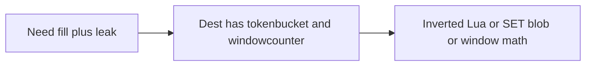

Developer review: in progress — 2026-09-11T20:59:10.691Z

## What this changes
**Operators.** None.

**Admin users.** None.

**Developers.** OpenSpec change `add-leakybucket` (pour clock + Redis sync-flush). No `leakybucket/` package on the branch yet.

**End users.** None.

## Motivation
Middleware authors who need a fill clock (pour water, constant leak, overflow = deny) have no package on `master`. Dest already ships `tokenbucket/` (Traefik refill + burst) and `windowcounter/` (Kong sliding hits + `INCRBY` flush) and tells callers not to mix those clocks.

If we do not add `leakybucket/`, a plugin either inverts Traefik’s token Lua and calls it leaky, or `SET`s a `{water, last}` snapshot from each replica (last-write-wins / double-leak), or reuses window integers for a job that is not a window.

## Merge readiness
Proposal is on the branch; product library is not. 1 item remains.

Priority: P3 — new library; no current operator or end-user harm

Reviewed head: 9f743b3
Owner decision: Required. See Explore Decisions.

## Review scores
| Measure | Result | What it means |
| --- | --- | --- |
| Overall readiness | 3 | CI in progress; no library yet |
| CI proof | 3 | Lint succeeded; Test and Integration in progress https://github.com/david-garcia-garcia/traefik-middleware-utilities/actions/runs/34646986686 |
| Local tests proof | N/A | Before implement |
| Review resolution | 6 | No open PR comments |

## Verification
| Check | Result | Evidence |
| --- | --- | --- |
| Branch | 2026-09-11-leaky-bucket pushed | git / origin |
| OpenSpec | add-leakybucket | openspec/changes/add-leakybucket/ |
| Pull request | https://github.com/david-garcia-garcia/traefik-middleware-utilities/pull/9 | pr-host |
| CI | build 34646986686 in progress https://github.com/david-garcia-garcia/traefik-middleware-utilities/actions/runs/34646986686 | GitHub MCP get_check_runs |
| Local tests | none | handoff.yaml localTests |
| PR comments | no comments | comments: none |

## Specs
- [std_go_leakybucket_pour](https://github.com/david-garcia-garcia/traefik-middleware-utilities/blob/2026-09-11-leaky-bucket/openspec/changes/add-leakybucket/proposal.md) — added
- [std_go_leakybucket_sync-flush](https://github.com/david-garcia-garcia/traefik-middleware-utilities/blob/2026-09-11-leaky-bucket/openspec/changes/add-leakybucket/proposal.md) — added

## Deviations from the ask
None.

## Follow-up issues
None.

## How this fits together
Local spec → branch `2026-09-11-leaky-bucket` → PR #9 → implement next.

## Explore Decisions
| Question | Rank | Decision | By |
| --- | --- | --- | --- |
| How is `{water, last}` encoded in Redis so EVAL can leak once then add a delta without a replica SET? | additive asked | assumed — HASH fields `water` (float string) and `last` (unix microseconds) on one KEYS[1]; EVAL HGETALL / leak / add / HSET / EXPIRE; Go never writes the hash except through that script. | explore |
| Is time-until-not-full a required return on Add/Take or omitted? | additive asked | assumed — always return it as the third value (duration until there is room for one more unit; 0 if already not full). Level does not return it. | explore |
| Are Add and Take aliases, or is Take n=1 only? | additive asked | assumed — `Add(key, n int64)` pours n (`n < 1` errors); `Take(key)` is Add(key, 1). | explore |
| What units make in-memory and Redis agree on admit/deny for the same leak/capacity sequence? | additive asked | assumed — leak float64 water/second, capacity float64, n int64, elapsed unix microseconds, Lua `tonumber` on the same ARGV as Go. | explore |
| What live env var names, and does CI reuse the existing Redis/Dragonfly services? | additive asked | assumed — `LEAKYBUCKET_LIVE_REDIS` and `LEAKYBUCKET_LIVE_DRAGONFLY`; CI sets them to `127.0.0.1:6379` and `127.0.0.1:6380`; skip under `-short` or unset locally; CI must not skip. | explore |
| Does the in-memory store expose Sleep/Wake/Close? | additive asked | assumed — only the Redis limiter (the type that may start a ticker) exports Sleep/Wake/Close; memory has no ticker. | explore |
| Where does Redis EXPIRE ttl come from? | additive asked | assumed — constructor `ttl` on both stores, min 1s; script EXPIRE that many seconds; missing hash is empty water. | explore |

## Before merge
- [x] Stub PR #9 open
- [x] Explore recorded
- [x] OpenSpec `add-leakybucket` proposed
- [ ] Land `leakybucket/` with unit, live Redis/Dragonfly, and Yaegi proof

## Findings
None.

## Axis review
None.

## Agent review details

### Review metrics
| Metric | Value | Why it matters |
| --- | --- | --- |
| Specs in this PR | 2 added / 0 modified | Same list as ## Specs; do not paste diff --stat |
| Open reviewer comments walked | 0 FIX / 0 ANSWER / 0 open | Unanswered review is merge risk |
| Reviewed head | 9f743b357902987f4dab4feeb28be3841399eae2 | Card must match the branch you measured |

### Stored data model
None.

### Technical review
Best possible solution: Dest already owns token-bucket refill and Kong window+flush as separate packages; a third package for the water clock matches that split.

Do we have a high-confidence way to reproduce? Yes, `leakybucket/` is still absent on DestBranch.

Is this the best way to solve the issue? Yes — new specs `std_go_leakybucket_pour` and `std_go_leakybucket_sync-flush`, not a fold into Traefik or Kong leaves.

### Evidence
What I checked:
- `openspec validate add-leakybucket --type change --strict` valid
- `validate_artifact_names` OK
- One OPEN PR #9, no comments
- CI run 34646986686 Lint success, Test/Integration in progress (head 9f743b3)

### Rank-up moves
None.
