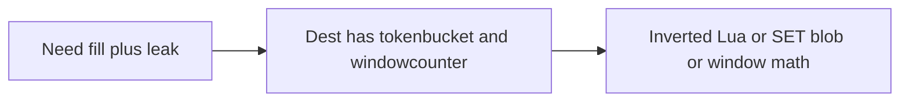

Developer review: in progress — 2026-09-11T20:48:46.184Z

## What this changes
**Operators.** None.

**Admin users.** None.

**Developers.** None.

**End users.** None.

## Motivation
Middleware authors who need a fill clock (pour water, constant leak, overflow = deny) have no package on `master`. Dest already ships `tokenbucket/` (Traefik refill + burst) and `windowcounter/` (Kong sliding hits + `INCRBY` flush) and tells callers not to mix those clocks.

If we do not add `leakybucket/`, a plugin either inverts Traefik’s token Lua and calls it leaky, or `SET`s a `{water, last}` snapshot from each replica (last-write-wins / double-leak), or reuses window integers for a job that is not a window.

## Merge readiness
Prepare grounded; stub PR is open; product library is not on the branch yet. 1 item remains.

Priority: P3 — new library; no current operator or end-user harm

Reviewed head: ee67f6a
Owner decision: None.

## Review scores
| Measure | Result | What it means |
| --- | --- | --- |
| Overall readiness | 3 | CI in progress; no library yet |
| CI proof | 3 | Lint succeeded; Test and Integration in progress https://github.com/david-garcia-garcia/traefik-middleware-utilities/actions/runs/34646084752 |
| Local tests proof | N/A | Before implement |
| Review resolution | 6 | No open PR comments |

## Verification
| Check | Result | Evidence |
| --- | --- | --- |
| Branch | 2026-09-11-leaky-bucket pushed | git / origin |
| OpenSpec | none | openspec/ |
| Pull request | https://github.com/david-garcia-garcia/traefik-middleware-utilities/pull/9 | pr-host |
| CI | build 34646084752 in progress https://github.com/david-garcia-garcia/traefik-middleware-utilities/actions/runs/34646084752 | GitHub MCP get_check_runs |
| Local tests | none | handoff.yaml localTests |
| PR comments | no comments | comments: none |

## Specs
None.

## Deviations from the ask
None.

## Follow-up issues
None.

## How this fits together
Local spec → branch `2026-09-11-leaky-bucket` → PR #9 → explore next.

## Explore Decisions
None.

## Before merge
- [x] Stub PR #9 open
- [ ] Land `leakybucket/` with unit, live Redis/Dragonfly, and Yaegi proof

## Findings
None.

## Axis review
None.

## Agent review details

### Review metrics
| Metric | Value | Why it matters |
| --- | --- | --- |
| Specs in this PR | none | Same list as ## Specs; do not paste diff --stat |
| Open reviewer comments walked | 0 FIX / 0 ANSWER / 0 open | Unanswered review is merge risk |
| Reviewed head | ee67f6acca9757109effd7aeca541d58e6fe3e31 | Card must match the branch you measured |

### Stored data model
None.

### Technical review
Best possible solution: Dest already owns token-bucket refill and Kong window+flush as separate packages; a third package for the water clock matches that split.

Do we have a high-confidence way to reproduce? Yes, dest has no `leakybucket/` and README has no leaky row.

Is this the best way to solve the issue? Yes — a new package beside the two clocks, not an invert of `tokenbucket/` Lua.

### Evidence
What I checked:
- `git ls-tree origin/master` has `tokenbucket/` and `windowcounter/` (dest = master)
- `simpleredis.Eval` present (`simpleredis/simpleredis.go`)
- One OPEN PR #9, no comments (GitHub MCP)
- CI run 34646084752 Lint success, Test/Integration in progress

### Rank-up moves
None.
