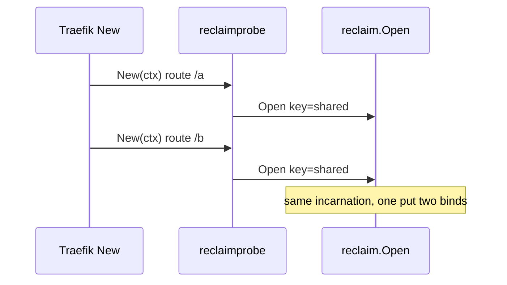

Developer review: in progress — 2026-09-11T05:09:22Z

## What this changes

**Operators.** None. (Library tests use Docker locally via `./Test-Integration.ps1`; that is not a production deploy key.)

**Admin users.** None.

**Developers.** `reclaim/` is the geoblock PR #83 table (non-generic `Open`, stdlib only). `e2e/reclaimprobe` plus Pester proves Traefik v3.7.11 Yaegi: two plugin `New`s share one incarnation (`X-Reclaim-ID`) and logs `reclaim_put`/`reclaim_bind`.

**End users.** None.

## Motivation

Traefik middlewares need one shared value per key while any plugin instance holds it, and a cheap sleep window after the last holder drops. That table lived only in `traefik-geoblock` PR #83.

On `origin/initial` this repo had no module and no Yaegi proof. Compiled `go test` cannot see interpreter-only failures.

If we do not land `reclaim/` with a Traefik local-plugin e2e, other middleware repos keep copying the table and DestBranch stays empty.

## Merge readiness

Implement applied; local unit and Pester e2e passed on this host. Code review is next. 1 item remains before archive.

Priority: P3 — spec, docs, tests, and internal library extraction; no current production harm.
Reviewed head: 091761a
Owner decision: Required. See Decision needed.

## Review scores
| Measure | Result | What it means |
| --- | --- | --- |
| Overall readiness | 6/6 | Local tests passed on prHost local |
| CI proof | N/A | prHost local |
| Local tests proof | 6/6 | `go test ./reclaim/...` and Pester e2e passed |
| Review resolution | N/A | No OPEN PR |

## Verification
| Check | Result | Evidence |
| --- | --- | --- |
| Branch | 2026-09-11-reclaim-table not pushed | human forbids push |
| OpenSpec | add-reclaim-table | tasks 11/11; validate strict passed |
| Pull request | none | prHost local |
| CI | N/A | prHost local |
| Local tests | passed | `go test ./reclaim/...`; `Test-Integration.ps1` 3/3 |
| PR comments | no comments | comments none |

## Specs
- [std_go_reclaim_context-lease](openspec/changes/add-reclaim-table/proposal.md) — added
- [std_go_reclaim_value-lifecycle](openspec/changes/add-reclaim-table/proposal.md) — added

## Deviations from the ask
None.

## Follow-up issues
- [ ] [Yaegi drops the method set of a value returned as `any`](knowledge/debt/2026-09-11-yaegi-drops-methods-on-any.md) — Yaegi strips methods on an `any` return, so optional reclaim lifecycle hooks never run interpreted.

## How this fits together
Local ticket `devstate/2026/09/2026-09-11-reclaim-table/`; change `add-reclaim-table`; durable card `devstate/card.md`.

## Decision needed
| Question | Decision | By |
| --- | --- | --- |
| What is the fake middleware shape for Yaegi e2e? | assumed — nested `e2e/reclaimprobe`; GOPATH dual mount | explore |
| How much of geoblock's Pester/docker harness do we reuse? | assumed — pattern only | explore |
| Do e2e tests run only on this host via Docker, or also CI? | assumed — this host; runner shipped; no push | explore |
| Under Yaegi, optional hooks are inert. Change `Open`? | assumed — no | explore |
| Traefik image and `useunsafe`? | assumed — `traefik:v3.7.11`; `useunsafe: false` | explore |
| Go module version? | assumed — `go 1.21` | explore |
| Rename test-only `Reset` to `ResetForTest`? | assumed — keep `Reset` | explore |

## Before merge
- [ ] Seven-axis code review of `origin/initial...HEAD` excluding `devstate/`
- [ ] Archive specs into `openspec/specs/`

## Findings
None.

## Axis review
None.

## Agent review details

### Review metrics
| Metric | Value | Why it matters |
| --- | --- | --- |
| Specs in this PR | 2 added / 0 modified | Still in the live change folder |
| Open reviewer comments walked | 0 FIX / 0 ANSWER / 0 open | No PR host |
| Reviewed head | 091761a34af8bb4eeffb057a63d07edee2ee948f | feat+e2e HEAD |

### Stored data model
None.

### Technical review
Best possible solution: Port the stdlib table, keep `Open`, prove Yaegi with a nested fake plugin so the library module is not a Traefik plugin.

Do we have a high-confidence way to reproduce? Yes. `go test ./reclaim/...` and `./Test-Integration.ps1` on this host (3/3 Pester, shared `X-Reclaim-ID=1`).

Is this the best way to solve the issue? Yes for a reusable library.

### Evidence
What I checked:
- `go test ./reclaim/...` passed
- `Test-Integration.ps1` 3 passed: API, shared incarnation, `reclaim_put`/`reclaim_bind`
- Traefik logs: one put, two binds on key `shared`

### Rank-up moves
- In-process Yaegi interp module outside this `go.mod` as a faster CI guard than Docker.
