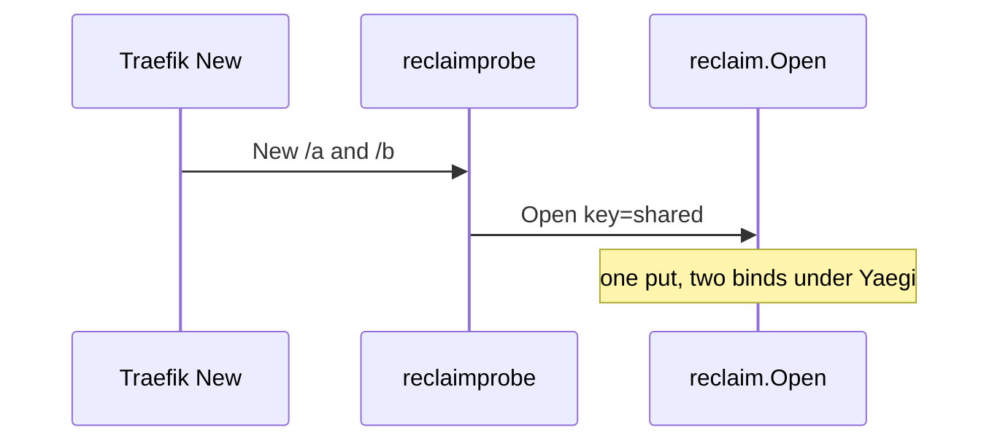

Developer review: ready for review — 2026-09-11T05:25:30Z

## What this changes

**Operators.** None.

**Admin users.** None.

**Developers.** Import `github.com/david-garcia-garcia/traefik-middleware-utilities/reclaim` for the keyed create/sleep/wake/close table. Prove Yaegi with `./Test-Integration.ps1` (fake plugin `e2e/reclaimprobe`, Traefik v3.7.11). Specs: `std_go_reclaim_context-lease`, `std_go_reclaim_value-lifecycle`.

**End users.** None.

## Motivation

Traefik middlewares need one shared value per key while any plugin instance holds it, and a cheap sleep window after the last holder drops. That table lived only in `traefik-geoblock` PR #83.

On `origin/initial` this repo had no module. Compiled `go test` cannot see interpreter-only failures.

If we do not land this library with a Traefik local-plugin e2e, other middleware repos keep copying reclaim.

## Merge readiness

Local workflow complete. Specs archived. Local unit and Pester e2e passed. 0 items remain.

Priority: P3 — spec, docs, tests, and internal library extraction.
Reviewed head: unknown until archive commit
Owner decision: Required. See Decision needed.

## Review scores
| Measure | Result | What it means |
| --- | --- | --- |
| Overall readiness | 6/6 | Local tests passed; prHost local |
| CI proof | N/A | prHost local |
| Local tests proof | 6/6 | `go test ./reclaim/...`; Pester 3/3 |
| Review resolution | N/A | No OPEN PR |

## Verification
| Check | Result | Evidence |
| --- | --- | --- |
| Branch | 2026-09-11-reclaim-table not pushed | human forbids push |
| OpenSpec | add-reclaim-table archived | `openspec/changes/archive/2026-09-11-add-reclaim-table/` |
| Pull request | none | prHost local |
| CI | N/A | prHost local |
| Local tests | passed | handoff.yaml |
| PR comments | no comments | comments none |

## Specs
- [std_go_reclaim_context-lease](openspec/changes/archive/2026-09-11-add-reclaim-table/proposal.md) — added
- [std_go_reclaim_value-lifecycle](openspec/changes/archive/2026-09-11-add-reclaim-table/proposal.md) — added

## Deviations from the ask
None.

## Follow-up issues
- [ ] [Yaegi drops the method set of a value returned as `any`](knowledge/debt/2026-09-11-yaegi-drops-methods-on-any.md) — Yaegi strips methods on an `any` return, so optional reclaim lifecycle hooks never run interpreted.

## How this fits together
Local ticket `devstate/2026/09/2026-09-11-reclaim-table/`; no remote PR; durable card is `devstate/card.md`.

## Decision needed
| Question | Decision | By |
| --- | --- | --- |
| Fake middleware shape? | assumed — nested `e2e/reclaimprobe` | explore |
| Geoblock harness reuse? | assumed — pattern only | explore |
| E2e host vs CI? | assumed — this host; runner shipped; no push | explore |
| Change `Open` for Yaegi hooks? | assumed — no | explore |
| Traefik image / useunsafe? | assumed — v3.7.11; false | explore |
| Go version? | assumed — 1.21 | explore |
| Rename `Reset`? | assumed — keep `Reset` | explore |

## Before merge
None.

## Findings
- [[P3] Name for the scope on test-only Reset](devstate/2026/09/2026-09-11-reclaim-table/codereview_standards.md) — skipped — keep `Reset` for spec/geoblock alignment. Path: `reclaim/default.go`. Reply none.

## Axis review
Standards — `devstate/2026/09/2026-09-11-reclaim-table/codereview_standards.md` — 1 total, 0 pending, 0 completed, 1 skipped
Nitpicks — `devstate/2026/09/2026-09-11-reclaim-table/codereview_nitpicks.md` — 0 total, 0 pending, 0 completed
Spec — `devstate/2026/09/2026-09-11-reclaim-table/codereview_spec.md` — 2 total, 0 pending, 1 completed, 1 skipped
Security — `devstate/2026/09/2026-09-11-reclaim-table/codereview_security.md` — 0 total, 0 pending, 0 completed
Performance — `devstate/2026/09/2026-09-11-reclaim-table/codereview_performance.md` — 0 total, 0 pending, 0 completed
Dead — `devstate/2026/09/2026-09-11-reclaim-table/codereview_dead.md` — 3 total, 0 pending, 0 completed, 3 skipped
Test coverage — `devstate/2026/09/2026-09-11-reclaim-table/codereview_coverage.md` — 0 total, 0 pending, 0 completed

## Agent review details

### Review metrics
| Metric | Value | Why it matters |
| --- | --- | --- |
| Specs in this PR | 2 added / 0 modified | Archived into `openspec/specs/` |
| Open reviewer comments walked | 0 FIX / 0 ANSWER / 0 open | No PR host |
| Reviewed head | working tree after archive | commit landing with this card |

### Stored data model
None.

### Technical review
Best possible solution: Port geoblock's stdlib reclaim table into this library module and prove Traefik Yaegi with a nested fake plugin, without making the library itself a plugin.

Do we have a high-confidence way to reproduce? Yes. `go test ./reclaim/...` and `./Test-Integration.ps1` (shared `X-Reclaim-ID=1`, one `reclaim_put` two `reclaim_bind`).

Is this the best way to solve the issue? Yes.

### Evidence
What I checked:
- `go test ./reclaim/...` passed
- `Test-Integration.ps1` 3/3 passed
- `validate-spec-map` and `validate-artifact-names` OK after archive
- Catalog: `openspec/specs/std_go_reclaim_context-lease`, `std_go_reclaim_value-lifecycle`

### Rank-up moves
- In-process Yaegi interp module outside this `go.mod` as a faster CI guard than Docker.
