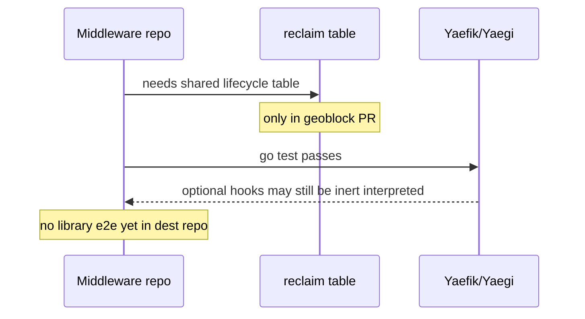

Developer review: in progress — 2026-09-11T04:46:00Z

## What this changes

**Operators.** None.

**Admin users.** None.

**Developers.** None yet — `origin/initial` at `ef7be38` is an empty tree; prepare grounded the reclaim spin-off from geoblock PR #83 and wrote research, no product code.

**End users.** None.

## Motivation

Traefik middlewares share a reclaim table that keeps one value per key alive while holders exist and through a grace window after the last holder drops. That logic currently lives only inside `traefik-geoblock` (`pkg/reclaim` on PR #83), so other middleware repos cannot reuse it without copying.

On `origin/initial` this repo has no Go module, no `reclaim/` package, no OpenSpec reclaim specs, and no Yaegi e2e harness. The caller's untracked README states the intent (shared libraries, Yaegi-first), but that file is not on the branch baseline yet.

If we do not spin the package out with tests that run under Yaegi, each middleware keeps reimplementing or forking reclaim logic, and interpreted-only failures stay invisible to compiled unit tests.

## Merge readiness

Prepare complete; explore is next. Qualify: qualified-with-gaps. 3 items remain.

Priority: P3 — spec, docs, tests, and internal library extraction; no current production harm on an empty repo.
Reviewed head: ef7be38
Owner decision: None.

## Review scores
| Measure | Result | What it means |
| --- | --- | --- |
| Overall readiness | N/A | No product delta vs DestBranch yet |
| CI proof | N/A | prHost local; no remote CI |
| Local tests proof | N/A | Before implement (`localTests: none`) |
| Review resolution | N/A | No OPEN PR |

## Verification
| Check | Result | Evidence |
| --- | --- | --- |
| Branch | 2026-09-11-reclaim-table not pushed | dedicated worktree from `origin/initial` |
| OpenSpec | none | not found on DestBranch |
| Pull request | none | prHost local |
| CI | N/A | prHost local |
| Local tests | none | handoff.yaml |
| PR comments | no comments | comments none |

## Specs
None.

## Deviations from the ask
None.

## Follow-up issues
None.

## How this fits together
Local ticket at `devstate/2026/09/2026-09-11-reclaim-table/ticket/source.md`; branch `2026-09-11-reclaim-table` in worktree `d:\repositories\wt-modsec-2026-09-11-reclaim-table`; durable card is `devstate/card.md` (`commentId: local`); caller checkout stays on `initial`.

## Decision needed
None.

## Before merge
- [ ] Explore open questions (fake middleware shape, Yaegi hook strategy, harness reuse)
- [ ] Propose OpenSpec change for reclaim port + e2e
- [ ] Implement `reclaim/`, specs, and Pester Yaegi e2e

## Findings
None.

## Axis review
None.

## Agent review details

### Review metrics
| Metric | Value | Why it matters |
| --- | --- | --- |
| Specs in this PR | none | No product diff yet |
| Open reviewer comments walked | 0 FIX / 0 ANSWER / 0 open | No PR host |
| Reviewed head | ef7be387c9067c523219bb7dbe7055b4e2c17190 | Empty DestBranch baseline |

### Stored data model
None.

### Technical review
Best possible solution: Port stdlib-only reclaim from geoblock PR #83 into `reclaim/`, adapt specs to `std_go_reclaim_*`, add Pester+Yaegi e2e with a minimal fake middleware — not yet started.

Do we have a high-confidence way to reproduce? No — no harness or package in dest tree yet.

Is this the best way to solve the issue? Yes — dedicated shared repo matches stated README intent and geoblock prior art.

### Evidence
What I checked:
- `origin/initial` tree empty at `ef7be38` (git ls-tree)
- Geoblock PR #83 temp clone @ `22f09a0`: `pkg/reclaim/*`, reclaim specs, Yaegi research
- Caller checkout README untracked; not on worktree HEAD

### Rank-up moves
None.
