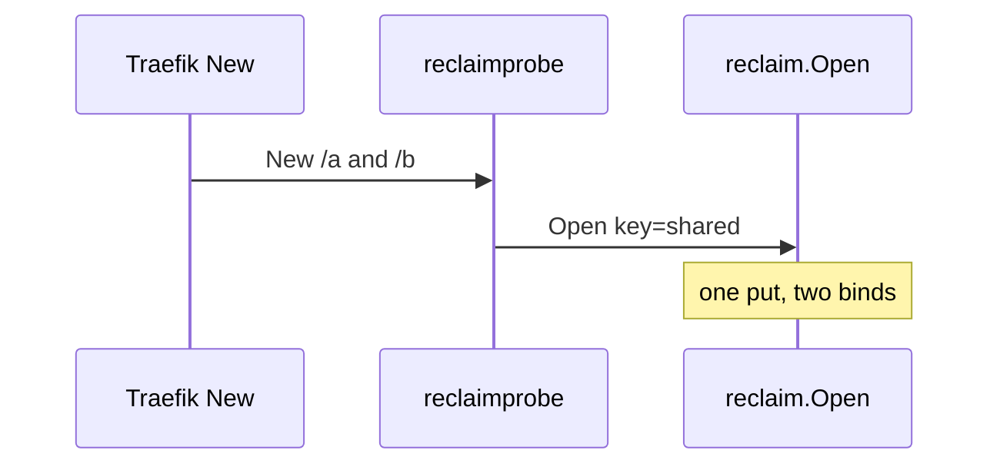

Developer review: in progress — 2026-09-11T05:18:40Z

## What this changes

**Operators.** None.

**Admin users.** None.

**Developers.** `reclaim/` plus Yaegi e2e (`e2e/reclaimprobe`, Pester). Compose now pins `useunsafe=false`. Test-only `Reset` kept (specs/geoblock import).

**End users.** None.

## Motivation

Traefik middlewares need one shared value per key while plugin instances hold it. DestBranch had no library. Interpreter-only failures stay invisible without the fake-plugin e2e.

If we do not land this, middleware repos keep copying `pkg/reclaim`.

## Merge readiness

Seven-axis review complete; hard Reset rename skipped (explore). Archive is next. 1 item remains.

Priority: P3 — spec, docs, tests, and internal library extraction.
Reviewed head: b20982b
Owner decision: Required. See Decision needed.

## Review scores
| Measure | Result | What it means |
| --- | --- | --- |
| Overall readiness | 6/6 | Local tests passed |
| CI proof | N/A | prHost local |
| Local tests proof | 6/6 | unit + Pester passed |
| Review resolution | N/A | No OPEN PR |

## Verification
| Check | Result | Evidence |
| --- | --- | --- |
| Branch | 2026-09-11-reclaim-table not pushed | human forbids push |
| OpenSpec | add-reclaim-table | live change folder |
| Pull request | none | prHost local |
| CI | N/A | prHost local |
| Local tests | passed | handoff.yaml |
| PR comments | no comments | comments none |

## Specs
- [std_go_reclaim_context-lease](openspec/changes/add-reclaim-table/proposal.md) — added
- [std_go_reclaim_value-lifecycle](openspec/changes/add-reclaim-table/proposal.md) — added

## Deviations from the ask
None.

## Follow-up issues
- [ ] [Yaegi drops the method set of a value returned as `any`](knowledge/debt/2026-09-11-yaegi-drops-methods-on-any.md) — Yaegi strips methods on an `any` return, so optional reclaim lifecycle hooks never run interpreted.

## How this fits together
Local ticket `devstate/2026/09/2026-09-11-reclaim-table/`; durable card `devstate/card.md`.

## Decision needed
| Question | Decision | By |
| --- | --- | --- |
| Fake middleware shape? | assumed — nested `e2e/reclaimprobe` | explore |
| Geoblock harness reuse? | assumed — pattern only | explore |
| E2e host vs CI? | assumed — this host; no push | explore |
| Change `Open` for Yaegi hooks? | assumed — no | explore |
| Traefik image / useunsafe? | assumed — v3.7.11; false (now explicit in compose) | explore |
| Go version? | assumed — 1.21 | explore |
| Rename `Reset`? | assumed — keep `Reset` | explore |

## Before merge
- [ ] Archive specs into `openspec/specs/`

## Findings
- [[P3] Name for the scope on test-only Reset](devstate/2026/09/2026-09-11-reclaim-table/codereview_standards.md) — skipped — keep `Reset` for spec/geoblock alignment. Path: `reclaim/default.go`. Reply none.

## Axis review
[Standards](`devstate/2026/09/2026-09-11-reclaim-table/codereview_standards.md`) — 1 total, 0 pending, 0 completed, 1 skipped
[Nitpicks](`devstate/2026/09/2026-09-11-reclaim-table/codereview_nitpicks.md`) — 0 total, 0 pending, 0 completed
[Spec](`devstate/2026/09/2026-09-11-reclaim-table/codereview_spec.md`) — 2 total, 0 pending, 1 completed, 1 skipped
[Security](`devstate/2026/09/2026-09-11-reclaim-table/codereview_security.md`) — 0 total, 0 pending, 0 completed
[Performance](`devstate/2026/09/2026-09-11-reclaim-table/codereview_performance.md`) — 0 total, 0 pending, 0 completed
[Dead](`devstate/2026/09/2026-09-11-reclaim-table/codereview_dead.md`) — 3 total, 0 pending, 0 completed, 3 skipped
[Test coverage](`devstate/2026/09/2026-09-11-reclaim-table/codereview_coverage.md`) — 0 total, 0 pending, 0 completed

## Agent review details

### Review metrics
| Metric | Value | Why it matters |
| --- | --- | --- |
| Specs in this PR | 2 added / 0 modified | Change folder |
| Open reviewer comments walked | 0 FIX / 0 ANSWER / 0 open | No PR |
| Reviewed head | b20982b | after useunsafe pin |

### Stored data model
None.

### Technical review
Best possible solution: Port the table, nested Yaegi probe, keep `Reset` as the imported test seam.

Do we have a high-confidence way to reproduce? Yes — `go test ./reclaim/...` and `./Test-Integration.ps1`.

Is this the best way to solve the issue? Yes.

### Evidence
What I checked:
- Seven axis files written
- Hard Reset rename skipped per explore
- Compose `useunsafe=false` applied

### Rank-up moves
None.
