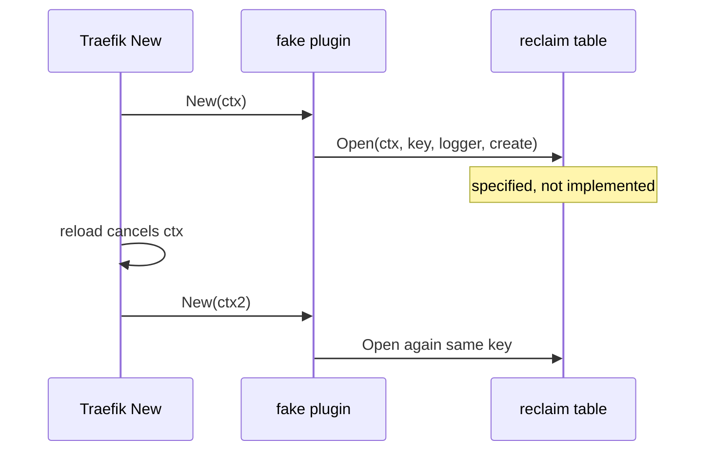

Developer review: in progress — 2026-09-11T05:01:27Z

## What this changes

**Operators.** None.

**Admin users.** None.

**Developers.** OpenSpec change `add-reclaim-table` adds two new specs (`std_go_reclaim_context-lease`, `std_go_reclaim_value-lifecycle`) and a design to port `reclaim/` plus a nested Yaegi fake plugin. No Go package on DestBranch yet.

**End users.** None.

## Motivation

Traefik middlewares need one shared value per key while any plugin instance holds it, and a cheap sleep window after the last holder drops. That table lives only in `traefik-geoblock` PR #83.

On `origin/initial` this repo is empty. Without a change that names the library API and the Yaegi e2e contract, implement would copy geoblock without a spec host in this catalog.

If we do not propose the two reclaim specs here, archive cannot fold them into `openspec/specs/` and later middlewares have no contract to import against.

## Merge readiness

Propose artifacts are valid (`openspec validate add-reclaim-table --strict`). Implement is next. 2 items remain.

Priority: P3 — spec, docs, tests, and internal library extraction; no current production harm on an empty dest.
Reviewed head: c45202c
Owner decision: Required. See Decision needed.

## Review scores
| Measure | Result | What it means |
| --- | --- | --- |
| Overall readiness | N/A | Package not implemented yet |
| CI proof | N/A | prHost local |
| Local tests proof | N/A | `localTests: none` |
| Review resolution | N/A | No OPEN PR |

## Verification
| Check | Result | Evidence |
| --- | --- | --- |
| Branch | 2026-09-11-reclaim-table not pushed | human forbids push |
| OpenSpec | add-reclaim-table | `openspec validate` strict passed |
| Pull request | none | prHost local |
| CI | N/A | prHost local |
| Local tests | none | handoff.yaml |
| PR comments | no comments | comments none |

## Specs
- [std_go_reclaim_context-lease](openspec/changes/add-reclaim-table/proposal.md) — added
- [std_go_reclaim_value-lifecycle](openspec/changes/add-reclaim-table/proposal.md) — added

## Deviations from the ask
None.

## Follow-up issues
- [ ] [Yaegi drops the method set of a value returned as `any`](knowledge/debt/2026-09-11-yaegi-drops-methods-on-any.md) — Yaegi strips methods on an `any` return, so optional reclaim lifecycle hooks never run interpreted.

## How this fits together
Local ticket `devstate/2026/09/2026-09-11-reclaim-table/`; change `add-reclaim-table`; durable card `devstate/card.md`.

## Decision needed
| Question | Decision | By |
| --- | --- | --- |
| What is the fake middleware shape for Yaegi e2e? | assumed — nested module `e2e/reclaimprobe`; GOPATH mounts plugin + this repo; no root `plugin.go` | explore |
| How much of geoblock's Pester/docker harness do we reuse? | assumed — pattern only; not geoblock routes | explore |
| Do e2e tests run only on this host via Docker, or also CI? | assumed — run on this host; ship the runner; no push | explore |
| Under Yaegi, optional hooks are inert. Change `Open`? | assumed — no; port geoblock API | explore |
| Traefik image and `useunsafe`? | assumed — `traefik:v3.7.11`; `useunsafe: false` | explore |
| Go module version? | assumed — `go 1.21` | explore |
| Rename test-only `Reset` to `ResetForTest`? | assumed — keep `Reset` | explore |

## Before merge
- [ ] Implement `reclaim/`, unit tests, and Pester Yaegi e2e on this host
- [ ] Archive specs into `openspec/specs/`

## Findings
None.

## Axis review
None.

## Agent review details

### Review metrics
| Metric | Value | Why it matters |
| --- | --- | --- |
| Specs in this PR | 2 added / 0 modified | Change deltas; not archived yet |
| Open reviewer comments walked | 0 FIX / 0 ANSWER / 0 open | No PR host |
| Reviewed head | c45202c | HEAD before propose commit |

### Stored data model
None.

### Technical review
Best possible solution: New specs under `std_go_reclaim_*` (empty catalog), nested fake plugin for Yaegi, port geoblock table without forking `Open`.

Do we have a high-confidence way to reproduce? Dest gap yes. E2e not built.

Is this the best way to solve the issue? Yes — fold would have no owner leaf.

### Evidence
What I checked:
- `openspec validate add-reclaim-table --type change --strict` passed
- FindSpecHost: both deltas `new` (no `openspec/specs/` leaves)

### Rank-up moves
None.
