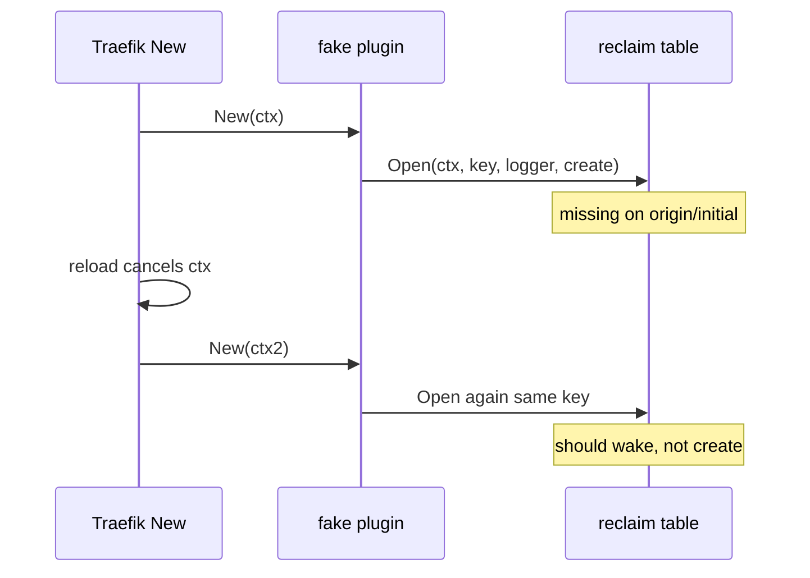

Developer review: in progress — 2026-09-11T04:53:40Z

## What this changes

**Operators.** None.

**Admin users.** None.

**Developers.** DestBranch still has no `reclaim/` package. This branch adds Traefik/Yaegi research, a `std_go_reclaim` usage packet, and a debt note that optional lifecycle hooks are inert under Yaegi.

**End users.** None.

## Motivation

Traefik middlewares need one shared value per key while any plugin instance holds it, and a cheap sleep window after the last holder drops so a reload does not recreate the value. That table lives only in `traefik-geoblock` PR #83 (`pkg/reclaim`).

On `origin/initial` this repo is an empty tree: no module, no `reclaim/`, no OpenSpec reclaim specs, no Yaegi e2e. Compiled `go test` cannot see interpreter-only failures (generics panic, method-set drop, multi-assignment nil).

If we do not spin the package out with a fake middleware loaded through Traefik's Yaegi GOPATH, other middleware repos keep copying the table, and DestBranch stays a library repo with nothing to import.

## Merge readiness

Explore recorded proceed policies; propose is next. Qualify: qualified-with-gaps. 2 items remain.

Priority: P3 — spec, docs, tests, and internal library extraction; no current production harm on an empty dest.
Reviewed head: f37d445
Owner decision: Required. See Decision needed.

## Review scores
| Measure | Result | What it means |
| --- | --- | --- |
| Overall readiness | N/A | No reclaim package vs DestBranch yet |
| CI proof | N/A | prHost local; no remote CI |
| Local tests proof | N/A | Before implement (`localTests: none`) |
| Review resolution | N/A | No OPEN PR |

## Verification
| Check | Result | Evidence |
| --- | --- | --- |
| Branch | 2026-09-11-reclaim-table not pushed | dedicated worktree; human forbids push |
| OpenSpec | none | no change folder yet |
| Pull request | none | prHost local |
| CI | N/A | prHost local |
| Local tests | none | handoff.yaml |
| PR comments | no comments | comments none |

## Specs
None.

## Deviations from the ask
None.

## Follow-up issues
- [ ] [Yaegi drops the method set of a value returned as `any`](knowledge/debt/2026-09-11-yaegi-drops-methods-on-any.md) — Yaegi strips methods on an `any` return, so optional reclaim lifecycle hooks never run interpreted.

## How this fits together
Local ticket at `devstate/2026/09/2026-09-11-reclaim-table/`; branch `2026-09-11-reclaim-table` in worktree `d:\repositories\wt-modsec-2026-09-11-reclaim-table`; durable card is `devstate/card.md` (`commentId: local`).

## Decision needed
| Question | Decision | By |
| --- | --- | --- |
| What is the fake middleware shape for Yaegi e2e? | assumed — nested module `e2e/reclaimprobe`; GOPATH mounts plugin + this repo; no root `plugin.go` | explore |
| How much of geoblock's Pester/docker harness do we reuse? | assumed — pattern only (`traefik:v3.7.11`, whoami, Pester, `reclaim_*` log helpers); not geoblock routes | explore |
| Do e2e tests run only on this host via Docker, or also CI? | assumed — run on this host; ship the same runner for later CI; this ticket does not push | explore |
| Under Yaegi, optional hooks are inert. Change `Open`? | assumed — no; port geoblock API; inert hooks are expected in e2e | explore |
| Traefik image and `useunsafe`? | assumed — `traefik:v3.7.11`; `useunsafe: false` | explore |
| Go module version? | assumed — `go 1.21` | explore |
| Rename test-only `Reset` to `ResetForTest`? | assumed — keep `Reset` to match imported specs | explore |

## Before merge
- [ ] Propose OpenSpec change for reclaim port + fake-plugin Pester e2e
- [ ] Implement `reclaim/`, adapted specs, and Yaegi e2e on this host

## Findings
None.

## Axis review
None.

## Agent review details

### Review metrics
| Metric | Value | Why it matters |
| --- | --- | --- |
| Specs in this PR | none | Specs land in propose/implement |
| Open reviewer comments walked | 0 FIX / 0 ANSWER / 0 open | No PR host |
| Reviewed head | f37d445e4bcadee73f51ac50cd90d9b80cd190cc | Research HEAD before explore bus commit |

### Stored data model
None.

### Technical review
Best possible solution: Port stdlib-only `reclaim` from geoblock PR #83, keep non-generic `Open`, prove Yaegi via a nested fake plugin under `plugins-local` rather than turning this library module into a plugin.

Do we have a high-confidence way to reproduce? Yes for the dest gap (`git ls-tree origin/initial` empty). Yaegi e2e is not built yet.

Is this the best way to solve the issue? Yes — library module + nested probe matches Traefik GOPATH loading and keeps `reclaim/` importable without Traefik symbols on the module root.

### Evidence
What I checked:
- `origin/initial` empty at `ef7be38` (`git ls-tree`)
- Geoblock PR #83 @ `22f09a0` reclaim API, specs, `traefik:v3.7.11` compose
- Traefik local loader: GOPATH `./plugins-local/`, Yaegi does not fetch modules (`knowledge/research/ext_traefik_plugins_local-loader/`)
- Geoblock Pester flow and reclaim log helpers (`knowledge/research/ext_geoblock_pester-integration/`)

### Rank-up moves
- A throwaway Yaegi interp module outside this `go.mod` (geoblock used one) as a faster guard than Docker — not in this ticket.
