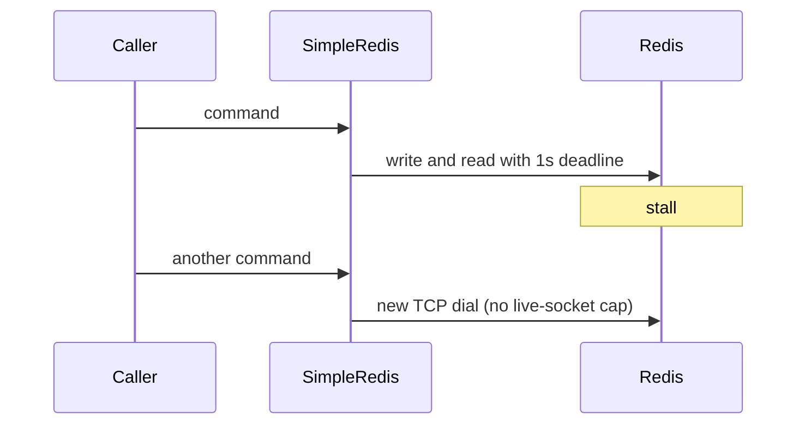

Developer review: in progress — 2026-09-11T21:33:10Z

## What this changes
**Operators.** None.

**Admin users.** None.

**Developers.** Research packets for Redis and Dragonfly `BLPOP` as the shared-CI stall; SimpleRedis timeouts are still compile-time constants on master.

**End users.** None.

## Motivation
SimpleRedis on master uses compile-time deadlines: 1 second for each command I/O and 2 seconds for a new dial. Callers that sit in front of Redis or Dragonfly (rate limiters, cache) cannot ask for tens of milliseconds and a fast fallback.

When Redis stalls, each in-flight command holds its socket until that 1 second deadline. There is no wait queue, so every new request dials another socket. A degraded backend is exactly when the client opens the most connections, and Traefik workers block for that second. Leaving the constants in place keeps that fan-out as the only behaviour.

## Merge readiness
Explore recorded InitWithOptions, BLPOP live proof, and omit unused poolSize. Product apply has not started. 3 items remain.

Priority: P2 — Redis slowness holds Traefik workers for a full second and fans out dials, with no caller-set shorter deadline
Reviewed head: b20848e
Owner decision: Required. See Explore Decisions.

## Review scores
| Measure | Result | What it means |
| --- | --- | --- |
| Overall readiness | 3/6 | CI still running; no product apply yet |
| CI proof | 3/6 | Lint, Test, and Integration Tests in progress |
| Local tests proof | N/A | Before implement; remote CI covers this host |
| Review resolution | 6/6 | OPEN PR, no comments |

## Verification
| Check | Result | Evidence |
| --- | --- | --- |
| Branch | 2026-09-11-simpleredis-perf-02-io-timeout pushed | `git` origin/2026-09-11-simpleredis-perf-02-io-timeout |
| OpenSpec | none | `openspec/` |
| Pull request | https://github.com/david-garcia-garcia/traefik-middleware-utilities/pull/16 | pr-host List/Create |
| CI | build 34649839773 in progress https://github.com/david-garcia-garcia/traefik-middleware-utilities/actions/runs/34649839773 | pr-host CI |
| Local tests | none | handoff.yaml localTests |
| PR comments | no comments | no comments.md |

## Specs
None.

## Deviations from the ask
- taken: finding listed poolSize/poolTimeout as config fields → Options has only DialTimeout, IoTimeout, IdleTimeout, MaxIdleConns — `simpleredis/simpleredis.go` — unused live-socket fields would lie until perf-01. Requester: not asked.

## Follow-up issues
None.

## How this fits together
Local finding perf-02 is on branch `2026-09-11-simpleredis-perf-02-io-timeout` from `master`. Stub PR 16 is the durable card host. Explore closed the stall and surface questions; apply is next.

## Explore Decisions
| Question | Rank | Decision | By |
| --- | --- | --- | --- |
| Options surface — InitWithOptions, extra Init args, or exported fields on SimpleRedis? | additive asked | assumed — InitWithOptions(host, pass, database, Options) with unexported session fields from a plain Options; Init calls it with Options{}; not extra Init args; not exported timeout fields on SimpleRedis | explore |
| How to stall a live Redis and Dragonfly command to prove a configured I/O timeout without DEBUG SLEEP, Lua 5.1-safe, KEYS-declared? | additive asked | assumed — same-package live test exec of BLPOP on a unique empty key with server timeout 10s and IoTimeout ~50ms; not Eval, CLIENT PAUSE, DEBUG SLEEP, or a public BLPOP method | explore |
| Whether unused poolSize/poolTimeout fields are stored as no-ops or omitted from the struct and only documented? | additive asked | assumed — omit from Options; document live-socket cap / wait queue as perf-01 | explore |
| Must the Traefik probe Config expose the new timeouts for Pester, or are live Go tests against compose/CI ports enough? | additive asked | assumed — live Go tests are enough; probe stays Host only; CI test job sets SIMPLEREDIS_LIVE_REDIS and SIMPLEREDIS_LIVE_DRAGONFLY | explore |
| How is configured DialTimeout proven if a blackhole SYN is not reliable in CI? | additive asked | assumed — package test that dial uses the stored duration plus hanging-SYN to 192.0.2.1 asserting redis:unreachable well under the 2s default; I/O timeout is the live-engine proof | explore |
| Can MaxIdleConns 0 mean "keep no idle sockets", or is 0 the default eight? | additive asked | assumed — MaxIdleConns == 0 means eight; callers cannot express idle cap zero on this Options type | explore |
| Rewrite the spec's "concurrent commands SHALL not open more than eight connections" now that MaxIdleConns is configurable? | bounded incidental | assumed — do not rewrite the live-socket claim; spec delta idle list at most MaxIdleConns (default 8); leave the live cap to perf-01 | explore |

## Before merge
- [ ] [P2] Make dial, I/O, idle timeout, and idle cap configurable with today's numbers as defaults
- [ ] [P2] Prove the new knobs on live Redis and Dragonfly (fake-server is not enough)
- [ ] Keep poolSize/poolTimeout as knobs or documented tension; do not ship perf-01's wait-queue semaphore

## Findings
None.

## Axis review
None.

## Agent review details

### Review metrics
| Metric | Value | Why it matters |
| --- | --- | --- |
| Specs in this PR | none | Same list as ## Specs; do not paste diff --stat |
| Open reviewer comments walked | 0 FIX / 0 ANSWER / 0 open | Unanswered review is merge risk |
| Reviewed head | b20848e9376b5a5f645c9f0c161046fd460311b9 | Card must match the branch you measured |

### Stored data model
None.

### Technical review
Best possible solution: Keep Init(host, pass, database) and today's defaults; add InitWithOptions with a plain Options struct; prove I/O timeout with BLPOP on both engines; leave the wait-queue to perf-01.

Do we have a high-confidence way to reproduce? Yes — TestIoTimeout on the 1s constant; live proof planned as BLPOP against Redis and Dragonfly with a short IoTimeout.

Is this the best way to solve the issue? Yes versus master: expose the existing constants as caller-set deadlines without rewriting the pool.

### Evidence
What I checked:
- explore.md eight open questions, none blocked (run root)
- deviations.md omit poolSize/poolTimeout from Options
- knowledge/research/ext_redis_blpop and ext_dragonfly_blpop on HEAD b20848e
- OPEN PR 16, zero comments, CI run 34649839773 in progress

### Rank-up moves
None.
