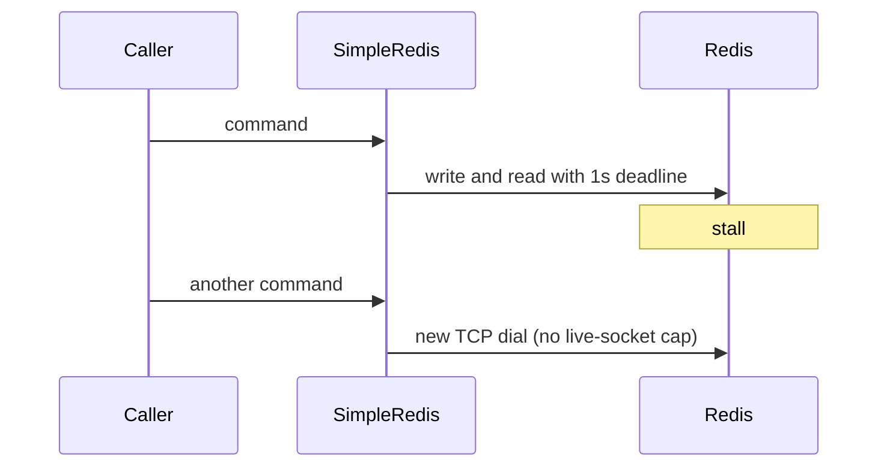

Developer review: in progress — 2026-09-11T21:20:49Z

## What this changes
**Operators.** None.

**Admin users.** None.

**Developers.** None.

**End users.** None.

## Motivation
SimpleRedis on master uses compile-time deadlines: 1 second for each command I/O and 2 seconds for a new dial. Callers that sit in front of Redis or Dragonfly (rate limiters, cache) cannot ask for tens of milliseconds and a fast fallback.

When Redis stalls, each in-flight command holds its socket until that 1 second deadline. There is no wait queue, so every new request dials another socket. A degraded backend is exactly when the client opens the most connections, and Traefik workers block for that second. Leaving the constants in place keeps that fan-out as the only behaviour.

## Merge readiness
Prepare grounded the ticket; product code versus master is unchanged. 3 items remain.

Priority: P2 — Redis slowness holds Traefik workers for a full second and fans out dials, with no caller-set shorter deadline
Reviewed head: 787eeff
Owner decision: None.

## Review scores
| Measure | Result | What it means |
| --- | --- | --- |
| Overall readiness | 3/6 | CI still running; no product apply yet |
| CI proof | 3/6 | Lint, Test, and Integration Tests in progress |
| Local tests proof | N/A | Before implement; remote CI covers this host |
| Review resolution | 6/6 | OPEN PR, no comments |

## Verification
| Check | Result | Evidence |
| --- | --- | --- |
| Branch | 2026-09-11-simpleredis-perf-02-io-timeout pushed | `git` origin/2026-09-11-simpleredis-perf-02-io-timeout |
| OpenSpec | none | `openspec/` |
| Pull request | https://github.com/david-garcia-garcia/traefik-middleware-utilities/pull/16 | pr-host List/Create |
| CI | build 34648859227 in progress https://github.com/david-garcia-garcia/traefik-middleware-utilities/actions/runs/34648859227 | pr-host CI |
| Local tests | none | handoff.yaml localTests |
| PR comments | no comments | no comments.md |

## Specs
None.

## Deviations from the ask
None.

## Follow-up issues
None.

## How this fits together
Local finding perf-02 is grounded on branch `2026-09-11-simpleredis-perf-02-io-timeout` from `master`. Stub PR 16 is the durable card host. CI on that push is still running.

## Explore Decisions
None.

## Before merge
- [ ] [P2] Make dial, I/O, idle timeout, and idle cap configurable with today's numbers as defaults
- [ ] [P2] Prove the new knobs on live Redis and Dragonfly (fake-server is not enough)
- [ ] Keep poolSize/poolTimeout as knobs or documented tension; do not ship perf-01's wait-queue semaphore

## Findings
None.

## Axis review
None.

## Agent review details

### Review metrics
| Metric | Value | Why it matters |
| --- | --- | --- |
| Specs in this PR | none | Same list as ## Specs; do not paste diff --stat |
| Open reviewer comments walked | 0 FIX / 0 ANSWER / 0 open | Unanswered review is merge risk |
| Reviewed head | 787eeff3f0aab012f5f01ff6f7af6cf4e8355222 | Card must match the branch you measured |

### Stored data model
None.

### Technical review
Best possible solution: Not applied yet versus master; the ticket is to expose the existing constants as caller-set deadlines without rewriting the pool.

Do we have a high-confidence way to reproduce? Yes, `TestIoTimeout` already shows the 1s constant against a silent peer; live Redis/Dragonfly stall method is still an unknown.

Is this the best way to solve the issue? Yes versus master: keep `Init(host, pass, database)` and today's defaults, add knobs, leave the wait-queue to perf-01.

### Evidence
What I checked:
- Dest `simpleredis/simpleredis.go` constants and `SetDeadline` on `origin/master` `7dc4b05`
- Compose Redis + Dragonfly and Pester `/redis` `/dragonfly` happy-path only (`docker-compose.yml`, `scripts/integration-tests.Tests.ps1`)
- OPEN PR 16, zero comments, CI run 34648859227 in progress

### Rank-up moves
None.
