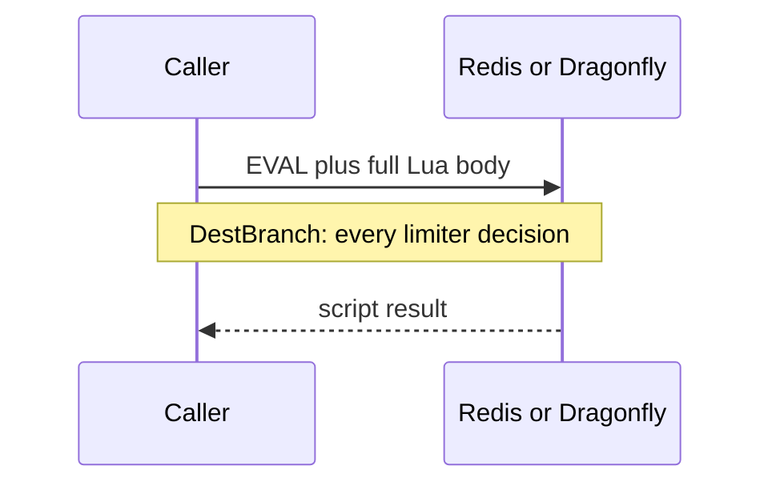

Developer review: ready for review — 2026-09-11T22:04:51Z

## What this changes
**Operators.** None.

**Admin users.** None.

**Developers.** `SimpleRedis.Eval` keeps `Eval(script, keys, args)` and sends EVALSHA of a client SHA-1 digest, falling back once to EVAL on NOSCRIPT; Yaegi and Pester `/redis` `/dragonfly` prove the miss then hit.

**End users.** None.

## Motivation
`Eval` is the hot-path verb for Redis and Dragonfly rate-limit decisions (token-bucket Allow, window-counter flush). On DestBranch every call copies the script onto the wire. The Traefik token-bucket script is ~470 bytes; at limiter traffic that is redundant Lua Redis already has compiled.

If this PR does not land, every exact-mode hit keeps paying that extra ~500 bytes and Redis-side hash of a body it already knows. Limiters still admit correctly. The miss is wire and parse cost, not a wrong allow/deny.

## Merge readiness
EVALSHA-inside-Eval is on the branch; Lint, Test, and Integration Tests succeeded. 0 items remain.

Priority: P3 — extra EVAL bytes on DestBranch; no wrong answers or outages
Reviewed head: 0d7aa06
Owner decision: None.

## Review scores
| Measure | Result | What it means |
| --- | --- | --- |
| Overall readiness | 6/6 | CI succeeded; no open PR comments |
| CI proof | 6/6 | Lint, Test, and Integration Tests succeeded https://github.com/david-garcia-garcia/traefik-middleware-utilities/actions/runs/34651975884 |
| Local tests proof | N/A | Remote CI is the proof axis |
| Review resolution | 6/6 | No OPEN PR comments |

## Verification
| Check | Result | Evidence |
| --- | --- | --- |
| Branch | 2026-09-11-simpleredis-perf-05-evalsha pushed | `git` origin 0d7aa06 |
| OpenSpec | simpleredis-evalsha | `openspec/changes/simpleredis-evalsha/` |
| Pull request | https://github.com/david-garcia-garcia/traefik-middleware-utilities/pull/13 | GitHub PR 13 |
| CI | build 34651975884 succeeded https://github.com/david-garcia-garcia/traefik-middleware-utilities/actions/runs/34651975884 | GitHub check runs |
| Local tests | passed | handoff.yaml localTests |
| PR comments | no comments | no comments.md |

## Specs
- [std_go_simpleredis_resp-commands](https://github.com/david-garcia-garcia/traefik-middleware-utilities/blob/2026-09-11-simpleredis-perf-05-evalsha/openspec/changes/simpleredis-evalsha/proposal.md) — modified

## Deviations from the ask
None.

## Follow-up issues
None.

## How this fits together
Implement landed on `2026-09-11-simpleredis-perf-05-evalsha` and stub PR 13. Code review of the apply diff is next.

## Explore Decisions
None.

## Before merge
- [x] Land EVALSHA inside `Eval` with NOSCRIPT fallback, Yaegi interp, and live Redis plus Dragonfly proof [P3]
- [x] OpenSpec change `simpleredis-evalsha` ready
- [x] Stub review PR opened

## Findings
None.

## Axis review
None.

## Agent review details

### Review metrics
| Metric | Value | Why it matters |
| --- | --- | --- |
| Specs in this PR | 0 added / 1 modified | Same list as ## Specs |
| Open reviewer comments walked | 0 FIX / 0 ANSWER / 0 open | Unanswered review is merge risk |
| Reviewed head | 0d7aa063bd54b50c5ecfcb3e837d0b1f58204896 | Card must match the branch you measured |

### Stored data model
None.

### Technical review
Best possible solution: keep `Eval(script, keys, args)` and send EVALSHA with a NOSCRIPT→EVAL fallback so callers and scripts (KEYS, no `table.maxn`) stay the same.

Do we have a high-confidence way to reproduce? Yes — compiled fake argv, Yaegi `EvalNoScript`, and Pester SCRIPT FLUSH/EXISTS on `/redis` and `/dragonfly`.

Is this the best way to solve the issue? Yes — digest plus fallback beats shipping the body, and avoids `SCRIPT LOAD` at Init.

### Evidence
What I checked:
- `origin/master...HEAD` at 0d7aa06 (`Eval` EVALSHA + NOSCRIPT fallback; probe digest/EvalAgain; Pester miss-then-hit)
- `go test -count=1 ./...` passed; `./Test-Integration.ps1` 8/8 (Redis and Dragonfly Describes, reclaim green)
- `openspec validate simpleredis-evalsha --strict` valid
- PR 13 OPEN; Lint / Test / Integration Tests succeeded (run 34651975884)
- qualify: qualified-with-gaps; localTests: passed; change: simpleredis-evalsha (`handoff.yaml`)

### Rank-up moves
None.
