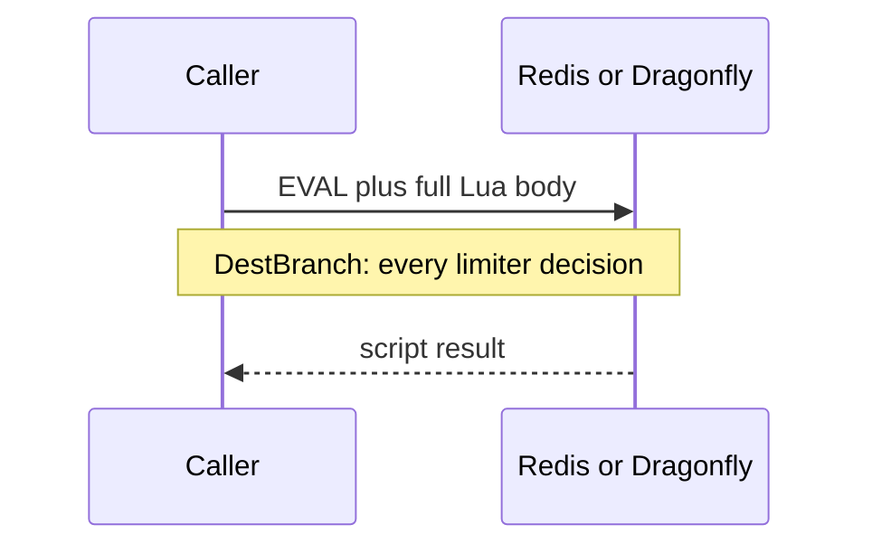

Developer review: in progress — 2026-09-11T21:39:11Z

## What this changes
**Operators.** None.

**Admin users.** None.

**Developers.** OpenSpec change `simpleredis-evalsha` folds EVALSHA-inside-Eval (NOSCRIPT→EVAL fallback, Yaegi, live Redis and Dragonfly SCRIPT FLUSH/EXISTS) into `std_go_simpleredis_resp-commands`. Product `Eval` still sends `EVAL` plus the full Lua body.

**End users.** None.

## Motivation
`Eval` is the hot-path verb for Redis and Dragonfly rate-limit decisions (token-bucket Allow, window-counter flush). On DestBranch every call copies the script onto the wire. The Traefik token-bucket script is ~470 bytes; at limiter traffic that is redundant Lua Redis already has compiled.

If this PR does not land, every exact-mode hit keeps paying that extra ~500 bytes and Redis-side hash of a body it already knows. Limiters still admit correctly. The miss is wire and parse cost, not a wrong allow/deny.

## Merge readiness
Propose is recorded; product Eval is unchanged. 1 item remains before merge (the apply).

Priority: P3 — extra EVAL bytes on DestBranch; no wrong answers or outages
Reviewed head: f00b5d4
Owner decision: None.

## Review scores
| Measure | Result | What it means |
| --- | --- | --- |
| Overall readiness | 3/6 | CI in progress; product apply has not started |
| CI proof | 3/6 | Checks in progress on run 34650365634 |
| Local tests proof | N/A | Before implement; remote CI is the proof axis |
| Review resolution | 6/6 | No OPEN PR comments |

## Verification
| Check | Result | Evidence |
| --- | --- | --- |
| Branch | 2026-09-11-simpleredis-perf-05-evalsha pushed | `git` origin f00b5d4 |
| OpenSpec | simpleredis-evalsha | `openspec/changes/simpleredis-evalsha/` |
| Pull request | https://github.com/david-garcia-garcia/traefik-middleware-utilities/pull/13 | GitHub PR 13 |
| CI | build 34650365634 in progress https://github.com/david-garcia-garcia/traefik-middleware-utilities/actions/runs/34650365634 | GitHub check runs |
| Local tests | none | handoff.yaml localTests |
| PR comments | no comments | no comments.md |

## Specs
- [std_go_simpleredis_resp-commands](https://github.com/david-garcia-garcia/traefik-middleware-utilities/blob/2026-09-11-simpleredis-perf-05-evalsha/openspec/changes/simpleredis-evalsha/proposal.md) — modified

## Deviations from the ask
None.

## Follow-up issues
None.

## How this fits together
Propose is on branch `2026-09-11-simpleredis-perf-05-evalsha` and stub PR 13. Implement is next; `Eval` is not changed yet.

## Explore Decisions
| Question | Rank | Decision | By |
| --- | --- | --- | --- |
| How can probe/Pester prove EVALSHA vs a one-shot EVAL on a live engine? | additive asked | assumed — no new compose service; probe EvalDigest + second Eval header; Pester SCRIPT FLUSH and SCRIPT EXISTS via redis-cli on redis and dragonfly; fake tests own EVALSHA argv | explore |

## Before merge
- [ ] Land EVALSHA inside `Eval` with NOSCRIPT fallback, Yaegi interp, and live Redis plus Dragonfly proof [P3]
- [x] OpenSpec change `simpleredis-evalsha` ready
- [x] Stub review PR opened

## Findings
None.

## Axis review
None.

## Agent review details

### Review metrics
| Metric | Value | Why it matters |
| --- | --- | --- |
| Specs in this PR | 0 added / 1 modified | Same list as ## Specs |
| Open reviewer comments walked | 0 FIX / 0 ANSWER / 0 open | Unanswered review is merge risk |
| Reviewed head | f00b5d41bba7f1dea63a9b986881dd3628e2f2ff | Card must match the branch you measured |

### Stored data model
None.

### Technical review
Best possible solution: keep `Eval(script, keys, args)` and send EVALSHA with a NOSCRIPT→EVAL fallback, as go-redis `Script.Run` does, so callers and scripts (KEYS, no `table.maxn`) stay the same.

Do we have a high-confidence way to reproduce? Yes, dest `Eval` always appends `EVAL` plus the script (`simpleredis/simpleredis.go`); fake and Pester `/redis` `/dragonfly` exist to extend.

Is this the best way to solve the issue? Yes — digest plus fallback beats shipping the body or `unsafe` zero-copy, and avoids `SCRIPT LOAD` at Init. Redis 7 and Dragonfly v1.40.2 both prefix the miss with `NOSCRIPT`.

### Evidence
What I checked:
- `origin/master...HEAD` at f00b5d4 (research packets + OpenSpec change; no product Eval change)
- FindSpecHost fold `std_go_simpleredis_resp-commands` (high); `openspec validate simpleredis-evalsha --strict` valid
- validate_artifact_names OK; validate_spec_map OK
- PR 13 OPEN, checks in progress (run 34650365634)
- qualify: qualified-with-gaps; explore: explore.md; change: simpleredis-evalsha (`handoff.yaml`)

### Rank-up moves
None.
