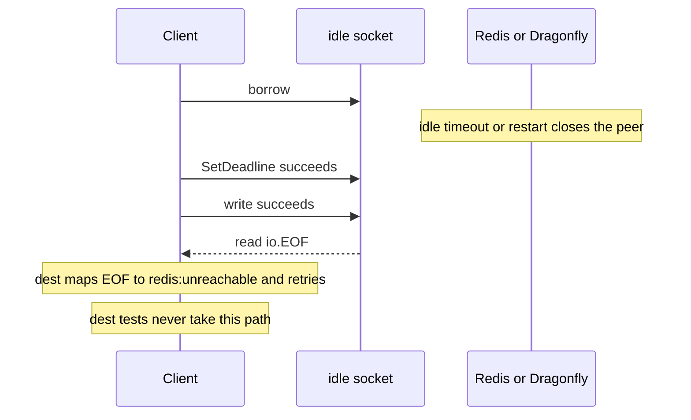

Developer review: in progress — 2026-09-11T21:23:52.836Z

## What this changes
**Operators.** None.

**Admin users.** None.

**Developers.** None.

**End users.** None.

## Motivation
Dest already retries a dead pooled SimpleRedis socket once, unless the error is a timeout. The test that looks like it covers a stale Redis close actually closes the socket on the client, so `SetDeadline` fails with a closed fd and `ioError` never sees `io.EOF`. That is the path Redis and Dragonfly take when they drop an idle client.

If we do not merge, a regression in that retry, in `clean`/`reusable` bookkeeping, or in the `ioError` mapping ships as 86% coverage and only fails after an idle period in production.

## Merge readiness
Prepare is grounded; apply has not started. CI on the stub PR is in progress. 2 items remain.

Priority: P3 — missing proof of dest retry; no current operator or end-user harm
Reviewed head: 92dd35a
Owner decision: None.

## Review scores
| Measure | Result | What it means |
| --- | --- | --- |
| Overall readiness | 3 | CI in progress; no apply yet |
| CI proof | 3 | Lint queued, Test in progress, Integration queued https://github.com/david-garcia-garcia/traefik-middleware-utilities/actions/runs/34649169500 |
| Local tests proof | N/A | prHost is github; CI proof covers remote |
| Review resolution | 6 | No open PR comments |

## Verification
| Check | Result | Evidence |
| --- | --- | --- |
| Branch | 2026-09-11-simpleredis-test-01-eof-redial pushed | git / origin |
| OpenSpec | none | openspec/ |
| Pull request | https://github.com/david-garcia-garcia/traefik-middleware-utilities/pull/25 | pr-host |
| CI | build 34649169500 in progress https://github.com/david-garcia-garcia/traefik-middleware-utilities/actions/runs/34649169500 | GitHub MCP get_check_runs |
| Local tests | none | handoff.yaml localTests |
| PR comments | no comments | comments: none |

## Specs
None.

## Deviations from the ask
None.

## Follow-up issues
None.

## How this fits together
Local finding test-01 → branch `2026-09-11-simpleredis-test-01-eof-redial` → PR #25 → CI run 34649169500 in progress.

## Explore Decisions
None.

## Before merge
- [P3] Prove peer-closed idle sockets on a fake plus live Redis and Dragonfly; extend Pester `/redis` `/dragonfly` and `e2e/simpleredisprobe`.
- [ ] CI on PR #25 succeeded (currently in progress).

## Findings
None.

## Axis review
None.

## Agent review details

### Review metrics
| Metric | Value | Why it matters |
| --- | --- | --- |
| Specs in this PR | none | Same list as ## Specs |
| Open reviewer comments walked | 0 FIX / 0 ANSWER / 0 open | Unanswered review is merge risk |
| Reviewed head | 92dd35a7253529ca7ced28c3cfdd37fcdd95799a | Card must match the branch you measured |

### Stored data model
None.

### Technical review
Best possible solution: dest already retries; this ticket must prove the peer-close / `io.EOF` arm that current tests skip by closing the client.

Do we have a high-confidence way to reproduce? Yes — a fake that answers once then closes from the server; live engines already run in compose and CI.

Is this the best way to solve the issue? Yes — add the missing proof; do not change retry policy unless that proof fails.

### Evidence
What I checked:
- GitHub MCP get_me: david-garcia-garcia / David / deivid.garcia.garcia@gmail.com
- origin `david-garcia-garcia/traefik-middleware-utilities`; dest `origin/master` at 7dc4b05; `simpleredis/` present
- `ioError` `:436`, `exec` `:182-201`, `do` `:292-307`, `TestStaleConnectionIsRetried` client-side close, compose Redis+Dragonfly, Pester `/redis` `/dragonfly`
- GitHub MCP list_pull_requests: one OPEN PR #25; get_comments empty; get_review_comments empty
- GitHub MCP get_check_runs: run 34649169500 Lint queued, Test in progress, Integration queued

### Rank-up moves
None.
