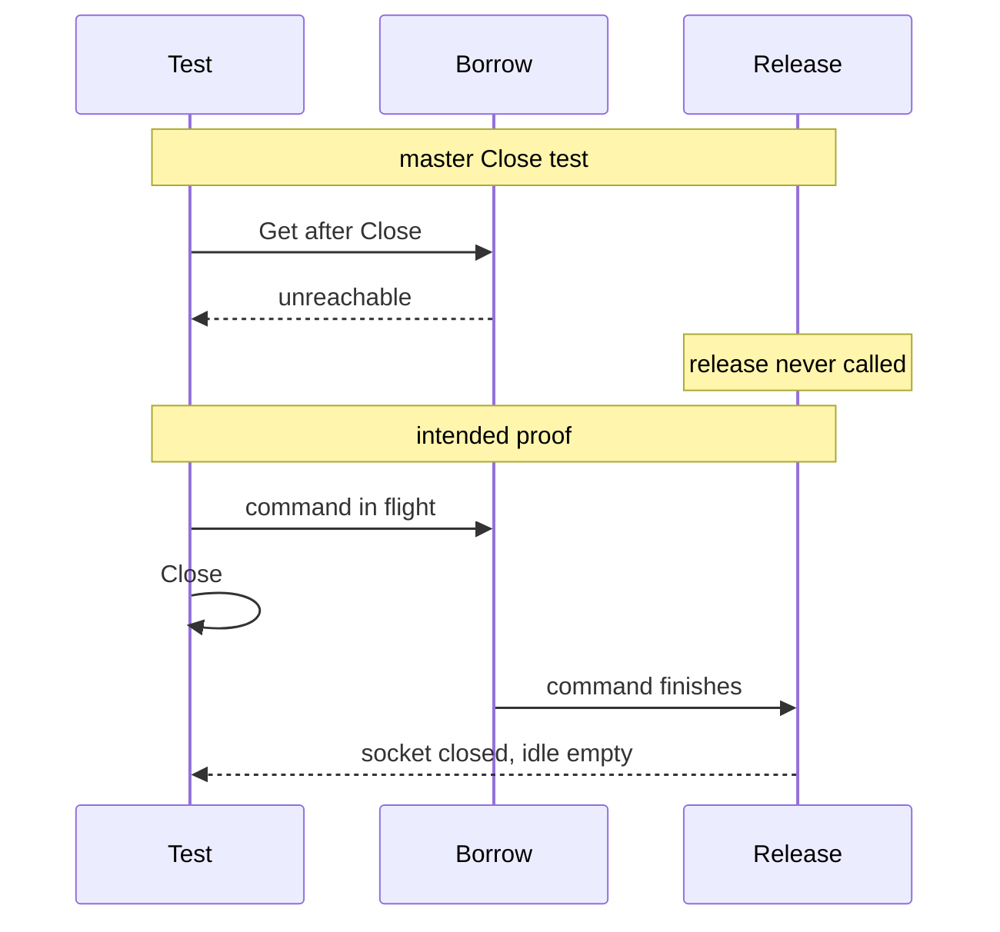

Developer review: in progress — 2026-09-11T22:16:41Z

## What this changes
**Operators.** None.

**Admin users.** None.

**Developers.** SimpleRedis now proves idle ≤ 8 after more than eight overlapping commands (hold fake, excess sockets closed, not leaked), in-flight Close closes the socket on release, and borrow's second closed check via `afterIdleScanForTest`; Pester fires 16 parallel `/redis` and `/dragonfly` requests then bare `CLIENT LIST` remaining ≤ 8; OpenSpec change `test-idle-cap-and-release-after-close` rewrites `std_go_simpleredis_tcp-session` to those contracts; `knowledge/devdocs/std_go_simpleredis.md` states that Close while a command is in flight may finish and closes the socket on release.

**End users.** None.

## Motivation
SimpleRedis already closes a socket when the idle list is full or the client is Closed. On master, no test executes those release branches. The concurrent-pool test starts eight goroutines and asserts at most eight TCP accepts, which eight goroutines cannot exceed. The Close test calls Get after Close, which returns `redis:unreachable` from borrow's first closed check, so release never runs. Live Pester `/redis` and `/dragonfly` each send one request, so they cannot prove overlapped commands leave at most eight idle sockets on either engine.

If those guards regress, idle sockets grow without bound in a long-lived Traefik process, or Close on config reload pools sockets into a client that is supposed to be dead. This ticket is missing proof, not a demonstrated production leak today.

## Merge readiness
Usage-doc impact recorded; Close-on-release gotcha produced. CI on this head still has Test running. 1 item remains.

Priority: P3 — tests and proof of existing idle-cap and Close-on-release guards; no current user or operator harm
Reviewed head: 6540e4b
Owner decision: Required. See Explore Decisions.

## Review scores
| Measure | Result | What it means |
| --- | --- | --- |
| Overall readiness | 3/6 | CI still in progress on this head |
| CI proof | 3/6 | in progress — [run 34653169718](https://github.com/david-garcia-garcia/traefik-middleware-utilities/actions/runs/34653169718) |
| Local tests proof | N/A | prHost github; CI proof covers remote |
| Review resolution | 6/6 | no PR comments |

## Verification
| Check | Result | Evidence |
| --- | --- | --- |
| Branch | 2026-09-11-simpleredis-test-02-idle-cap pushed | `git push` to origin; HEAD 6540e4b |
| OpenSpec | test-idle-cap-and-release-after-close | `openspec/changes/test-idle-cap-and-release-after-close/` |
| Pull request | https://github.com/david-garcia-garcia/traefik-middleware-utilities/pull/14 | GitHub PR 14 |
| CI | build 34653169718 in progress — Lint success https://github.com/david-garcia-garcia/traefik-middleware-utilities/actions/runs/34653169718/job/103439716665; Integration Tests success https://github.com/david-garcia-garcia/traefik-middleware-utilities/actions/runs/34653169718/job/103439716440; Test in progress https://github.com/david-garcia-garcia/traefik-middleware-utilities/actions/runs/34653169718/job/103439716633 | GitHub check runs on PR 14 |
| Local tests | passed | handoff.yaml localTests |
| PR comments | no comments | comments.md absent; PR comment list empty |

## Specs
- [std_go_simpleredis_tcp-session](https://github.com/david-garcia-garcia/traefik-middleware-utilities/blob/2026-09-11-simpleredis-test-02-idle-cap/openspec/changes/test-idle-cap-and-release-after-close/proposal.md) — modified

## Deviations from the ask
None.

## Follow-up issues
None.

## How this fits together
Idle-cap and Close-on-release proof is on branch `2026-09-11-simpleredis-test-02-idle-cap`, PR 14; usage-doc impact produced the SimpleRedis Close-on-release gotcha; CI run 34653169718 in progress after that push.

## Explore Decisions
| Question | Rank | Decision | By |
| --- | --- | --- | --- |
| How to drive genuine overlap on DestBranch without `startSlowRedis` / `bench_test.go`? | additive asked | assumed — add a same-file hold fake; 16 Gets then `len(idle) <= 8` and live sockets equal idle. Do not add `bench_test.go`. | propose |
| How does Pester observe idle socket count vs cap on live Redis and Dragonfly? | additive asked | assumed — 16 parallel `/redis` and `/dragonfly` requests, then bare `CLIENT LIST` via `docker compose exec redis redis-cli` (and `-h dragonfly`). Remaining clients ≤ 8. No idle getter. | propose |
| Can `Close` between idle scan and `dial` be made deterministic without a test hook? | additive asked | assumed — nil-checked same-package hook after idle-scan unlock; test sets it to `Close`. Do not leave `:236-238` untested. | propose |
| Does the spec SHALL "Concurrent commands SHALL not open more than eight connections" stay, given usage says in-flight dials are not capped? | bounded asked | assumed — rewrite SHALL/scenario to idle ≤ 8 after overlap of more than eight; in-flight MAY exceed eight. Repair the 8-goroutine test. Add in-flight-Close scenario. | propose |

## Before merge
- [ ] [P3] CI on this head (Lint and Integration Tests succeeded; Test in progress)
- [x] Usage packet Close-on-release gotcha (`std_go_simpleredis`)
- [x] Seven-axis review written; hard items applied (436cdd0)
- [x] Unit-test idle cap and in-flight Close so those `release` branches can fail
- [x] Live overlap on Redis and Dragonfly must not leak idle sockets beyond the cap
- [x] Stub PR opened
- [x] Propose artifacts written

## Findings
None.

## Axis review
[Standards](https://github.com/david-garcia-garcia/traefik-middleware-utilities/blob/2026-09-11-simpleredis-test-02-idle-cap/devstate/2026/09/2026-09-11-simpleredis-test-02-idle-cap/codereview_standards.md) — 3 total, 0 pending, 1 completed, 2 skipped
[Nitpicks](https://github.com/david-garcia-garcia/traefik-middleware-utilities/blob/2026-09-11-simpleredis-test-02-idle-cap/devstate/2026/09/2026-09-11-simpleredis-test-02-idle-cap/codereview_nitpicks.md) — 2 total, 0 pending, 2 completed
[Spec](https://github.com/david-garcia-garcia/traefik-middleware-utilities/blob/2026-09-11-simpleredis-test-02-idle-cap/devstate/2026/09/2026-09-11-simpleredis-test-02-idle-cap/codereview_spec.md) — 0 total, 0 pending, 0 completed
[Security](https://github.com/david-garcia-garcia/traefik-middleware-utilities/blob/2026-09-11-simpleredis-test-02-idle-cap/devstate/2026/09/2026-09-11-simpleredis-test-02-idle-cap/codereview_security.md) — 0 total, 0 pending, 0 completed
[Performance](https://github.com/david-garcia-garcia/traefik-middleware-utilities/blob/2026-09-11-simpleredis-test-02-idle-cap/devstate/2026/09/2026-09-11-simpleredis-test-02-idle-cap/codereview_performance.md) — 0 total, 0 pending, 0 completed
[Dead](https://github.com/david-garcia-garcia/traefik-middleware-utilities/blob/2026-09-11-simpleredis-test-02-idle-cap/devstate/2026/09/2026-09-11-simpleredis-test-02-idle-cap/codereview_dead.md) — 0 total, 0 pending, 0 completed
[Test coverage](https://github.com/david-garcia-garcia/traefik-middleware-utilities/blob/2026-09-11-simpleredis-test-02-idle-cap/devstate/2026/09/2026-09-11-simpleredis-test-02-idle-cap/codereview_coverage.md) — 0 total, 0 pending, 0 completed

## Agent review details

### Review metrics
| Metric | Value | Why it matters |
| --- | --- | --- |
| Specs in this PR | 0 added / 1 modified | Same list as ## Specs |
| Open reviewer comments walked | 0 FIX / 0 ANSWER / 0 open | Unanswered review is merge risk |
| Reviewed head | 6540e4b9cf09a4db6e8696a959c88807a87629d1 | Card must match the branch you measured |

### Stored data model
None.

### Technical review
Best possible solution: DestBranch already caps idle at eight and closes in-flight sockets after Close; this change makes those branches fail the tests when they regress, smokes the same idle cap on live Redis and Dragonfly, and the usage packet now matches the in-flight Close contract.

Do we have a high-confidence way to reproduce? Yes: hold fake starts 16 overlapping Gets then asserts idle ≤ 8 and open sockets equal idle; in-flight Close then empty idle and no redial; Pester 16-way `/redis` and `/dragonfly` then bare CLIENT LIST remaining ≤ 8.

Is this the best way to solve the issue? Yes versus DestBranch: prove idle ≤ 8 after overlap and in-flight Close, and extend `/redis` `/dragonfly` overlap; do not take perf-01's total connection cap here.

### Evidence
What I checked:
- Pin `origin/master` `7dc4b051888d857869b4beb53cdd9579f930d3c1` three-dot product diff (exclude `devstate/`, `.cursor/`)
- Produced stale-usage Close-on-release gotcha on `knowledge/devdocs/std_go_simpleredis.md`; no skipped findings
- Seven axis files under the run root; hard items applied; 2 Standards judgement skipped
- PR 14 OPEN, comments empty
- CI run 34653169718 Lint success; Integration Tests success; Test in progress

### Rank-up moves
- Extract a shared overlap-launch helper if a later change must keep both idle-cap tests in lockstep
- Extract a Pester wait-until-idle-≤8 helper if the Redis and Dragonfly Its grow a third copy
