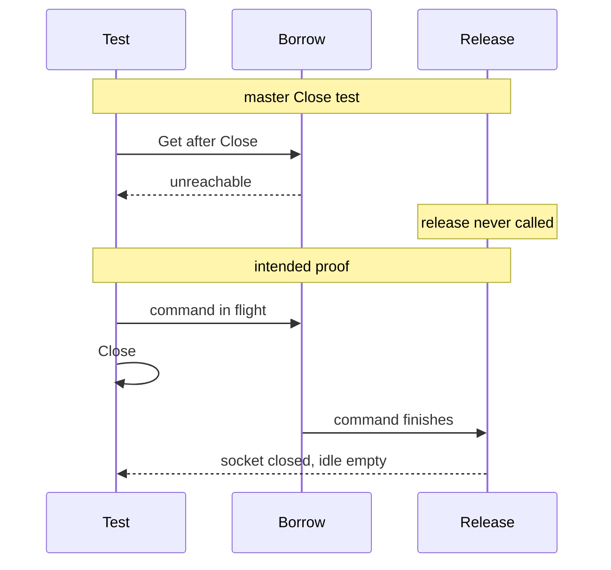

Developer review: ready for review — 2026-09-11T22:29:42Z

## What this changes
**Operators.** None.

**Admin users.** None.

**Developers.** SimpleRedis now proves idle ≤ 8 after more than eight overlapping commands (hold fake, excess sockets closed, not leaked), in-flight Close closes the socket on release, and borrow's second closed check via `afterIdleScanForTest`; Pester fires 16 parallel `/redis` and `/dragonfly` requests then bare `CLIENT LIST` remaining ≤ 8; live spec `std_go_simpleredis_tcp-session` now requires those idle-cap and in-flight-Close contracts (change archived as `2026-09-11-test-idle-cap-and-release-after-close`); `knowledge/devdocs/std_go_simpleredis.md` states that Close while a command is in flight may finish and closes the socket on release.

**End users.** None.

## Motivation
SimpleRedis already closes a socket when the idle list is full or the client is Closed. On master, no test executes those release branches. The concurrent-pool test starts eight goroutines and asserts at most eight TCP accepts, which eight goroutines cannot exceed. The Close test calls Get after Close, which returns `redis:unreachable` from borrow's first closed check, so release never runs. Live Pester `/redis` and `/dragonfly` each send one request, so they cannot prove overlapped commands leave at most eight idle sockets on either engine.

If those guards regress, idle sockets grow without bound in a long-lived Traefik process, or Close on config reload pools sockets into a client that is supposed to be dead. This ticket is missing proof, not a demonstrated production leak today.

## Merge readiness
Ready for review. 0 items remain.

Priority: P3 — tests and proof of existing idle-cap and Close-on-release guards; no current user or operator harm
Reviewed head: f974cab
Owner decision: Required. See Explore Decisions.

## Review scores
| Measure | Result | What it means |
| --- | --- | --- |
| Overall readiness | 6/6 | CI succeeded on this head; no open PR comments |
| CI proof | 6/6 | succeeded — [run 34653964433](https://github.com/david-garcia-garcia/traefik-middleware-utilities/actions/runs/34653964433) |
| Local tests proof | N/A | prHost github; CI proof covers remote |
| Review resolution | 6/6 | no PR comments |

## Verification
| Check | Result | Evidence |
| --- | --- | --- |
| Branch | 2026-09-11-simpleredis-test-02-idle-cap pushed | `git` HEAD f974cab matches origin |
| OpenSpec | test-idle-cap-and-release-after-close archived | `openspec/changes/archive/2026-09-11-test-idle-cap-and-release-after-close/` |
| Pull request | https://github.com/david-garcia-garcia/traefik-middleware-utilities/pull/14 | GitHub PR 14 |
| CI | build 34653964433 success https://github.com/david-garcia-garcia/traefik-middleware-utilities/actions/runs/34653964433 — Lint success https://github.com/david-garcia-garcia/traefik-middleware-utilities/actions/runs/34653964433/job/103442201051; Test success https://github.com/david-garcia-garcia/traefik-middleware-utilities/actions/runs/34653964433/job/103442201126; Integration Tests success https://github.com/david-garcia-garcia/traefik-middleware-utilities/actions/runs/34653964433/job/103442200918 | GitHub check runs on PR 14 head f974cab |
| Local tests | passed | handoff.yaml localTests |
| PR comments | no comments | comments.md absent; PR comment list empty |

## Specs
- [std_go_simpleredis_tcp-session](https://github.com/david-garcia-garcia/traefik-middleware-utilities/blob/2026-09-11-simpleredis-test-02-idle-cap/openspec/changes/archive/2026-09-11-test-idle-cap-and-release-after-close/proposal.md) — modified

## Deviations from the ask
None.

## Follow-up issues
None.

## How this fits together
Idle-cap and Close-on-release proof is on branch `2026-09-11-simpleredis-test-02-idle-cap`, PR 14; the change is archived and the live tcp-session spec carries the idle-cap contracts; CI workflow CI run 34653964433 succeeded on f974cab.

## Explore Decisions
| Question | Rank | Decision | By |
| --- | --- | --- | --- |
| How to drive genuine overlap on DestBranch without `startSlowRedis` / `bench_test.go`? | additive asked | assumed — add a same-file hold fake; 16 Gets then `len(idle) <= 8` and live sockets equal idle. Do not add `bench_test.go`. | propose |
| How does Pester observe idle socket count vs cap on live Redis and Dragonfly? | additive asked | assumed — 16 parallel `/redis` and `/dragonfly` requests, then bare `CLIENT LIST` via `docker compose exec redis redis-cli` (and `-h dragonfly`). Remaining clients ≤ 8. No idle getter. | propose |
| Can `Close` between idle scan and `dial` be made deterministic without a test hook? | additive asked | assumed — nil-checked same-package hook after idle-scan unlock; test sets it to `Close`. Do not leave `:236-238` untested. | propose |
| Does the spec SHALL "Concurrent commands SHALL not open more than eight connections" stay, given usage says in-flight dials are not capped? | bounded asked | assumed — rewrite SHALL/scenario to idle ≤ 8 after overlap of more than eight; in-flight MAY exceed eight. Repair the 8-goroutine test. Add in-flight-Close scenario. | propose |

## Before merge
None.

## Findings
None.

## Axis review
[Standards](https://github.com/david-garcia-garcia/traefik-middleware-utilities/blob/2026-09-11-simpleredis-test-02-idle-cap/devstate/2026/09/2026-09-11-simpleredis-test-02-idle-cap/codereview_standards.md) — 3 total, 0 pending, 1 completed, 2 skipped
[Nitpicks](https://github.com/david-garcia-garcia/traefik-middleware-utilities/blob/2026-09-11-simpleredis-test-02-idle-cap/devstate/2026/09/2026-09-11-simpleredis-test-02-idle-cap/codereview_nitpicks.md) — 2 total, 0 pending, 2 completed
[Spec](https://github.com/david-garcia-garcia/traefik-middleware-utilities/blob/2026-09-11-simpleredis-test-02-idle-cap/devstate/2026/09/2026-09-11-simpleredis-test-02-idle-cap/codereview_spec.md) — 0 total, 0 pending, 0 completed
[Security](https://github.com/david-garcia-garcia/traefik-middleware-utilities/blob/2026-09-11-simpleredis-test-02-idle-cap/devstate/2026/09/2026-09-11-simpleredis-test-02-idle-cap/codereview_security.md) — 0 total, 0 pending, 0 completed
[Performance](https://github.com/david-garcia-garcia/traefik-middleware-utilities/blob/2026-09-11-simpleredis-test-02-idle-cap/devstate/2026/09/2026-09-11-simpleredis-test-02-idle-cap/codereview_performance.md) — 0 total, 0 pending, 0 completed
[Dead](https://github.com/david-garcia-garcia/traefik-middleware-utilities/blob/2026-09-11-simpleredis-test-02-idle-cap/devstate/2026/09/2026-09-11-simpleredis-test-02-idle-cap/codereview_dead.md) — 0 total, 0 pending, 0 completed
[Test coverage](https://github.com/david-garcia-garcia/traefik-middleware-utilities/blob/2026-09-11-simpleredis-test-02-idle-cap/devstate/2026/09/2026-09-11-simpleredis-test-02-idle-cap/codereview_coverage.md) — 0 total, 0 pending, 0 completed

## Agent review details

### Review metrics
| Metric | Value | Why it matters |
| --- | --- | --- |
| Specs in this PR | 0 added / 1 modified | Same list as ## Specs |
| Open reviewer comments walked | 0 FIX / 0 ANSWER / 0 open | Unanswered review is merge risk |
| Reviewed head | f974cabccaca64fa586042e4bacdb94303696097 | Card must match the branch you measured |

### Stored data model
None.

### Technical review
Best possible solution: DestBranch already caps idle at eight and closes in-flight sockets after Close; this change makes those branches fail the tests when they regress, smokes the same idle cap on live Redis and Dragonfly, and the live spec plus usage packet now match the in-flight Close contract.

Do we have a high-confidence way to reproduce? Yes: hold fake starts 16 overlapping Gets then asserts idle ≤ 8 and open sockets equal idle; in-flight Close then empty idle and no redial; Pester 16-way `/redis` and `/dragonfly` then bare CLIENT LIST remaining ≤ 8.

Is this the best way to solve the issue? Yes versus DestBranch: prove idle ≤ 8 after overlap and in-flight Close, and extend `/redis` `/dragonfly` overlap; do not take perf-01's total connection cap here.

### Evidence
What I checked:
- Pin `origin/master` `7dc4b051888d857869b4beb53cdd9579f930d3c1` three-dot product diff (exclude `devstate/`, `.cursor/`)
- Fetch `origin/master` and merge into IssueKey: already up to date
- One OPEN PR 14; title set to gitmoji ready form; comments.md absent
- CI workflow CI run 34653964433 completed success on head f974cab; Lint / Test / Integration Tests all success
- Seven axis files under the run root; hard items applied; 2 Standards judgement skipped
- Qualify from handoff.yaml: qualified-with-gaps

### Rank-up moves
- Extract a shared overlap-launch helper if a later change must keep both idle-cap tests in lockstep
- Extract a Pester wait-until-idle-≤8 helper if the Redis and Dragonfly Its grow a third copy
