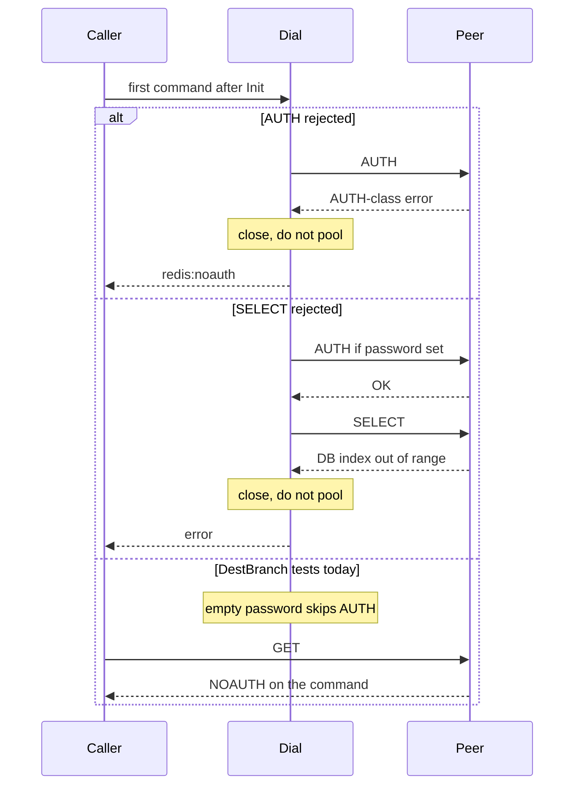

Developer review: in progress — 2026-09-11T21:20:54Z

## What this changes
**Operators.** None.

**Admin users.** None.

**Developers.** None.

**End users.** None.

## Motivation
On DestBranch, SimpleRedis already closes the socket when AUTH or SELECT fails during dial. Operators hit that path on a wrong password or a bad database index. The suite never runs those branches: `TestRejectedAuthIsReturned` Inits with an empty password, so `-NOAUTH` answers GET, and `TestAuthAndSelectOncePerDial` only covers a successful handshake.

If we do not merge the missing proof, a later change can drop `conn.close()`, pool an unauthenticated socket, or retry-storm a failed handshake, and CI will still look green. Middleware that distinguishes `redis:noauth` from Redis-down never sees the handshake route in tests.

## Merge readiness
Prepare grounded the ticket; product code versus `master` is unchanged. 2 items remain.

Priority: P3 — Spec, docs, tests, or internal clarity — no current user or operator harm
Reviewed head: 9d9109e
Owner decision: None.

## Review scores
| Measure | Result | What it means |
| --- | --- | --- |
| Overall readiness | 3/6 | CI is still running; no product apply yet |
| CI proof | 3/6 | Lint, Test, and Integration Tests in progress |
| Local tests proof | N/A | `localTests: none` (before implement; remote CI covers) |
| Review resolution | 6/6 | No open PR comments |

## Verification
| Check | Result | Evidence |
| --- | --- | --- |
| Branch | 2026-09-11-simpleredis-test-03-auth-select pushed | `git` origin |
| OpenSpec | none | `openspec/` |
| Pull request | https://github.com/david-garcia-garcia/traefik-middleware-utilities/pull/11 | pr-host List |
| CI | build 34648884660 in progress https://github.com/david-garcia-garcia/traefik-middleware-utilities/actions/runs/34648884660 | pr-host check runs |
| Local tests | none | handoff.yaml localTests |
| PR comments | no comments | no comments.md |

## Specs
None.

## Deviations from the ask
None.

## Follow-up issues
None.

## How this fits together
Local finding test-03 is on branch `2026-09-11-simpleredis-test-03-auth-select` as stub PR 11. Prepare qualified-with-gaps; CI on that head is still running.

## Explore Decisions
None.

## Before merge
- [ ] [P3] Prove AUTH and SELECT handshake failures on the in-process fake (close, empty pool, mapped error, no retry storm)
- [ ] [P3] Live proof on Redis and Dragonfly for the AUTH/SELECT cases each engine supports

## Findings
None.

## Axis review
None.

## Agent review details

### Review metrics
| Metric | Value | Why it matters |
| --- | --- | --- |
| Specs in this PR | none | Same list as ## Specs; do not paste diff --stat |
| Open reviewer comments walked | 0 FIX / 0 ANSWER / 0 open | Unanswered review is merge risk |
| Reviewed head | 9d9109e0cdbefe24936201b463b4e69858588c2d | Card must match the branch you measured |

### Stored data model
None.

### Technical review
Best possible solution: DestBranch already closes on AUTH/SELECT dial errors; this ticket only needs proof (fake plus live engines), not a new dial path.

Do we have a high-confidence way to reproduce? Yes, compiled tests skip those `dial` branches; live compose has no passworded or bad-SELECT service.

Is this the best way to solve the issue? Yes versus DestBranch: add the fake the finding specifies and live cases each engine supports, without changing production `dial` unless a test proves it wrong.

### Evidence
What I checked:
- `dial` AUTH/SELECT close-on-error (`simpleredis/simpleredis.go`, origin/master 7dc4b05)
- `TestRejectedAuthIsReturned` Inits empty pass (`simpleredis/simpleredis_test.go`)
- compose Redis/Dragonfly have no password (`docker-compose.yml`)
- PR 11 check runs in progress (build 34648884660)

### Rank-up moves
None.
