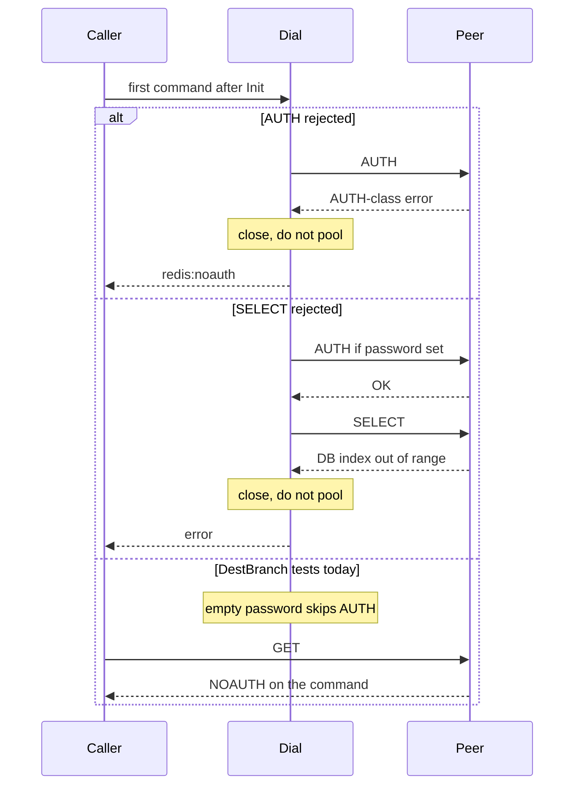

Developer review: ready for review — 2026-09-11T21:56:41Z

## What this changes
**Operators.** CI and compose start passworded Redis and Dragonfly siblings (`redis-auth` / `dragonfly-auth`; CI host ports 6381/6382) so WRONGPASS is not skip-only; unpassworded 6379/6380 and `/redis` `/dragonfly` stay.

**Admin users.** None.

**Developers.** Handshake AUTH/SELECT failure now has an in-process fake (configurable replies, hangup count), skip-if-unset live Go tests on both engines, probe `Password`/`Database`, and Pester 502 routes. Production `dial` / `replyError` / pool are unchanged.

**End users.** None.

## Motivation
On DestBranch, SimpleRedis already closes the socket when AUTH or SELECT fails during dial. Operators hit that path on a wrong password or a bad database index. The suite never ran those branches: `TestRejectedAuthIsReturned` Inits with an empty password, so `-NOAUTH` answers GET, and `TestAuthAndSelectOncePerDial` only covers a successful handshake.

If we do not merge the missing proof, a later change can drop `conn.close()`, pool an unauthenticated socket, or retry-storm a failed handshake, and CI will still look green. Middleware that distinguishes `redis:noauth` from Redis-down never sees the handshake route in tests.

## Merge readiness
Handshake AUTH/SELECT failure proof landed on the fake, live skip-if-unset Go tests, compose/Pester, and CI passworded siblings. 0 items remain.

Priority: P3 — Spec, docs, tests, or internal clarity — no current user or operator harm
Reviewed head: ab033bd
Owner decision: Required. See Explore Decisions.

## Review scores
| Measure | Result | What it means |
| --- | --- | --- |
| Overall readiness | 6/6 | CI succeeded on the implement head; no open PR comments |
| CI proof | 6/6 | Lint, Test, and Integration Tests succeeded https://github.com/david-garcia-garcia/traefik-middleware-utilities/actions/runs/34651408967 |
| Local tests proof | N/A | `localTests: passed` (remote CI covers) |
| Review resolution | 6/6 | No open PR comments |

## Verification
| Check | Result | Evidence |
| --- | --- | --- |
| Branch | 2026-09-11-simpleredis-test-03-auth-select pushed | `git` origin |
| OpenSpec | simpleredis-test-03-auth-select | `openspec/` |
| Pull request | https://github.com/david-garcia-garcia/traefik-middleware-utilities/pull/11 | pr-host List |
| CI | build 34651408967 success https://github.com/david-garcia-garcia/traefik-middleware-utilities/actions/runs/34651408967 | pr-host check runs |
| Local tests | passed | handoff.yaml localTests |
| PR comments | no comments | no comments.md |

## Specs
- [std_go_simpleredis_tcp-session](https://github.com/david-garcia-garcia/traefik-middleware-utilities/blob/2026-09-11-simpleredis-test-03-auth-select/openspec/changes/simpleredis-test-03-auth-select/proposal.md) — modified
- [std_go_simpleredis_resp-commands](https://github.com/david-garcia-garcia/traefik-middleware-utilities/blob/2026-09-11-simpleredis-test-03-auth-select/openspec/changes/simpleredis-test-03-auth-select/proposal.md) — modified

## Deviations from the ask
None.

## Follow-up issues
None.

## How this fits together
Local finding test-03 is on branch `2026-09-11-simpleredis-test-03-auth-select` as stub PR 11. Implement applied handshake-failure proof; CI on head ab033bd succeeded.

## Explore Decisions
| Question | Rank | Decision | By |
| --- | --- | --- | --- |
| How does the fake observe that the client closed the socket? | additive asked | assumed — count serve-loop exit (EOF after `pooledConn.close`); assert it plus empty `idle`. | explore |
| How to add a passworded live service without breaking no-password `/redis` and `/dragonfly`? | additive asked | assumed — sibling `redis-auth` / `dragonfly-auth` plus probe `Password`/`Database`; existing services and success Pester unchanged. | explore |
| Should Go live tests use extra CI requirepass services or only Pester? | additive asked | assumed — both: Pester on compose siblings, and extra CI passworded services so `go test` WRONGPASS is not skip-only. SELECT 99 uses the existing unpassworded CI services. | explore |
| Rename `TestRejectedAuthIsReturned` now that it is not handshake coverage? | additive incidental | assumed — keep the name; add new handshake test names that say AUTH/SELECT failure. | explore |

## Before merge
- [x] [P3] Prove AUTH and SELECT handshake failures on the in-process fake (close, empty pool, mapped error, no retry storm)
- [x] [P3] Live proof on Redis and Dragonfly for the AUTH/SELECT cases each engine supports

## Findings
None.

## Axis review
None.

## Agent review details

### Review metrics
| Metric | Value | Why it matters |
| --- | --- | --- |
| Specs in this PR | 0 added / 2 modified | Same list as ## Specs; do not paste diff --stat |
| Open reviewer comments walked | 0 FIX / 0 ANSWER / 0 open | Unanswered review is merge risk |
| Reviewed head | ab033bd53cb860fbb6d03e3b4a4aef4a8fd17488 | Card must match the branch you measured |

### Stored data model
None.

### Technical review
Best possible solution: DestBranch already closes on AUTH/SELECT dial errors; this apply adds the missing proof (fake plus live Redis and Dragonfly) without a new dial path.

Do we have a high-confidence way to reproduce? Yes — compiled fake tests hit `dial` AUTH/SELECT error blocks (cover counts 4 and 1); CI live engines ran SELECT 99 and WRONGPASS on both backends.

Is this the best way to solve the issue? Yes versus DestBranch: add the fake the finding specifies and live cases each engine supports, without changing production `dial` unless a test proves it wrong.

### Evidence
What I checked:
- `go test ./...` passed locally (HEAD ab033bd); live tests skip-if-unset on this host
- `dial` cover blocks `277.85,280.4` count 4 and `283.91,286.4` count 1 (`go test -covermode=count`)
- `openspec validate simpleredis-test-03-auth-select --strict` valid
- PR 11 check runs succeeded (build 34651408967): Lint, Test, Integration Tests

### Rank-up moves
None.
