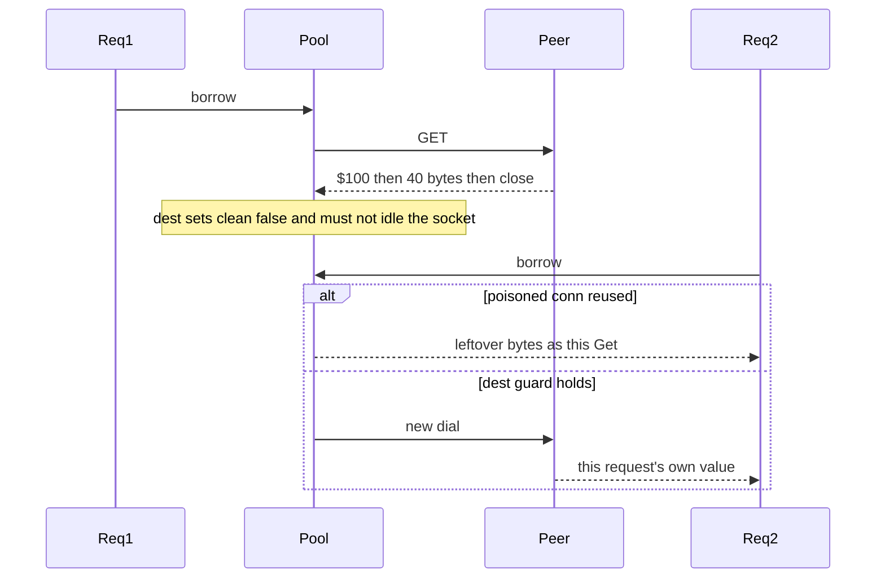

Developer review: in progress — 2026-09-11T21:38:30Z

## What this changes
**Operators.** None.

**Admin users.** None.

**Developers.** OpenSpec change `simpleredis-truncated-bulk` folds dirty-conn pool discard into `std_go_simpleredis_tcp-session` and unique live Get/MGet into `std_go_simpleredis_resp-commands`. Research packet `ext_redis_resp_bulk-string` records that a truncated bulk is a transport fake. Product tests are not applied yet.

**End users.** None.

## Motivation
SimpleRedis Get and MGet decode Redis bulk strings on a pooled TCP socket. Dest already treats a short `io.ReadFull` as an unusable stream and closes that socket instead of returning it to the idle list. The `ReadFull` fail block (`401.52,403.3`) still has coverage count 0.

On dest, a peer that announces `$100` and dies after 40 bytes leaves the reader mid-payload. If that socket were reused, the next Get or MGet would treat leftover bytes as its own reply. Today's compiled tests still pass if `readBulk` starts reporting that stream as clean. A throwaway truncated Get on dest already returned `redis:unreachable` with idle empty; the missing work is the committed invariant, not a decoder rewrite.

Live `/redis` and `/dragonfly` Set the constant `"ok"`, so a swapped key would still look correct. Not merging leaves the pool-discard guard as a code-review invariant and the live own-value check vacuous.

## Merge readiness
Propose is written; product tests are not applied. 4 items remain.

Priority: P3 — spec, docs, tests, or internal clarity — no current user or operator harm
Reviewed head: 8e8ed31
Owner decision: Required. See Explore Decisions.

## Review scores
| Measure | Result | What it means |
| --- | --- | --- |
| Overall readiness | 3/6 | Propose done; CI in progress; no product apply yet |
| CI proof | 3/6 | in progress — [run 34650279616](https://github.com/david-garcia-garcia/traefik-middleware-utilities/actions/runs/34650279616) |
| Local tests proof | N/A | `localTests: none`; remote PR uses CI |
| Review resolution | 6/6 | OPEN PR, no reviewer comments |

## Verification
| Check | Result | Evidence |
| --- | --- | --- |
| Branch | 2026-09-11-simpleredis-test-04-truncated-bulk pushed | `git` / origin |
| OpenSpec | simpleredis-truncated-bulk | `openspec/changes/simpleredis-truncated-bulk/` |
| Pull request | https://github.com/david-garcia-garcia/traefik-middleware-utilities/pull/19 | pr-host List |
| CI | build 34650279616 in progress https://github.com/david-garcia-garcia/traefik-middleware-utilities/actions/runs/34650279616 | GitHub check runs Test, Lint, Integration Tests |
| Local tests | none | handoff.yaml localTests |
| PR comments | no comments | no comments.md |

## Specs
- [std_go_simpleredis_tcp-session](https://github.com/david-garcia-garcia/traefik-middleware-utilities/blob/2026-09-11-simpleredis-test-04-truncated-bulk/openspec/changes/simpleredis-truncated-bulk/proposal.md) — modified
- [std_go_simpleredis_resp-commands](https://github.com/david-garcia-garcia/traefik-middleware-utilities/blob/2026-09-11-simpleredis-test-04-truncated-bulk/openspec/changes/simpleredis-truncated-bulk/proposal.md) — modified

## Deviations from the ask
- taken: extend compose plus Pester `/redis` `/dragonfly` → keep dest `whoami-redis` / `whoami-dragonfly` and image pins; extend probe payload and Pester assertions only — `docker-compose.yml` — dest already wires both engines on those routes. Requester: not asked.

## Follow-up issues
None.

## How this fits together
Local test-04 finding → branch `2026-09-11-simpleredis-test-04-truncated-bulk` → stub PR 19 → OpenSpec `simpleredis-truncated-bulk` proposed; CI in progress.

## Explore Decisions
| Question | Rank | Decision | By |
| --- | --- | --- | --- |
| Can live Redis or Dragonfly announce `$100` and close after 40 bytes so truncated/`clean == false` is an e2e test? | additive asked | assumed — no. Official RESP is complete values (`ext_redis_resp_bulk-string`). Truncate stays unit-only on the raw-reply fake. Live engines prove Get/MGet own-value only. No new compose proxy. | explore |
| Is compose “extend” new services/routes or new assertions on `/redis` and `/dragonfly`? | additive asked | assumed — existing `whoami-redis` / `whoami-dragonfly` and image pins stay. New Pester assertions (and probe payload) only. | explore |
| How far must Pester go past today’s unique-key Get/MGet `"ok"` to prove the caller’s own value? | bounded asked | assumed — Set the per-request prefix as the payload; Pester requires Value == that token and MGet == Value; two overlapping GETs per route with distinct tokens. Do not add routes. | explore |
| What fake covers truncated bytes without changing `startStaticRedis`? | additive asked | assumed — new helper in `simpleredis_test.go` only. First Accept truncates; later Accepts return a complete bulk. Malformed complete lines may use that helper or `startStaticRedis`; both assert `len(idle)==0`. | explore |
| Is `len(idle)==0` still required if the second Get already returns the right key? | additive asked | assumed — yes. `exec` retries a dead reused socket, so a second Get can succeed even if the dirty conn was pooled. Idle==0 after the failed call is the anti-corruption assert; the second Get proves the client still dials a clean socket. | explore |
| Do dest `readBulk` / `do` / `release` need a production change? | additive asked | assumed — no. Throwaway truncated Get on dest: `redis:unreachable`, idle 0, second Get `hello`. Implement lands tests; edit production only if those tests fail. | explore |
| Coverage block ids `401.52,403.3` will move if `readBulk` is edited — what is the proof? | additive asked | assumed — invariant tests are the proof. After implement, measure that `401.52,403.3` (or the new id of the `ReadFull` fail block) is non-zero. Do not treat a hardcoded dest id as the only assertion. | explore |
| How is `readBulk`’s non-`$` head (`390-392`) covered when `readReply` only calls it for `$`? | additive asked | assumed — same-package test calls `readBulk` with a non-`$` head and expects `redis:issue?`. Do not widen `readReply`. `$abc\r\n` covers the unparseable-length branch via Get. | explore |
| Which spec leaves take the dirty-conn and live own-value requirements? | additive asked | assumed — fold into `std_go_simpleredis_tcp-session` (dirty reply not idle-pooled) and `std_go_simpleredis_resp-commands` (Pester unique own-value). No new spec folder. No rename. | explore |

## Before merge
- [ ] [P3] Unit-test truncated bulk (`$100` / 40 bytes / close): `redis:unreachable`, idle empty, second command returns its own key's value
- [ ] [P3] Unit-test malformed bulk header `$abc` and a non-`$`/:`/+` array element: `redis:issue?`, nothing pooled
- [ ] [P3] Live Get/MGet on Redis and Dragonfly still return the caller's own unique value; Pester `/redis` `/dragonfly` (existing routes)
- [ ] [P3] Any Lua in this change stays 5.1-safe with declared KEYS (Dragonfly)
- [x] Stub PR 19 opened from `origin/master`
- [x] Explore recorded (`devstate/.../explore.md`)
- [x] OpenSpec `simpleredis-truncated-bulk` proposed (tcp-session + resp-commands)

## Findings
None.

## Axis review
None.

## Agent review details

### Review metrics
| Metric | Value | Why it matters |
| --- | --- | --- |
| Specs in this PR | 0 added / 2 modified | Same list as ## Specs |
| Open reviewer comments walked | 0 FIX / 0 ANSWER / 0 open | Unanswered review is merge risk |
| Reviewed head | 8e8ed31407b5f8dcf319bbab8c21f0a70ca83596 | Card must match the branch you measured |

### Stored data model
None.

### Technical review
Best possible solution: keep dest `clean == false` on short read and prove it with a mid-stream fake plus `len(idle)==0`; live Get/MGet own-value uses a unique payload on existing `/redis` and `/dragonfly` — do not rewrite the decoder or `exec` retry first.

Do we have a high-confidence way to reproduce? Yes — throwaway truncated Get on dest returned `redis:unreachable`, idle 0, second Get `hello`; dest `startStaticRedis` cannot express that.

Is this the best way to solve the issue? Yes versus dest: the finding is a missing test, dest already has the pool-destroy path, and `exec` retry means idle==0 is the load-bearing assert.

### Evidence
What I checked:
- OpenSpec change `simpleredis-truncated-bulk` (proposal, two folded deltas, design, tasks) at HEAD `8e8ed31`
- FindSpecHost fold `std_go_simpleredis_tcp-session` and `std_go_simpleredis_resp-commands`; `openspec validate` strict OK; MCP `validate_artifact_names` / `validate_spec_map` OK
- `handoff.yaml` `change: simpleredis-truncated-bulk`; `devstate/.../specs.md` written
- GitHub whoami `david-garcia-garcia` / David; PR 19 OPEN; checks in progress on SHA `8e8ed31` run 34650279616

### Rank-up moves
None.
