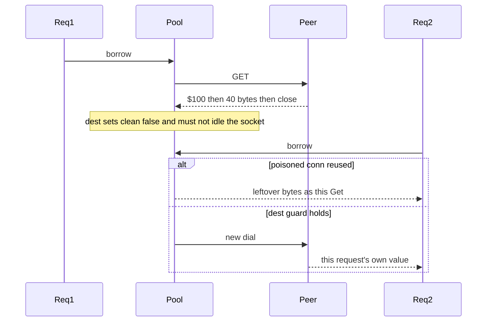

Developer review: in progress — 2026-09-11T21:21:31Z

## What this changes
**Operators.** None.

**Admin users.** None.

**Developers.** None versus `master` in product code. Prepare grounded the truncated-bulk / `clean == false` coverage ticket; tests are not on the branch yet.

**End users.** None.

## Motivation
SimpleRedis Get and MGet decode Redis bulk strings on a pooled TCP socket. Dest already treats a short read as an unusable stream (`clean == false`) and closes that socket instead of returning it to the idle list. Nothing executes that branch.

On dest, a peer that announces `$100` and dies after 40 bytes leaves the reader mid-payload. If that socket were reused, the next Get or MGet would treat the leftover bytes as its own reply — one tenant's cached value, session token, or rate-limit verdict served to another. Today's tests still pass if `readBulk` starts reporting that stream as clean.

Not merging leaves that leak as a code-review invariant only. The same Get/MGet own-value check has to hold on live Redis and live Dragonfly; dest already routes `/redis` and `/dragonfly`, but the truncated-payload unit path is still missing.

## Merge readiness
Prepare is done; product tests are not on the branch yet. 4 items remain.

Priority: P3 — spec, docs, tests, or internal clarity — no current user or operator harm
Reviewed head: c87bb80
Owner decision: None.

## Review scores
| Measure | Result | What it means |
| --- | --- | --- |
| Overall readiness | 3/6 | CI still running; no product apply yet |
| CI proof | 3/6 | queued — [run 34648941801](https://github.com/david-garcia-garcia/traefik-middleware-utilities/actions/runs/34648941801) |
| Local tests proof | N/A | `localTests: none`; remote PR uses CI |
| Review resolution | 6/6 | OPEN PR, no reviewer comments |

## Verification
| Check | Result | Evidence |
| --- | --- | --- |
| Branch | 2026-09-11-simpleredis-test-04-truncated-bulk pushed | `git` / origin |
| OpenSpec | none | `openspec/` |
| Pull request | https://github.com/david-garcia-garcia/traefik-middleware-utilities/pull/19 | pr-host List |
| CI | build 34648941801 queued https://github.com/david-garcia-garcia/traefik-middleware-utilities/actions/runs/34648941801 | GitHub check runs |
| Local tests | none | handoff.yaml localTests |
| PR comments | no comments | no comments.md |

## Specs
None.

## Deviations from the ask
None.

## Follow-up issues
None.

## How this fits together
Local test-04 finding → branch `2026-09-11-simpleredis-test-04-truncated-bulk` → stub PR 19 → CI queued on the empty product delta.

## Explore Decisions
None.

## Before merge
- [ ] [P3] Unit-test truncated bulk (`$100` / 40 bytes / close): `redis:unreachable`, idle empty, second command returns its own key's value
- [ ] [P3] Unit-test malformed bulk header `$abc` and a non-`$`/:`/+` array element: `redis:issue?`, nothing pooled
- [ ] [P3] Live Get/MGet on Redis and Dragonfly still return the caller's own value; extend compose + Pester `/redis` `/dragonfly`
- [ ] [P3] Any Lua in this change stays 5.1-safe with declared KEYS (Dragonfly)
- [x] Stub PR 19 opened from `origin/master`

## Findings
None.

## Axis review
None.

## Agent review details

### Review metrics
| Metric | Value | Why it matters |
| --- | --- | --- |
| Specs in this PR | none | Same list as ## Specs |
| Open reviewer comments walked | 0 FIX / 0 ANSWER / 0 open | Unanswered review is merge risk |
| Reviewed head | c87bb8041507560cd693cde855d3f3913c099e89 | Card must match the branch you measured |

### Stored data model
None.

### Technical review
Best possible solution: keep dest `clean == false` on short read and prove it with a mid-stream fake, plus live Get/MGet own-value on Redis and Dragonfly — do not rewrite the decoder first.

Do we have a high-confidence way to reproduce? Yes — a fake that announces `$100`, writes 40 bytes, and closes; dest `startStaticRedis` cannot do that.

Is this the best way to solve the issue? Yes versus dest: the finding is a missing test, and dest already has the pool-destroy path.

### Evidence
What I checked:
- `readBulk` short-read and header branches, `do` `clean` handling, `release` (`simpleredis/simpleredis.go`, dest `7dc4b05`)
- `startStaticRedis` always writes a full canned reply (`simpleredis/simpleredis_test.go`)
- Compose `/redis` `/dragonfly` and Pester verb echo already exist (`docker-compose.yml`, `scripts/integration-tests.Tests.ps1`)
- Probe Get/MGet uses a per-request key; Eval script already KEYS + Lua 5.1 (`e2e/simpleredisprobe/plugin.go`)
- Research consumed: `knowledge/research/ext_redis_eval/notes.md`, `knowledge/research/ext_dragonfly_eval/notes.md`, `knowledge/research/ext_dragonfly_container-image/notes.md`
- GitHub whoami `david-garcia-garcia` / David; PR 19 OPEN; checks queued on SHA `c87bb80`

### Rank-up moves
None.
