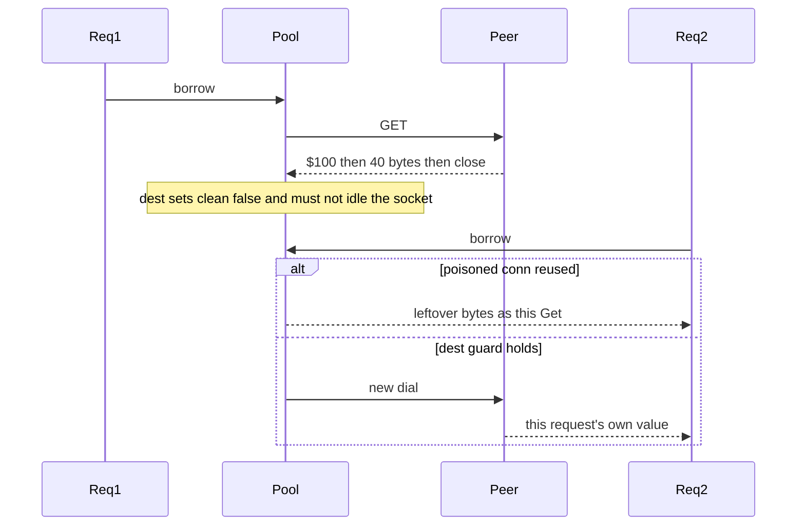

Developer review: ready for review — 2026-09-11T21:59:13Z

## What this changes
**Operators.** None.

**Admin users.** None.

**Developers.** Unit tests prove a truncated bulk (`$100` then 40 bytes then close) is `redis:unreachable` and not idle-pooled, a later Get returns that key's own bytes, and `$abc` / illegal array heads are `redis:issue?` with nothing pooled. Live probe Set/Get/MGet store the per-request prefix (not `"ok"`); Pester `/redis` and `/dragonfly` require Value == that token, MGet == Value, and two overlapping requests with distinct tokens. Dest `kongIncrbyExpireatScript` is unchanged (Lua 5.1, `KEYS[1]`). `simpleredis.go` was not edited.

**End users.** None.

## Motivation
SimpleRedis Get and MGet decode Redis bulk strings on a pooled TCP socket. Dest already treats a short `io.ReadFull` as an unusable stream and closes that socket instead of returning it to the idle list. Until this PR, the `ReadFull` fail block (`401.52,403.3`) had coverage count 0, and live `/redis` / `/dragonfly` Set the constant `"ok"`.

On dest, a peer that announces `$100` and dies after 40 bytes leaves the reader mid-payload. If that socket were reused, the next Get or MGet would treat leftover bytes as its own reply. Compiled tests still passed if `readBulk` started reporting that stream as clean. Live `"ok"` made a swapped key look correct.

Not merging leaves the pool-discard guard as an untested code-review invariant and the live own-value check vacuous.

## Merge readiness
Implement applied; Lint, Test, and Integration Tests succeeded. 0 items remain.

Priority: P3 — spec, docs, tests, or internal clarity — no current user or operator harm
Reviewed head: 3ee4169
Owner decision: Required. See Explore Decisions.

## Review scores
| Measure | Result | What it means |
| --- | --- | --- |
| Overall readiness | 6/6 | Ready |
| CI proof | 6/6 | succeeded — [run 34651721384](https://github.com/david-garcia-garcia/traefik-middleware-utilities/actions/runs/34651721384) |
| Local tests proof | N/A | `localTests: passed`; remote PR uses CI |
| Review resolution | 6/6 | OPEN PR, no reviewer comments |

## Verification
| Check | Result | Evidence |
| --- | --- | --- |
| Branch | 2026-09-11-simpleredis-test-04-truncated-bulk pushed | `git` / origin |
| OpenSpec | simpleredis-truncated-bulk | `openspec/changes/simpleredis-truncated-bulk/` |
| Pull request | https://github.com/david-garcia-garcia/traefik-middleware-utilities/pull/19 | pr-host List |
| CI | build 34651721384 succeeded https://github.com/david-garcia-garcia/traefik-middleware-utilities/actions/runs/34651721384 | Lint success, Test success, Integration Tests success |
| Local tests | passed | handoff.yaml localTests |
| PR comments | no comments | no comments.md |

## Specs
- [std_go_simpleredis_tcp-session](https://github.com/david-garcia-garcia/traefik-middleware-utilities/blob/2026-09-11-simpleredis-test-04-truncated-bulk/openspec/changes/simpleredis-truncated-bulk/proposal.md) — modified
- [std_go_simpleredis_resp-commands](https://github.com/david-garcia-garcia/traefik-middleware-utilities/blob/2026-09-11-simpleredis-test-04-truncated-bulk/openspec/changes/simpleredis-truncated-bulk/proposal.md) — modified

## Deviations from the ask
- taken: extend compose plus Pester `/redis` `/dragonfly` → keep dest `whoami-redis` / `whoami-dragonfly` and image pins; extend probe payload and Pester assertions only — `docker-compose.yml` — dest already wires both engines on those routes. Requester: not asked.

## Follow-up issues
None.

## How this fits together
Local test-04 finding → branch `2026-09-11-simpleredis-test-04-truncated-bulk` → PR 19 → OpenSpec `simpleredis-truncated-bulk` applied; CI run 34651721384 succeeded.

## Explore Decisions
| Question | Rank | Decision | By |
| --- | --- | --- | --- |
| Can live Redis or Dragonfly announce `$100` and close after 40 bytes so truncated/`clean == false` is an e2e test? | additive asked | assumed — no. Official RESP is complete values (`ext_redis_resp_bulk-string`). Truncate stays unit-only on the raw-reply fake. Live engines prove Get/MGet own-value only. No new compose proxy. | explore |
| Is compose “extend” new services/routes or new assertions on `/redis` and `/dragonfly`? | additive asked | assumed — existing `whoami-redis` / `whoami-dragonfly` and image pins stay. New Pester assertions (and probe payload) only. | explore |
| How far must Pester go past today’s unique-key Get/MGet `"ok"` to prove the caller’s own value? | bounded asked | assumed — Set the per-request prefix as the payload; Pester requires Value == that token and MGet == Value; two overlapping GETs per route with distinct tokens. Do not add routes. | explore |
| What fake covers truncated bytes without changing `startStaticRedis`? | additive asked | assumed — new helper in `simpleredis_test.go` only. First Accept truncates; later Accepts return a complete bulk. Malformed complete lines may use that helper or `startStaticRedis`; both assert `len(idle)==0`. | explore |
| Is `len(idle)==0` still required if the second Get already returns the right key? | additive asked | assumed — yes. `exec` retries a dead reused socket, so a second Get can succeed even if the dirty conn was pooled. Idle==0 after the failed call is the anti-corruption assert; the second Get proves the client still dials a clean socket. | explore |
| How is `readBulk`’s non-`$` head (`390-392`) covered when `readReply` only calls it for `$`? | additive asked | assumed — same-package test calls `readBulk` with a non-`$` head and expects `redis:issue?`. Do not widen `readReply`. `$abc\r\n` covers the unparseable-length branch via Get. | explore |
| Which spec leaves take the dirty-conn and live own-value requirements? | additive asked | assumed — fold into `std_go_simpleredis_tcp-session` (dirty reply not idle-pooled) and `std_go_simpleredis_resp-commands` (Pester unique own-value). No new spec folder. No rename. | explore |

## Before merge
None.

## Findings
None.

## Axis review
None.

## Agent review details

### Review metrics
| Metric | Value | Why it matters |
| --- | --- | --- |
| Specs in this PR | 0 added / 2 modified | Same list as ## Specs |
| Open reviewer comments walked | 0 FIX / 0 ANSWER / 0 open | Unanswered review is merge risk |
| Reviewed head | 3ee4169e21d48f88639eaecce3d1163346796342 | Card must match the branch you measured |

### Stored data model
None.

### Technical review
Best possible solution: keep dest `clean == false` on short read and prove it with `startRawReplyRedis` plus `len(idle)==0`; live Get/MGet own-value uses a unique payload on existing `/redis` and `/dragonfly`.

Do we have a high-confidence way to reproduce? Yes — `go test ./simpleredis/...` truncated Get returns `redis:unreachable`, idle 0, second Get `hello`; `Test-Integration.ps1` 10/10 including overlapping `/redis` and `/dragonfly`.

Is this the best way to solve the issue? Yes versus dest: the finding is a missing test, dest already has the pool-destroy path, and `exec` retry means idle==0 is the load-bearing assert.

### Evidence
What I checked:
- `go test -timeout 2m -count=1 ./...` passed (HEAD after unit tests; reclaim/simpleredis/tokenbucket/windowcounter)
- `go test ./simpleredis -covermode=set`: `401.52,403.3` count 1 (was 0); `390.38,392.3` and `394.16,396.3` count 1
- `./Test-Integration.ps1` 10 passed / 0 failed (reclaim green; `/redis` and `/dragonfly` own-value)
- `openspec validate simpleredis-truncated-bulk --type change --strict` OK
- GitHub check runs on SHA `3ee4169`: Lint success, Test success, Integration Tests success, run 34651721384

### Rank-up moves
None.
