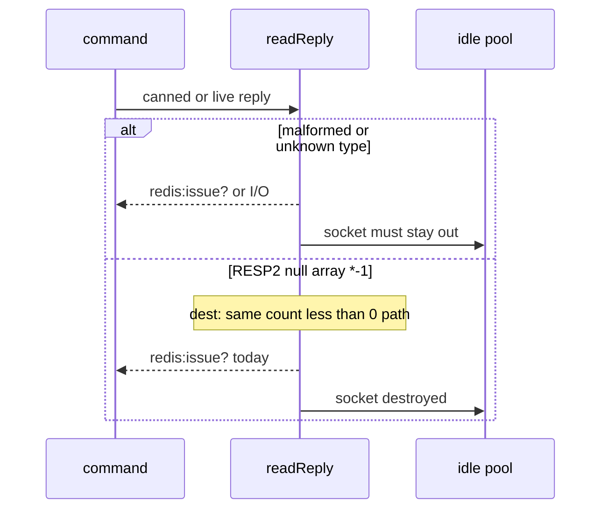

Developer review: in progress — 2026-09-11T21:22:40Z

## What this changes
**Operators.** None.

**Admin users.** None.

**Developers.** Prepare grounds test-06 (malformed RESP branches + idle hygiene). This branch adds `knowledge/research/ext_redis_resp_null-array/` (RESP2 `*-1` vs null bulk / empty array). No decoder or test code versus `master` yet.

**End users.** None.

## Motivation
On `master`, `readReply` already fails empty lines, unknown type bytes, bad array counts (including `*-1`), missing CR, and truncated array elements as `redis:issue?` and marks the socket dirty. Almost none of those branches run. Only nested-array and garbage-integer cases exist, and they do not assert the idle list is empty. A proxy, TLS-as-plaintext, or HTTP on the Redis port is how those paths actually fire.

If we do not merge the coverage, a later decoder change can ship with those failure modes unproven, and a reused poisoned connection can contaminate the next request. Live `/redis` and `/dragonfly` already prove the happy path; they do not prove the garbage path. RESP2 null array `*-1` is a legal nil reply (BLPOP timeout, EXEC abort) that dest currently treats as the same `count < 0` violation — that choice is still open.

## Merge readiness
Prepare is grounded; stub PR is open; CI is still running. 3 items remain before merge.

Priority: P3 — tests and decoder proof, no current operator or user harm
Reviewed head: 407f80c
Owner decision: None.

## Review scores
| Measure | Result | What it means |
| --- | --- | --- |
| Overall readiness | 3/6 | CI still in progress; prepare only |
| CI proof | 3/6 | Test queued, Integration Tests in progress, Lint queued |
| Local tests proof | N/A | Before implement; remote CI is the proof axis |
| Review resolution | 6/6 | No PR comments |

## Verification
| Check | Result | Evidence |
| --- | --- | --- |
| Branch | 2026-09-11-simpleredis-test-06-malformed-reply pushed | `git` / origin |
| OpenSpec | none | `openspec/` |
| Pull request | https://github.com/david-garcia-garcia/traefik-middleware-utilities/pull/24 | pr-host List/Create |
| CI | build 34649004216 in progress https://github.com/david-garcia-garcia/traefik-middleware-utilities/actions/runs/34649004216 | pr-host CI |
| Local tests | none | handoff.yaml localTests |
| PR comments | no comments | no comments.md |

## Specs
None.

## Deviations from the ask
None.

## Follow-up issues
None.

## How this fits together
Local test-06 finding → branch `2026-09-11-simpleredis-test-06-malformed-reply` → PR 24 → CI run 34649004216 still in progress.

## Explore Decisions
None.

## Before merge
- [ ] Decide RESP2 null-array (`*-1`) on explore.md (keep as `redis:issue?` + comment, or map like null bulk)
- [ ] Table-driven fake-server malformed replies with `len(idle) == 0`
- [ ] Keep live `/redis` and `/dragonfly` happy-path on both engines

## Findings
None.

## Axis review
None.

## Agent review details

### Review metrics
| Metric | Value | Why it matters |
| --- | --- | --- |
| Specs in this PR | none | Same list as ## Specs |
| Open reviewer comments walked | 0 FIX / 0 ANSWER / 0 open | Unanswered review is merge risk |
| Reviewed head | 407f80caa554f6de93329a78dc80363d8d4217a7 | Card must match the branch you measured |

### Stored data model
None.

### Technical review
Best possible solution: prepare records the coverage gap and the RESP2 null-array fact; it does not guess the `*-1` mapping.

Do we have a high-confidence way to reproduce? Yes, `startStaticRedis` canned replies in the finding, plus dest Pester `/redis` `/dragonfly`.

Is this the best way to solve the issue? Yes for this phase versus `master`: ground first, decide `*-1` in explore, then tests.

### Evidence
What I checked:
- `readReply` / `readLine` / `Get` / `parseIntegerReply` / `exec` retry-borrow on dest SHA 7dc4b05 (`simpleredis/simpleredis.go`)
- Existing malformed tests: `TestEvalNestedArrayIsIssue`, `TestIncrGarbageIntegerPayload` (`simpleredis/simpleredis_test.go`)
- Compose + Pester `/redis` `/dragonfly` already on dest
- Official RESP2 null array (`*-1`) and EXEC nil abort (`knowledge/research/ext_redis_resp_null-array/`)
- PR 24 comments empty; CI run 34649004216 pending/in progress

### Rank-up moves
None.
