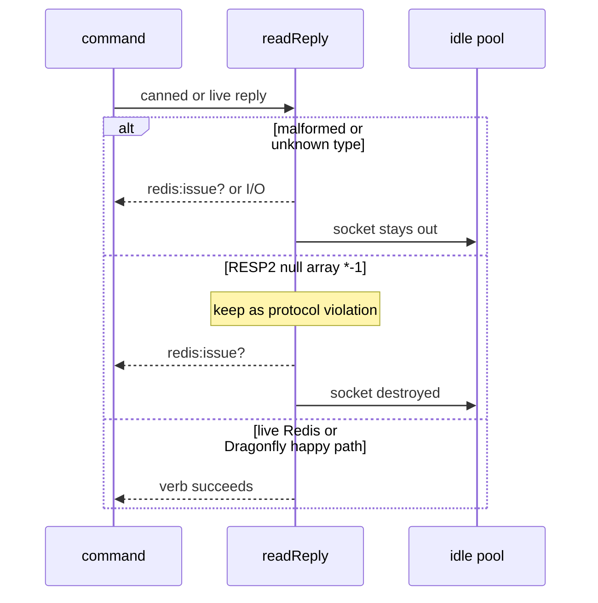

Developer review: in progress — 2026-09-11T21:40:32Z

## What this changes
**Operators.** None.

**Admin users.** None.

**Developers.** OpenSpec change `simpleredis-malformed-reply` folds dirty RESP decode (not pooled), `*-1` as `redis:issue?` not miss, Get/Incr arity, and live Get-miss on both engines into `std_go_simpleredis_resp-commands`, and adds `knowledge/research/ext_redis_resp_null-array/`. Versus `master` no decoder or test code has landed yet.

**End users.** None.

## Motivation
On `master`, SimpleRedis already treats empty lines, unknown type bytes, bad array counts (including `*-1`), missing CR, and truncated elements as `redis:issue?` and marks the socket dirty. Almost none of those branches run. Only nested-array and garbage-integer cases exist, and they do not assert the idle list is empty. A proxy, TLS-as-plaintext, or HTTP on the Redis port is how those paths actually fire.

If we do not merge the coverage, a later decoder change can ship with those failure modes unproven, and a reused poisoned connection can contaminate the next request. Live `/redis` and `/dragonfly` already prove the happy path; they do not prove Get-miss (`$-1`) beside fake `*-1` as issue. Propose pins that contract in `std_go_simpleredis_resp-commands` before the tests land.

## Merge readiness
Propose is apply-ready; stub PR is open; CI is still in progress. 2 items remain before merge.

Priority: P3 — tests and decoder proof, no current operator or user harm
Reviewed head: 8d7e884
Owner decision: Required. See Explore Decisions.

## Review scores
| Measure | Result | What it means |
| --- | --- | --- |
| Overall readiness | 3/6 | CI still in progress; propose only |
| CI proof | 3/6 | Test queued, Lint queued, Integration Tests in progress |
| Local tests proof | N/A | Before implement; remote CI is the proof axis |
| Review resolution | 6/6 | No PR comments |

## Verification
| Check | Result | Evidence |
| --- | --- | --- |
| Branch | 2026-09-11-simpleredis-test-06-malformed-reply pushed | `git` / origin |
| OpenSpec | simpleredis-malformed-reply | `openspec/` |
| Pull request | https://github.com/david-garcia-garcia/traefik-middleware-utilities/pull/24 | pr-host List/Create |
| CI | build 34650442784 in progress https://github.com/david-garcia-garcia/traefik-middleware-utilities/actions/runs/34650442784 | pr-host CI |
| Local tests | none | handoff.yaml localTests |
| PR comments | no comments | no comments.md |

## Specs
- [std_go_simpleredis_resp-commands](https://github.com/david-garcia-garcia/traefik-middleware-utilities/blob/2026-09-11-simpleredis-test-06-malformed-reply/openspec/changes/simpleredis-malformed-reply/proposal.md) — modified

## Deviations from the ask
- taken: uniform `idle==0` on `Get` / `parseIntegerReply` arity mismatch → `idle==0` only on dirty decoder rows — `simpleredis/simpleredis.go` — those checks run after a clean `readReply`. Requester: not asked.

## Follow-up issues
None.

## How this fits together
Local test-06 finding → propose `simpleredis-malformed-reply` on `2026-09-11-simpleredis-test-06-malformed-reply` → PR 24 → CI run 34650442784 still in progress.

## Explore Decisions
| Question | Rank | Decision | By |
| --- | --- | --- | --- |
| How to exercise `exec` borrow-failure on the retry attempt (`:195`) with a canned reply? | additive asked | assumed — dedicated one-accept helper (good first reply, then malformed on the reused socket, listener closed before retry dial). Expect `redis:unreachable` and `idle==0`. | propose |
| Do `Get` / `parseIntegerReply` count-mismatch rows assert `len(idle)==0` the same as decoder poison? | additive asked | assumed — cover with canned `*0` / `*2`; assert `redis:issue?`; do not assert `idle==0`. | propose |
| How do live Redis and Dragonfly stay in the proof if malformed cases are fake-server only? | additive asked | assumed — keep compose both engines and both whoami routes; extend probe + Pester with Get-miss on `/redis` and `/dragonfly`. | propose |

## Before merge
- [x] Decide RESP2 null-array (`*-1`) on explore.md — keep as `redis:issue?` + comment at `count < 0`
- [x] Propose OpenSpec change `simpleredis-malformed-reply` (fold into `std_go_simpleredis_resp-commands`)
- [ ] [P3] Table-driven fake-server malformed replies with `len(idle) == 0` on dirty rows
- [ ] [P3] Keep live `/redis` and `/dragonfly` happy-path; extend Get-miss on both engines

## Findings
None.

## Axis review
None.

## Agent review details

### Review metrics
| Metric | Value | Why it matters |
| --- | --- | --- |
| Specs in this PR | 0 added / 1 modified | Same list as ## Specs |
| Open reviewer comments walked | 0 FIX / 0 ANSWER / 0 open | Unanswered review is merge risk |
| Reviewed head | 8d7e88441a3db24302307fc89bed236bdab39752 | Card must match the branch you measured |

### Stored data model
None.

### Technical review
Best possible solution: pin `*-1` as issue (no verb receives a null array), prove poison with a fake-server table plus write-then-close truncations, and keep live Redis and Dragonfly Get-miss so a decoder change cannot ship unproven.

Do we have a high-confidence way to reproduce? Yes, `startStaticRedis` canned replies plus a write-then-close helper for truncations, plus dest Pester `/redis` `/dragonfly`.

Is this the best way to solve the issue? Yes versus `master`: specify the contract in the existing RESP-commands leaf, do not map `*-1` to `redis:miss`, and do not drop live engines.

### Evidence
What I checked:
- FindSpecHost fold into `std_go_simpleredis_resp-commands` (candidates: that leaf, `std_go_simpleredis_tcp-session`)
- `openspec validate simpleredis-malformed-reply --strict --type change` — valid
- `readReply` / `readLine` / `Get` / `parseIntegerReply` / `exec` retry-borrow (`simpleredis/simpleredis.go`)
- Official RESP2 null array (`knowledge/research/ext_redis_resp_null-array/`)
- PR 24 comments empty; CI run 34650442784 in progress (SHA 8d7e884)

### Rank-up moves
None.
