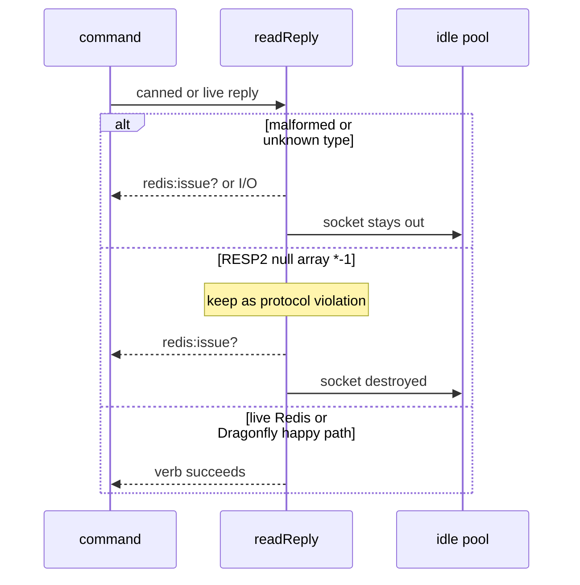

Developer review: in progress — 2026-09-11T22:18:49Z

## What this changes
**Operators.** None.

**Admin users.** None.

**Developers.** Dirty RESP decode returns `redis:issue?` or I/O and stays out of the idle pool; `*-1` stays `redis:issue?` not `redis:miss`; Get/Incr arity mismatch keeps a clean conn pooled; live Get-miss (`$-1`) is asserted on `/redis` and `/dragonfly`.

**End users.** None.

## Motivation
On `master`, SimpleRedis already treats empty lines, unknown type bytes, bad array counts (including `*-1`), missing CR, and truncated elements as `redis:issue?` and marks the socket dirty. Almost none of those branches ran. Only nested-array and garbage-integer cases existed, and they did not assert the idle list is empty. A proxy, TLS-as-plaintext, or HTTP on the Redis port is how those paths actually fire.

If we do not merge the coverage, a later decoder change can ship with those failure modes unproven, and a reused poisoned connection can contaminate the next request. Live `/redis` and `/dragonfly` already proved the happy path; they did not prove Get-miss (`$-1`) beside fake `*-1` as issue.

## Merge readiness
Usage-doc impact is none (`std_go_simpleredis` already distinguishes `*-1` from `$-1`). CI on this head is still running. 1 item remains.

Priority: P3 — tests and decoder proof, no current operator or user harm
Reviewed head: 99a8289
Owner decision: None.

## Review scores
| Measure | Result | What it means |
| --- | --- | --- |
| Overall readiness | 3/6 | CI is in progress on the reviewed head |
| CI proof | 3/6 | Lint, Test, and Integration Tests in progress |
| Local tests proof | N/A | Remote PR; CI is the proof axis |
| Review resolution | 6/6 | No PR comments |

## Verification
| Check | Result | Evidence |
| --- | --- | --- |
| Branch | 2026-09-11-simpleredis-test-06-malformed-reply pushed | `git` / origin |
| OpenSpec | simpleredis-malformed-reply | `openspec/` |
| Pull request | https://github.com/david-garcia-garcia/traefik-middleware-utilities/pull/24 | pr-host List/Create |
| CI | build 34653358963 in progress https://github.com/david-garcia-garcia/traefik-middleware-utilities/actions/runs/34653358963 | pr-host CI |
| Local tests | passed | handoff.yaml localTests |
| PR comments | no comments | no comments.md |

## Specs
- [std_go_simpleredis_resp-commands](https://github.com/david-garcia-garcia/traefik-middleware-utilities/blob/2026-09-11-simpleredis-test-06-malformed-reply/openspec/changes/simpleredis-malformed-reply/proposal.md) — modified

## Deviations from the ask
- taken: uniform `idle==0` on `Get` / `parseIntegerReply` arity mismatch → `idle==0` only on dirty decoder rows — `simpleredis/simpleredis.go` (`Get`, `parseIntegerReply`, `release`) — those checks run after a clean `readReply`. Requester: not asked.

## Follow-up issues
None.

## How this fits together
Local test-06 finding → implement `simpleredis-malformed-reply` on `2026-09-11-simpleredis-test-06-malformed-reply` → PR 24 → CI run 34653358963 in progress.

## Explore Decisions
None.

## Before merge
- [ ] CI run 34653358963 (Lint, Test, Integration Tests in progress)

## Findings
None.

## Axis review
[Standards](https://github.com/david-garcia-garcia/traefik-middleware-utilities/blob/2026-09-11-simpleredis-test-06-malformed-reply/devstate/2026/09/2026-09-11-simpleredis-test-06-malformed-reply/codereview_standards.md) — 0 total, 0 pending, 0 completed
[Nitpicks](https://github.com/david-garcia-garcia/traefik-middleware-utilities/blob/2026-09-11-simpleredis-test-06-malformed-reply/devstate/2026/09/2026-09-11-simpleredis-test-06-malformed-reply/codereview_nitpicks.md) — 0 total, 0 pending, 0 completed
[Spec](https://github.com/david-garcia-garcia/traefik-middleware-utilities/blob/2026-09-11-simpleredis-test-06-malformed-reply/devstate/2026/09/2026-09-11-simpleredis-test-06-malformed-reply/codereview_spec.md) — 0 total, 0 pending, 0 completed
[Security](https://github.com/david-garcia-garcia/traefik-middleware-utilities/blob/2026-09-11-simpleredis-test-06-malformed-reply/devstate/2026/09/2026-09-11-simpleredis-test-06-malformed-reply/codereview_security.md) — 0 total, 0 pending, 0 completed
[Performance](https://github.com/david-garcia-garcia/traefik-middleware-utilities/blob/2026-09-11-simpleredis-test-06-malformed-reply/devstate/2026/09/2026-09-11-simpleredis-test-06-malformed-reply/codereview_performance.md) — 0 total, 0 pending, 0 completed
[Dead](https://github.com/david-garcia-garcia/traefik-middleware-utilities/blob/2026-09-11-simpleredis-test-06-malformed-reply/devstate/2026/09/2026-09-11-simpleredis-test-06-malformed-reply/codereview_dead.md) — 0 total, 0 pending, 0 completed
[Test coverage](https://github.com/david-garcia-garcia/traefik-middleware-utilities/blob/2026-09-11-simpleredis-test-06-malformed-reply/devstate/2026/09/2026-09-11-simpleredis-test-06-malformed-reply/codereview_coverage.md) — 0 total, 0 pending, 0 completed

## Agent review details

### Review metrics
| Metric | Value | Why it matters |
| --- | --- | --- |
| Specs in this PR | 0 added / 1 modified | Same list as ## Specs |
| Open reviewer comments walked | 0 FIX / 0 ANSWER / 0 open | Unanswered review is merge risk |
| Reviewed head | 99a8289448aead5a1bac1fd769aaa6d6ef90de99 | Card must match the branch you measured |

### Stored data model
None.

### Technical review
Best possible solution: pin `*-1` as issue (no verb receives a null array), prove poison with a fake-server table plus write-then-close truncations, and keep live Redis and Dragonfly Get-miss so a decoder change cannot ship unproven.

Do we have a high-confidence way to reproduce? Yes, table-driven `startStaticRedis` plus write-then-close truncations, a one-accept retry-borrow helper, and CI Pester `/redis` `/dragonfly`.

Is this the best way to solve the issue? Yes versus `master`: keep dest `count < 0` as issue, do not map `*-1` to `redis:miss`, and do not drop live engines.

### Evidence
What I checked:
- Pin `origin/master` `7dc4b051888d857869b4beb53cdd9579f930d3c1`; three-dot product diff excluding `devstate/` and `.cursor/`
- Usage packet `knowledge/devdocs/std_go_simpleredis.md` already has the `*-1` vs `$-1` Gotcha; Language has SimpleRedis; findings none
- Seven-axis review: all axes `none.`
- PR 24 comments: none
- CI run 34653358963 in progress on 99a8289 (Lint, Test, Integration Tests); prior head fcdc1c1 Test failed (run 34653054907)

### Rank-up moves
None.
