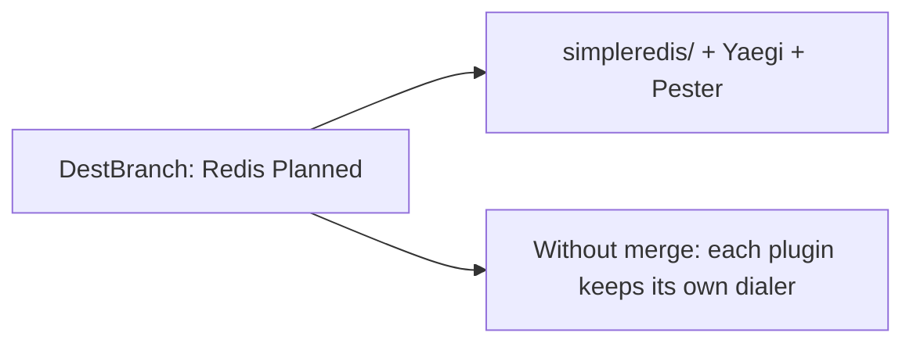

Developer review: in progress — 2026-09-11T09:04:43Z

## What this changes
**Operators.** E2e compose runs `redis:7-alpine` at `redis:6379` plus `whoami-redis` on `/redis` on `reclaim-e2e` (ports 8000/8080 unchanged).

**Admin users.** None.

**Developers.** Package `simpleredis/` is a copied stdlib RESP client with Yaegi tests, `e2e/simpleredisprobe`, and OpenSpec `add-simpleredis`. Code review applied comment/test hards; skipped renaming copied `do`, rewriting retry, and capping in-flight dials.

**End users.** None.

## Motivation
DestBranch had no Redis client. Without this PR each middleware keeps a private RESP dialer and there is no Yaegi/Traefik proof for SimpleRedis.

## Merge readiness
Seven-axis review is recorded. Archive and ready PR title remain. 1 item remains.

Priority: P3 — missing planned library; no production harm today
Reviewed head: 73cdb00
Owner decision: Required. See Explore Decisions.

## Review scores
| Measure | Result | What it means |
| --- | --- | --- |
| Overall readiness | 3/6 | CI on the review-fix push still in progress |
| CI proof | 3/6 | Lint, Test, Integration Tests in progress — https://github.com/david-garcia-garcia/traefik-middleware-utilities/actions/runs/34582322122 |
| Local tests proof | N/A | `localTests: passed`; remote CI is the proof axis |
| Review resolution | 6/6 | OPEN PR #3, no review comments |

## Verification
| Check | Result | Evidence |
| --- | --- | --- |
| Branch | 2026-09-11-simpleredis pushed | `git` @ 73cdb00 |
| OpenSpec | add-simpleredis | `openspec/changes/add-simpleredis/` |
| Pull request | https://github.com/david-garcia-garcia/traefik-middleware-utilities/pull/3 | GitHub MCP |
| CI | build 34582322122 in progress https://github.com/david-garcia-garcia/traefik-middleware-utilities/actions/runs/34582322122 | GitHub check runs |
| Local tests | passed | handoff.yaml |
| PR comments | no comments | comments: none |

## Specs
- [std_go_simpleredis_tcp-session](https://github.com/david-garcia-garcia/traefik-middleware-utilities/blob/2026-09-11-simpleredis/openspec/changes/add-simpleredis/proposal.md) — added
- [std_go_simpleredis_resp-commands](https://github.com/david-garcia-garcia/traefik-middleware-utilities/blob/2026-09-11-simpleredis/openspec/changes/add-simpleredis/proposal.md) — added

## Deviations from the ask
- taken: README Planned Redis connection under `redis/` → folder and import `simpleredis/` — `README.md` — dest sibling `reclaim/` kept folder=package. Requester: not asked.

## Follow-up issues
- [ ] [Rename compose project `reclaim-e2e` to a harness name](https://github.com/david-garcia-garcia/traefik-middleware-utilities/blob/2026-09-11-simpleredis/knowledge/debt/2026-09-11-rename-reclaim-e2e-compose.md) — compose project `reclaim-e2e` will also host the Redis probe after this change.
- [ ] [Choose a product LICENSE for dest](https://github.com/david-garcia-garcia/traefik-middleware-utilities/blob/2026-09-11-simpleredis/knowledge/debt/2026-09-11-choose-product-license.md) — dest has no root LICENSE while this change adds Apache-2.0 files under `simpleredis/`.

## How this fits together
Local ticket 2026-09-11-simpleredis is the branch and stub PR into master. Code review closed hard findings that did not reshape the copied client; archive is next.

## Explore Decisions
| Question | Rank | Decision | By |
| --- | --- | --- | --- |
| Folder and import last segment — README `redis/` vs source package `simpleredis`? | additive asked | assumed — `simpleredis/` and `package simpleredis`. | explore |
| Ticket names simpleredis vs README “Redis connection” under `redis/`? | additive asked | assumed — Libraries title SimpleRedis; Status Current. | explore |
| Does the host plugin share the reclaim compose project or get its own stack/ports? | additive asked | assumed — share `reclaim-e2e`. | explore |
| Is e2e Redis a compose `redis` container or a fake like `startFakeRedis`? | additive asked | assumed — compose `redis:7-alpine` at `redis:6379`. | explore |
| How does Apache-2.0 attribution land given dest has no root LICENSE? | additive incidental | assumed — package-local `simpleredis/LICENSE`. | explore |
| Does `Test-Integration.ps1` stay one script for both libraries or split? | additive asked | assumed — one runner and one Pester file. | explore |
| What is the fake middleware shape for Redis Yaegi e2e? | additive asked | assumed — nested `e2e/simpleredisprobe`. | explore |
| Where do Yaegi interpreter tests live? | additive asked | assumed — `simpleredis/yaegi_test.go`. | explore |

## Before merge
- [ ] Archive `add-simpleredis` and drop WIP from PR #3 [P3]
- [x] Seven-axis review (hard comments/tests applied; copied-client hards skipped)
- [x] Land SimpleRedis, Yaegi tests, Redis host plugin, Pester e2e
- [x] Stub PR #3 opened into master

## Findings
None.

## Axis review
[Standards](https://github.com/david-garcia-garcia/traefik-middleware-utilities/blob/2026-09-11-simpleredis/devstate/2026/09/2026-09-11-simpleredis/codereview_standards.md) — 4 total, 0 pending, 4 completed
[Nitpicks](https://github.com/david-garcia-garcia/traefik-middleware-utilities/blob/2026-09-11-simpleredis/devstate/2026/09/2026-09-11-simpleredis/codereview_nitpicks.md) — 3 total, 0 pending, 1 completed, 2 skipped
[Spec](https://github.com/david-garcia-garcia/traefik-middleware-utilities/blob/2026-09-11-simpleredis/devstate/2026/09/2026-09-11-simpleredis/codereview_spec.md) — 0 total, 0 pending, 0 completed
[Security](https://github.com/david-garcia-garcia/traefik-middleware-utilities/blob/2026-09-11-simpleredis/devstate/2026/09/2026-09-11-simpleredis/codereview_security.md) — 0 total, 0 pending, 0 completed
[Performance](https://github.com/david-garcia-garcia/traefik-middleware-utilities/blob/2026-09-11-simpleredis/devstate/2026/09/2026-09-11-simpleredis/codereview_performance.md) — 1 total, 0 pending, 0 completed, 1 skipped
[Dead](https://github.com/david-garcia-garcia/traefik-middleware-utilities/blob/2026-09-11-simpleredis/devstate/2026/09/2026-09-11-simpleredis/codereview_dead.md) — 0 total, 0 pending, 0 completed
[Test coverage](https://github.com/david-garcia-garcia/traefik-middleware-utilities/blob/2026-09-11-simpleredis/devstate/2026/09/2026-09-11-simpleredis/codereview_coverage.md) — 5 total, 0 pending, 4 completed, 1 skipped

## Agent review details

### Review metrics
| Metric | Value | Why it matters |
| --- | --- | --- |
| Specs in this PR | 2 added / 0 modified | Same list as ## Specs |
| Open reviewer comments walked | 0 FIX / 0 ANSWER / 0 open | Unanswered review is merge risk |
| Reviewed head | 73cdb005e098f82340473bc50918aec47e20ff3f | Card must match the branch you measured |

### Stored data model
- New: Redis keys written by `e2e/simpleredisprobe` (probe SET/GET `simpleredisprobe`).

### Technical review
Best possible solution: Keep the copied SimpleRedis contract; prove it under Yaegi and Traefik; do not add a max-open the source never had.

Do we have a high-confidence way to reproduce? Yes — `go test ./simpleredis/...` and prior Integration success on 34581091629.

Is this the best way to solve the issue? Yes versus DestBranch.

### Evidence
What I checked:
- Seven axis files under the run root (HEAD 73cdb00)
- `go test ./simpleredis/...` passed after review-fix 0d90461
- GitHub check runs 34582322122 in progress

### Rank-up moves
None.
