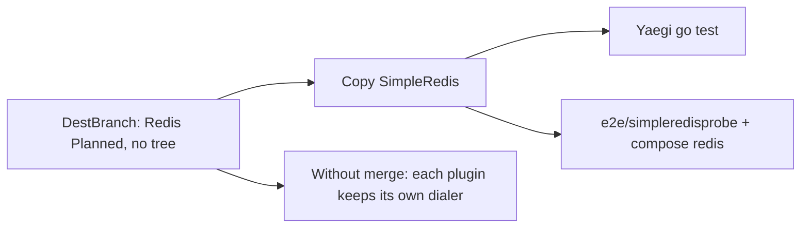

Developer review: in progress — 2026-09-11T08:23:04Z

## What this changes
**Operators.** None.

**Admin users.** None.

**Developers.** Explore landed the copy as package `simpleredis/` (not README `redis/`), with Yaegi tests beside it, a nested `e2e/simpleredisprobe`, and compose Redis on the existing reclaim harness; the library sources are not in the tree yet. Research notes and two license/harness follow-ups are on the branch.

**End users.** None.

## Motivation
DestBranch still lists Redis as Planned. Callers cannot import SimpleRedis from this module; they keep a private copy. Explore closed the folder, harness, and Redis-in-compose choices so propose can spec a copy of crowdsec `pkg/simpleredis` plus Yaegi and Pester proof.

If this PR does not land, each middleware keeps inventing a RESP client, and the Planned library never gets a Yaegi or Traefik e2e seam.

## Merge readiness
Explore decided the copy shape. OpenSpec and library sources are not written yet. 1 item remains.

Priority: P3 — missing planned library; no production harm today
Reviewed head: 12cd821
Owner decision: Required. See Explore Decisions.

## Review scores
| Measure | Result | What it means |
| --- | --- | --- |
| Overall readiness | 3/6 | Integration still in progress; no library code yet |
| CI proof | 3/6 | Lint success, Test success, Integration Tests in progress — https://github.com/david-garcia-garcia/traefik-middleware-utilities/actions/runs/34578797896 |
| Local tests proof | N/A | `localTests: none`; remote CI is the proof axis |
| Review resolution | 6/6 | OPEN PR #3, no review comments |

## Verification
| Check | Result | Evidence |
| --- | --- | --- |
| Branch | 2026-09-11-simpleredis pushed | `git` / origin/2026-09-11-simpleredis @ 12cd821 |
| OpenSpec | none | `openspec/changes/` has no live change |
| Pull request | https://github.com/david-garcia-garcia/traefik-middleware-utilities/pull/3 | GitHub MCP |
| CI | build 34578797896 in progress https://github.com/david-garcia-garcia/traefik-middleware-utilities/actions/runs/34578797896 | GitHub check runs |
| Local tests | none | handoff.yaml localTests |
| PR comments | no comments | comments: none |

## Specs
None.

## Deviations from the ask
- taken: README Planned Redis connection under `redis/` → folder and import `simpleredis/`, Libraries title SimpleRedis — `README.md` — dest sibling `reclaim/` kept folder=package; renaming the copied package would add a variation. Requester: not asked.

## Follow-up issues
- [ ] [Rename compose project `reclaim-e2e` to a harness name](https://github.com/david-garcia-garcia/traefik-middleware-utilities/blob/2026-09-11-simpleredis/knowledge/debt/2026-09-11-rename-reclaim-e2e-compose.md) — compose project `reclaim-e2e` will also host the Redis probe after this change.
- [ ] [Choose a product LICENSE for dest](https://github.com/david-garcia-garcia/traefik-middleware-utilities/blob/2026-09-11-simpleredis/knowledge/debt/2026-09-11-choose-product-license.md) — dest has no root LICENSE while this change adds Apache-2.0 files under `simpleredis/`.

## How this fits together
Local ticket 2026-09-11-simpleredis is the branch and stub PR into master. Explore decided `simpleredis/` plus shared compose Redis; propose still has to write the change specs.

## Explore Decisions
| Question | Rank | Decision | By |
| --- | --- | --- | --- |
| Folder and import last segment — README `redis/` vs source package `simpleredis`? | additive asked | assumed — `simpleredis/` and `package simpleredis`. README Layout `redis/` becomes `simpleredis/`. Do not change the package clause to `redis`. | explore |
| Ticket names simpleredis vs README “Redis connection” under `redis/`? | additive asked | assumed — Libraries title SimpleRedis (exported type); Role is the shared stdlib RESP client; Status Current. “Redis connection” was the Planned placeholder. | explore |
| Does the host plugin share the reclaim compose project or get its own stack/ports? | additive asked | assumed — share `docker-compose.yml` project `reclaim-e2e`. Add redis + `simpleredisprobe` + a whoami that is not a/b. Do not change project name, `reclaim-e2e-traefik`, ports 8000/8080, or reclaim `/a` `/b`. | explore |
| Is e2e Redis a compose `redis` container or a fake like `startFakeRedis`? | additive asked | assumed — Pester uses compose `redis:7-alpine` at `redis:6379` with no password and empty database. Copied unit tests and Yaegi go tests keep in-process fake TCP. | explore |
| How does Apache-2.0 attribution land given dest has no root LICENSE? | additive incidental | assumed — package-local `simpleredis/LICENSE`. Do not add a repo-root LICENSE. README notes the copied client is Apache-2.0. | explore |
| Does `Test-Integration.ps1` stay one script for both libraries or split? | additive asked | assumed — one `Test-Integration.ps1` and one `scripts/integration-tests.Tests.ps1`. Add Redis and `/redis` waits plus a Describe that does not stop whoami-a/b. | explore |
| What is the fake middleware shape for Redis Yaegi e2e? | additive asked | assumed — nested module `e2e/simpleredisprobe` with Traefik Config/CreateConfig/New; New Inits the client; handler SET+GET plus a response header. | explore |
| Where do Yaegi interpreter tests live? | additive asked | assumed — `simpleredis/yaegi_test.go`. GOPATH copy of non-test sources; interp stdlib only. | explore |

## Before merge
- [ ] Land the copied SimpleRedis library, Yaegi tests, Redis host plugin, and Pester e2e [P3]
- [x] Decide `simpleredis/` vs `redis/` and how e2e Redis is provided
- [x] Stub PR #3 opened into master
- [x] Crowdsec SimpleRedis researched @ `6548da47`

## Findings
None.

## Axis review
None.

## Agent review details

### Review metrics
| Metric | Value | Why it matters |
| --- | --- | --- |
| Specs in this PR | none | Same list as ## Specs |
| Open reviewer comments walked | 0 FIX / 0 ANSWER / 0 open | Unanswered review is merge risk |
| Reviewed head | 12cd821ce176cf937a4da9399a3223ee7d94f1e9 | Card must match the branch you measured |

### Stored data model
None.

### Technical review
Best possible solution: Copy the named stdlib SimpleRedis as `simpleredis/` (folder=package, same as reclaim) and prove it with dest’s Yaegi + shared-compose Pester pattern, instead of inventing a `redis/` rename DestBranch never shipped.

Do we have a high-confidence way to reproduce? Yes — dest has no `simpleredis/`; explore.md records the copy and harness decisions.

Is this the best way to solve the issue? Yes versus DestBranch: keep the copied API and dest’s e2e shape rather than a second Redis client or a second compose stack.

### Evidence
What I checked:
- `devstate/explore.md` 10 questions, none blocked (HEAD 12cd821)
- `git diff origin/master...HEAD` product paths: research + two `knowledge/debt/` notes; no library sources
- GitHub check runs on 34578797896: Lint success, Test success, Integration Tests in progress
- comments: none

### Rank-up moves
None.
