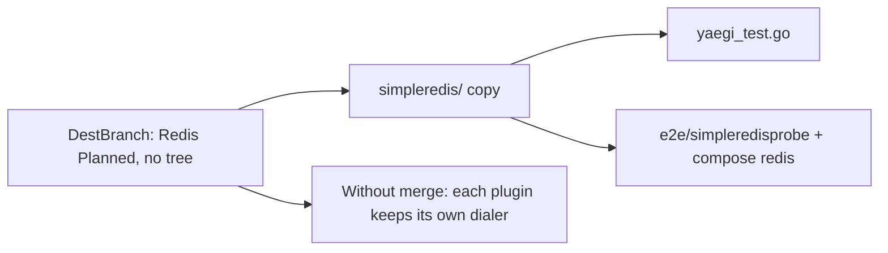

Developer review: in progress — 2026-09-11T08:51:13Z

## What this changes
**Operators.** E2e compose now runs `redis:7-alpine` at `redis:6379` (no password) plus `whoami-redis` on `/redis` on the existing `reclaim-e2e` stack (ports 8000/8080 unchanged).

**Admin users.** None.

**Developers.** Package `simpleredis/` is a copied stdlib RESP client (`Init`/`Get`/`MGet`/`Set`/`Del`/`Close`) with copied fake-TCP tests, `simpleredis/yaegi_test.go`, nested plugin `e2e/simpleredisprobe`, and OpenSpec `add-simpleredis` (`std_go_simpleredis_tcp-session`, `std_go_simpleredis_resp-commands`).

**End users.** None.

## Motivation
DestBranch listed Redis as Planned and had no client. Middleware authors could not import SimpleRedis from this module and kept private copies.

If this PR does not land, each plugin keeps inventing a RESP dialer, and there is no Yaegi or Traefik e2e seam for that client.

## Merge readiness
Library, Yaegi tests, host plugin, and Pester e2e are on the branch. Code review and archive have not run. 2 items remain.

Priority: P3 — missing planned library; no production harm today
Reviewed head: 9acc41b
Owner decision: Required. See Explore Decisions.

## Review scores
| Measure | Result | What it means |
| --- | --- | --- |
| Overall readiness | 6/6 | Lint, Test, and Integration Tests succeeded |
| CI proof | 6/6 | Lint, Test, Integration Tests success — https://github.com/david-garcia-garcia/traefik-middleware-utilities/actions/runs/34581091629 |
| Local tests proof | N/A | `localTests: passed`; remote CI is the proof axis |
| Review resolution | 6/6 | OPEN PR #3, no review comments |

## Verification
| Check | Result | Evidence |
| --- | --- | --- |
| Branch | 2026-09-11-simpleredis pushed | `git` / origin/2026-09-11-simpleredis @ 9acc41b |
| OpenSpec | add-simpleredis | `openspec/changes/add-simpleredis/` |
| Pull request | https://github.com/david-garcia-garcia/traefik-middleware-utilities/pull/3 | GitHub MCP |
| CI | build 34581091629 success https://github.com/david-garcia-garcia/traefik-middleware-utilities/actions/runs/34581091629 | GitHub check runs |
| Local tests | passed | handoff.yaml localTests |
| PR comments | no comments | comments: none |

## Specs
- [std_go_simpleredis_tcp-session](https://github.com/david-garcia-garcia/traefik-middleware-utilities/blob/2026-09-11-simpleredis/openspec/changes/add-simpleredis/proposal.md) — added
- [std_go_simpleredis_resp-commands](https://github.com/david-garcia-garcia/traefik-middleware-utilities/blob/2026-09-11-simpleredis/openspec/changes/add-simpleredis/proposal.md) — added

## Deviations from the ask
- taken: README Planned Redis connection under `redis/` → folder and import `simpleredis/`, Libraries title SimpleRedis — `README.md` — dest sibling `reclaim/` kept folder=package; renaming the copied package would add a variation. Requester: not asked.

## Follow-up issues
- [ ] [Rename compose project `reclaim-e2e` to a harness name](https://github.com/david-garcia-garcia/traefik-middleware-utilities/blob/2026-09-11-simpleredis/knowledge/debt/2026-09-11-rename-reclaim-e2e-compose.md) — compose project `reclaim-e2e` will also host the Redis probe after this change.
- [ ] [Choose a product LICENSE for dest](https://github.com/david-garcia-garcia/traefik-middleware-utilities/blob/2026-09-11-simpleredis/knowledge/debt/2026-09-11-choose-product-license.md) — dest has no root LICENSE while this change adds Apache-2.0 files under `simpleredis/`.

## How this fits together
Local ticket 2026-09-11-simpleredis is the branch and stub PR into master. Apply copied SimpleRedis and proved it under Yaegi and Traefik Pester; code review is next.

## Explore Decisions
| Question | Rank | Decision | By |
| --- | --- | --- | --- |
| Folder and import last segment — README `redis/` vs source package `simpleredis`? | additive asked | assumed — `simpleredis/` and `package simpleredis`. | explore |
| Ticket names simpleredis vs README “Redis connection” under `redis/`? | additive asked | assumed — Libraries title SimpleRedis; Status Current. | explore |
| Does the host plugin share the reclaim compose project or get its own stack/ports? | additive asked | assumed — share `reclaim-e2e`; add redis + `simpleredisprobe` + whoami-redis. | explore |
| Is e2e Redis a compose `redis` container or a fake like `startFakeRedis`? | additive asked | assumed — Pester uses compose `redis:7-alpine` at `redis:6379`. | explore |
| How does Apache-2.0 attribution land given dest has no root LICENSE? | additive incidental | assumed — package-local `simpleredis/LICENSE`. | explore |
| Does `Test-Integration.ps1` stay one script for both libraries or split? | additive asked | assumed — one runner and one Pester file. | explore |
| What is the fake middleware shape for Redis Yaegi e2e? | additive asked | assumed — nested `e2e/simpleredisprobe`; New Inits; SET+GET + `X-SimpleRedis-Value`. | explore |
| Where do Yaegi interpreter tests live? | additive asked | assumed — `simpleredis/yaegi_test.go`. | explore |

## Before merge
- [ ] Code review, archive `add-simpleredis`, drop WIP from PR #3 [P3]
- [x] Land copied SimpleRedis, Yaegi tests, Redis host plugin, and Pester e2e
- [x] CI Lint/Test/Integration success on 34581091629
- [x] Propose OpenSpec `add-simpleredis`
- [x] Stub PR #3 opened into master

## Findings
None.

## Axis review
None.

## Agent review details

### Review metrics
| Metric | Value | Why it matters |
| --- | --- | --- |
| Specs in this PR | 2 added / 0 modified | Same list as ## Specs |
| Open reviewer comments walked | 0 FIX / 0 ANSWER / 0 open | Unanswered review is merge risk |
| Reviewed head | 9acc41b82f6ef0b390a54ef72eea1ab9f4d0735d | Card must match the branch you measured |

### Stored data model
- New: Redis keys written by `e2e/simpleredisprobe` (probe SET/GET `simpleredisprobe`).

### Technical review
Best possible solution: Copy the named stdlib client as `simpleredis/` and prove it with dest’s Yaegi + shared-compose Pester pattern, not a `redis/` rename or a second stack.

Do we have a high-confidence way to reproduce? Yes — `go test ./simpleredis/...` and CI Integration Tests on 34581091629.

Is this the best way to solve the issue? Yes versus DestBranch: folder=package copy plus dest e2e shape.

### Evidence
What I checked:
- `git diff origin/master...HEAD` includes `simpleredis/`, `e2e/simpleredisprobe/`, compose redis, Pester Describe
- `go test ./simpleredis/...` passed locally after errcheck fix
- GitHub check runs 34581091629: Lint/Test/Integration success
- handoff.yaml `localTests: passed`

### Rank-up moves
None.
