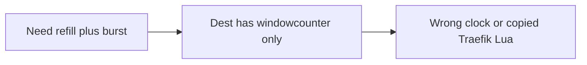

Developer review: in progress — 2026-09-11T19:21:44.694Z

## What this changes
**Operators.** None.

**Admin users.** None.

**Developers.** Package `tokenbucket/` adds `NewMemory` / `NewRedis` and `Allow(key)` (Traefik Lua math, copied script with `#rl_source == 4`). Live env `TOKENBUCKET_LIVE_REDIS` / `TOKENBUCKET_LIVE_DRAGONFLY`. Specs `std_go_tokenbucket_allow` and `std_go_tokenbucket_lua-eval`. Usage packet `knowledge/devdocs/std_go_tokenbucket.md`.

**End users.** None.

## Motivation
Middleware authors who need Traefik RateLimit behaviour (refill `rate`, cap `burst`, wait, refund when wait exceeds maxDelay) had no package on `master`. Dest already ships `windowcounter/` for Kong sliding windows and says a token bucket would be a separate package.

If we do not add that package, a plugin either imports the window counter (wrong clock) or copies Traefik’s Lua with `table.maxn` and `go-redis`, which Yaegi and Dragonfly will not run.

## Merge readiness
Library landed locally; CI on this HEAD is still running. 1 item remains.

Priority: P3 — new library; no current operator or end-user harm

Reviewed head: 8adbab2
Owner decision: Required. See Explore Decisions.

## Review scores
| Measure | Result | What it means |
| --- | --- | --- |
| Overall readiness | 3 | CI in progress; local tests passed |
| CI proof | 3 | Lint, Test, Integration in progress |
| Local tests proof | 6 | go test ./tokenbucket/... passed (live skipped without engines) |
| Review resolution | 6 | No open PR comments |

## Verification
| Check | Result | Evidence |
| --- | --- | --- |
| Branch | 2026-09-11-traefik-token-limiter pushed | git / origin |
| OpenSpec | add-tokenbucket | openspec/changes/add-tokenbucket |
| Pull request | https://github.com/david-garcia-garcia/traefik-middleware-utilities/pull/8 | pr-host |
| CI | build 34638405714 in progress https://github.com/david-garcia-garcia/traefik-middleware-utilities/actions/runs/34638405714 | GitHub MCP get_check_runs |
| Local tests | passed | handoff.yaml localTests |
| PR comments | no comments | comments: none |

## Specs
- [std_go_tokenbucket_allow](https://github.com/david-garcia-garcia/traefik-middleware-utilities/blob/2026-09-11-traefik-token-limiter/openspec/changes/add-tokenbucket/proposal.md) — added
- [std_go_tokenbucket_lua-eval](https://github.com/david-garcia-garcia/traefik-middleware-utilities/blob/2026-09-11-traefik-token-limiter/openspec/changes/add-tokenbucket/proposal.md) — added

## Deviations from the ask
- taken: README leaky-bucket row replacement → add a Token bucket row beside Window counter — `README.md` — dest already replaced leaky-`bucket/` with `windowcounter/`. Requester: not asked.

## Follow-up issues
None.

## How this fits together
Local spec → branch `2026-09-11-traefik-token-limiter` → PR #8 → implement `tokenbucket/`. Code review is next.

## Explore Decisions
| Question | Rank | Decision | By |
| --- | --- | --- | --- |
| How does Allow's allowed bool map Traefik Lua (always "true") plus HTTP 429 when wait > maxDelay or delay is nil? | additive asked | assumed — Lua still returns "true"; Go maps allowed=false wait=0 when no burst; allowed=false wait>maxDelay after refund; allowed=true wait>=0 when admitted now or after waiting ≤ maxDelay. Library never sleeps. | explore |
| Microsecond Lua clock vs nanosecond x/time/rate — which unit so both stores agree? | additive asked | assumed — public API is time.Duration + reqs/s; both stores convert like Traefik Redis (rate/1e6, UnixMicro, maxDelay.Microseconds()); in-memory uses those formulas, not x/time/rate. | explore |
| Live env var names, and does CI reuse the existing Redis/Dragonfly pair? | additive asked | assumed — TOKENBUCKET_LIVE_REDIS / TOKENBUCKET_LIVE_DRAGONFLY; reuse CI 127.0.0.1:6379 and :6380; skip without addrs or under -short; CI sets both. | explore |
| Do in-memory buckets need reclaim Sleep/Wake/Close? | additive incidental | assumed — no reclaim hooks on the limiter in v1; memory expires entries on Allow using caller ttl; no per-key ticker. | explore |
| Default ttl if the caller does not pass Traefik’s formula? | additive asked | assumed — no default; ttl < 1s fails New; document Traefik’s formula in usage (2s when rate ≥ 1, else 1 + int(1/rate)). | explore |
| What happens when rate <= 0 (Traefik average: 0 / rate.Inf)? | additive incidental | assumed — New errors when rate <= 0 or burst < 1 or maxDelay < 0; do not copy Inf short-circuit. | explore |

## Before merge
- [x] Stub PR #8 open
- [x] Explore Allow mapping, clock units, live env
- [x] Propose OpenSpec change
- [x] Implement `tokenbucket/` + unit/Yaegi tests
- [ ] CI Test job green on both live engines

## Findings
None.

## Axis review
None.

## Agent review details

### Review metrics
| Metric | Value | Why it matters |
| --- | --- | --- |
| Specs in this PR | 2 added / 0 modified | Same list as ## Specs |
| Open reviewer comments walked | 0 FIX / 0 ANSWER / 0 open | Unanswered review is merge risk |
| Reviewed head | 8adbab213f08c31e4a5f09131d384205def68257 | Card must match the branch you measured |

### Stored data model
- New: Redis hash (caller-prefixed key) with fields `last` and `tokens`.

### Technical review
Best possible solution: Lua-formula memory plus `simpleredis.Eval` so both stores share one meaning; EVALSHA and x/time/rate stay out.

Do we have a high-confidence way to reproduce? Yes — `go test ./tokenbucket/...` burst, refund, two-instance share, memory/Redis agreement, Yaegi on fake TCP.

Is this the best way to solve the issue? Yes — separate package as dest README reserved.

### Evidence
What I checked:
- `go test ./tokenbucket/...` passed (live skipped; env unset)
- `go test ./reclaim/... ./simpleredis/... ./windowcounter/...` passed
- `openspec validate add-tokenbucket --type change --strict` valid
- GitHub MCP PR #8 run 34638405714 in progress

### Rank-up moves
None.
