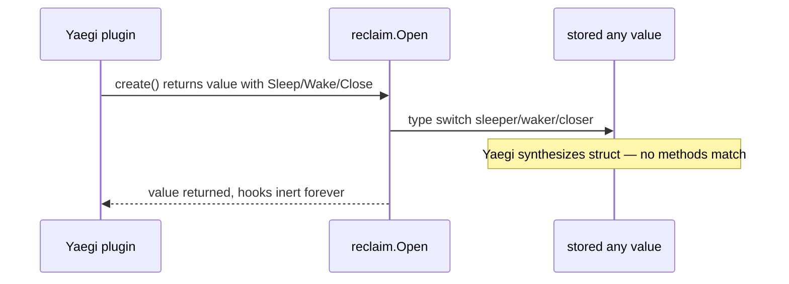

Developer review: in progress — 2026-09-11T05:59:25Z

## What this changes
**Operators.** None.

**Admin users.** None.

**Developers.** Prepare grounded the Yaegi lifecycle gap on `reclaim.Open`; explicit-hook API design and product code are not started yet.

**End users.** None.

## Motivation
Reclaim drives stored middleware values through create, sleep, wake, and close so idle resources release under Traefik context cancellation. On `master`, `Open` discovers optional `Sleep` / `Wake` / `Close` on the stored value via type switches after `create func() (any, error)` returns.

Under Traefik v3.7.11's Yaegi v0.16.1 loader, values returned through that interpreted create lose their method set when stored as `any`. The table still logs put/bind, but sleep, wake, and close never run in production plugins. Compiled `go test` passes while Traefik never sleeps or closes stored values — operators may believe idle cost is released when it is not.

If we do not merge a fix, lifecycle hooks remain decorative under Yaegi and the debt file stays open despite the spec promising four events.

## Merge readiness
Prepare complete; product work not started. 5 items remain.

Priority: P2 — real operator pain with a workaround (compiled tests green; production plugins never sleep/close)

Reviewed head: b47513d
Owner decision: None.

## Review scores
| Measure | Result | What it means |
| --- | --- | --- |
| Overall readiness | N/A | No product delta yet; prepare only |
| CI proof | 1 | Branch pushed; CI not seen |
| Local tests proof | N/A | Before implement |
| Review resolution | N/A | No OPEN PR comments inventoried |

## Verification
| Check | Result | Evidence |
| --- | --- | --- |
| Branch | 2026-09-11-yaegi-reclaim-hooks pushed | git push |
| OpenSpec | none | handoff.yaml |
| Pull request | https://github.com/david-garcia-garcia/traefik-middleware-utilities/pull/2 | GitHub MCP create |
| CI | not seen | gh unavailable |
| Local tests | none | handoff.yaml localTests |
| PR comments | no comments | comments: none |

## Specs
None.

## Deviations from the ask
None.

## Follow-up issues
None.

## How this fits together
Local ticket spec → branch `2026-09-11-yaegi-reclaim-hooks` → stub PR #2 → CI pending first run.

## Explore Decisions
None.

## Before merge
- [ ] [P2] Explore and propose explicit-hook API for `reclaim.Open`
- [ ] [P2] Implement hooks + Yaegi unit tests + lifecycle test host
- [ ] [P2] Extend Pester e2e for hook proof; delete debt file when taken
- [ ] [P3] Update `std_go_reclaim_value-lifecycle` spec and devdocs
- [x] Prepare bus, requirement, stub PR

## Findings
None.

## Axis review
None.

## Agent review details

### Review metrics
| Metric | Value | Why it matters |
| --- | --- | --- |
| Specs in this PR | none | Prepare only — no spec delta yet |
| Open reviewer comments walked | 0 FIX / 0 ANSWER / 0 open | No PR comments |
| Reviewed head | b47513d | Matches pushed branch |

### Stored data model
None.

### Technical review
Best possible solution: Not measured — no product code on branch yet.

Do we have a high-confidence way to reproduce? Yes — `knowledge/research/ext_traefik_plugins_yaegi-generics/notes.md` documents the Yaegi `any` method-set loss; compiled tests in `reclaim/table_test.go` vs inert interpreted behavior.

Is this the best way to solve the issue? Pending explore — ticket requires explicit hooks instead of interface discovery.

### Evidence
What I checked:
- `reclaim/table.go` optional interface type switches and Yaegi comment (`origin/master` @ acd9884)
- `knowledge/debt/2026-09-11-yaegi-drops-methods-on-any.md` debt on master
- `scripts/integration-tests.Tests.ps1` — put/bind only, no lifecycle hook proof
- GitHub MCP `get_me` identity for commits

### Rank-up moves
None.
