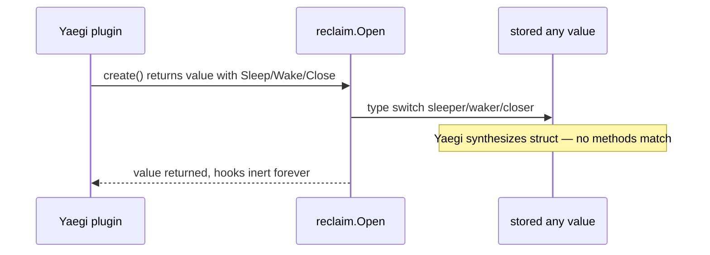

Developer review: in progress — 2026-09-11T06:28:27Z

## What this changes
**Operators.** None.

**Admin users.** None.

**Developers.** Research notes under `knowledge/research/ext_traefik_plugins_yaegi-generics/` record that Yaegi v0.16.1 type-switch on create `any` does not match sleeper/waker/closer, while explicit `func()` hooks fire. `reclaim.Open` is unchanged versus `master`.

**End users.** None.

## Motivation
Reclaim still has to run create, sleep, wake, and close on stored middleware values so idle resources release when Traefik cancels the request context. On `master`, `Open` finds those events with type switches on the stored `any` after `create func() (any, error)` returns.

Under Traefik v3.7.11's Yaegi v0.16.1 loader, that interpreted create return loses its method set. The table still logs put/bind; sleep, wake, and close never run. Compiled `go test` stays green, so the four-event lifecycle looks proven while production plugins never sleep or close.

If we do not merge a fix, those hooks stay decorative under Yaegi, operators can think idle cost was released when it was not, and the debt file stays open against a spec that promises four events.

## Merge readiness
Explore finished; four assumed Open/test-host choices need owner review. 4 items remain.

Priority: P2 — real operator pain with a workaround (compiled tests green; production plugins never sleep/close)

Reviewed head: d57cc46
Owner decision: Required. See Explore Decisions.

## Review scores
| Measure | Result | What it means |
| --- | --- | --- |
| Overall readiness | 6 | CI succeeded and no open PR comments; `Open` change not proposed yet |
| CI proof | 6 | Lint, Test, Integration Tests succeeded — https://github.com/david-garcia-garcia/traefik-middleware-utilities/actions/runs/34569795963 |
| Local tests proof | N/A | Before implement |
| Review resolution | 6 | No open PR comments |

## Verification
| Check | Result | Evidence |
| --- | --- | --- |
| Branch | 2026-09-11-yaegi-reclaim-hooks pushed | git / origin |
| OpenSpec | none | handoff.yaml |
| Pull request | https://github.com/david-garcia-garcia/traefik-middleware-utilities/pull/2 | pr-host |
| CI | build 34569795963 success https://github.com/david-garcia-garcia/traefik-middleware-utilities/actions/runs/34569795963 | GitHub MCP get_check_runs |
| Local tests | none | handoff.yaml localTests |
| PR comments | no comments | comments: none |

## Specs
None.

## Deviations from the ask
None.

## Follow-up issues
None.

## How this fits together
Local ticket → branch `2026-09-11-yaegi-reclaim-hooks` → stub PR #2 → explore assumed `Hooks` on `Open`; CI on HEAD succeeded.

## Explore Decisions
| Question | Rank | Decision | By |
| --- | --- | --- | --- |
| Exact explicit-hook API shape on `Open` (function parameters vs struct)? | bounded asked | assumed — last argument `reclaim.Hooks{Sleep, Wake, Close func()}`. Store on the slot at put; bind/reclaim ignore the new argument. Nil funcs skip. Callers close over the pointer set inside `create`. | explore |
| Do compiled callers keep optional methods on the value as a convenience wrapper, or migrate fully to explicit hooks? | bounded asked | assumed — full migrate. Delete `sleeper`/`waker`/`closer` type-switches. Compiled tests pass `Hooks{Sleep: life.Sleep, ...}`. | explore |
| Which Yaegi import path and version pin matches Traefik v3.7.11 for unit tests? | additive asked | assumed — `github.com/traefik/yaegi v0.16.1` (traefik@v3.7.11 `go.mod`). Test files only. GOPATH interp + `stdlib.Symbols`. No `unsafe`. | explore |
| Where do Yaegi interpreter tests live, and what is the test host for all four hooks? | additive asked | assumed — `reclaim/*_yaegi_test.go` (or `reclaim/yaegi_test.go`) imports yaegi; GOPATH consumer under testdata/temp. `e2e/reclaimprobe` is the log-only host (explicit hooks + slog). Pester: put/bind plus orphan/dispose and hook log lines on a reload path. | explore |

## Before merge
- [x] Explore explicit-hook API for `reclaim.Open` (assumed; owner review)
- [ ] [P2] Propose OpenSpec change for `Hooks` on `Open`
- [ ] [P2] Implement hooks + Yaegi unit tests + lifecycle test host
- [ ] [P2] Extend Pester e2e for hook proof; delete debt file when taken
- [ ] [P3] Update `std_go_reclaim_value-lifecycle` spec and devdocs
- [x] Prepare bus, requirement, stub PR

## Findings
None.

## Axis review
None.

## Agent review details

### Review metrics
| Metric | Value | Why it matters |
| --- | --- | --- |
| Specs in this PR | none | Same list as ## Specs; do not paste diff --stat |
| Open reviewer comments walked | 0 FIX / 0 ANSWER / 0 open | Unanswered review is merge risk |
| Reviewed head | d57cc46c296c86658260b6e1b216085e20cba041 | Card must match the branch you measured |

### Stored data model
None.

### Technical review
Best possible solution: Versus `master`, stop discovering Sleep/Wake/Close on the stored `any`; pass optional `reclaim.Hooks` funcs into `Open` so the events run under Yaegi. That API is not on this branch yet.

Do we have a high-confidence way to reproduce? Yes — throwaway Yaegi v0.16.1 GOPATH interp (`knowledge/research/ext_traefik_plugins_yaegi-generics/.sources/yaegi-reclaim-hooks-probe.md`): type-switch sleeper no match, sleeps=0; explicit `func()` hooks fire.

Is this the best way to solve the issue? Yes versus `master`'s type-switch — assumed `Hooks` struct is one job for the three funcs; owner still to confirm the four assumed rows.

### Evidence
What I checked:
- `origin/master...HEAD` excluding `devstate/` and `.cursor/`: research packet only @ d57cc46
- `explore.md` four assumed open questions
- GitHub MCP `get_check_runs` on PR 2: Lint, Test, Integration Tests success (run 34569795963); `gh` not on PATH
- `deviations.md` heading-only; no `issues.md`; no `codereview_*.md`; `comments: none`

### Rank-up moves
- Owner confirm the four assumed rows before propose.

[sgsi-dev-ticket-status:2026-09-11-yaegi-reclaim-hooks]
