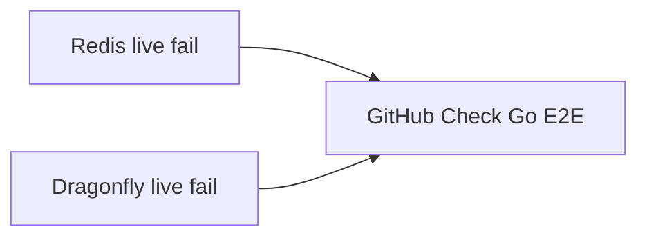

Developer review: in progress — 2026-09-12T16:00:23Z

## What this changes
**Operators.** None.

**Admin users.** None.

**Developers.** None.

**End users.** None.

## Motivation
GitHub Checks on this repo are how a Redis-only versus Dragonfly-only live failure is supposed to show up. On master, compiled Go E2E still runs in one job named `Go E2E`: that job starts Redis 7 and Dragonfly together, sets every `*_LIVE_REDIS` and `*_LIVE_DRAGONFLY` pair, and `go test` talks to both. A fail on one engine is the same red check as a fail on the other.

If this PR does not land, Checks keep a single `Go E2E` item. A Redis regression and a Dragonfly regression look the same on the pull request, and the skip helper still `Fatal`s when only one engine address is set, so the two jobs the ticket wants cannot run.

## Merge readiness
Prepare grounded the split; product files versus master are unchanged. 3 items remain.

Priority: P3 — GitHub Checks hide which live engine failed; no production harm today
Reviewed head: 0d14dd1
Owner decision: None.

## Review scores
| Measure | Result | What it means |
| --- | --- | --- |
| Overall readiness | 3/6 | CI on the stub is still in progress |
| CI proof | 3/6 | Workflow in progress, [run 34703829210](https://github.com/david-garcia-garcia/traefik-middleware-utilities/actions/runs/34703829210) |
| Local tests proof | N/A | `localTests: none`; remote CI is the proof axis |
| Review resolution | 6/6 | OPEN PR, no review comments |

## Verification
| Check | Result | Evidence |
| --- | --- | --- |
| Branch | 2026-09-12-ci-e2e-split-engines pushed | `git` / origin |
| OpenSpec | none | `openspec/` |
| Pull request | https://github.com/david-garcia-garcia/traefik-middleware-utilities/pull/41 | GitHub PR 41 |
| CI | build 34703829210 in progress https://github.com/david-garcia-garcia/traefik-middleware-utilities/actions/runs/34703829210 | GitHub Checks: Lint/Unit/Unit race success; Go E2E and Integration Tests in progress |
| Local tests | none | handoff.yaml localTests |
| PR comments | no comments | no comments.md |

## Specs
None.

## Deviations from the ask
None.

## Follow-up issues
None.

## How this fits together
Local ticket 2026-09-12-ci-e2e-split-engines is on branch `2026-09-12-ci-e2e-split-engines` into master as [PR 41](https://github.com/david-garcia-garcia/traefik-middleware-utilities/pull/41). Stub CI is run 34703829210.

## Explore Decisions
None.

## Before merge
- [ ] [P3] Split CI job `e2e` so GitHub Checks show a Redis live-Go item and a Dragonfly live-Go item
- [ ] [P3] Change live skip so a Redis-only (or Dragonfly-only) job does not `Fatal` on the unset engine, including AUTH pairs
- [ ] [P3] Update specs, `std_go_test-suites.md`, and README that still require one `Go E2E` job and both-or-neither fail

## Findings
None.

## Axis review
None.

## Agent review details

### Review metrics
| Metric | Value | Why it matters |
| --- | --- | --- |
| Specs in this PR | none | Same list as ## Specs; do not paste diff --stat |
| Open reviewer comments walked | 0 FIX / 0 ANSWER / 0 open | Unanswered review is merge risk |
| Reviewed head | 0d14dd1316cb67e76d0c73ce39bd4143ee0e6b26 | Card must match the branch you measured |

### Stored data model
None.

### Technical review
Best possible solution: two GitHub Checks, each starting one engine, versus master’s single `Go E2E` job that always starts both.

Do we have a high-confidence way to reproduce? Yes — PR 41 Checks still list one `Go E2E` item, and `lookupLiveEngineAddrs` fatals when exactly one address is set.

Is this the best way to solve the issue? Yes versus master: split the job and allow one-engine skip; keep Lint, Unit, Unit race, and Pester.

### Evidence
What I checked:
- `.github/workflows/ci.yml` job `e2e` starts Redis and Dragonfly and sets both LIVE pairs (`origin/master` `7c6f70a`)
- `lookupLiveEngineAddrs` in `simpleredis/simpleredis_e2e_test.go` (copied in windowcounter and tokenbucket e2e files) returns `errLiveEngineOneAddr` when one addr is set
- `openspec/specs/std_go_ci_test-suites/spec.md` pins one `e2e` job and fail-when-one-addr
- Stub PR 41; Checks run 34703829210 (Go E2E still one in-progress item)

### Rank-up moves
None.
