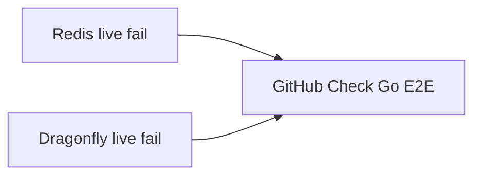

Developer review: in progress — 2026-09-12T16:09:34Z

## What this changes
**Operators.** None.

**Admin users.** None.

**Developers.** OpenSpec change `split-go-e2e-engine-jobs` is apply-ready: two Checks `Go E2E Redis` / `Go E2E Dragonfly`, one-engine skip, six folded specs.

**End users.** None.

## Motivation
GitHub Checks on this repo are how a Redis-only versus Dragonfly-only live failure is supposed to show up. On master, compiled Go E2E still runs in one job named `Go E2E`: that job starts Redis 7 and Dragonfly together, sets every `*_LIVE_REDIS` and `*_LIVE_DRAGONFLY` pair, and `go test` talks to both. A fail on one engine is the same red check as a fail on the other.

If this PR does not land, Checks keep a single `Go E2E` item. A Redis regression and a Dragonfly regression look the same on the pull request, and `lookupLiveEngineAddrs` still `Fatal`s when only one engine address is set, so the two jobs the ticket wants cannot run.

## Merge readiness
Proposal and delta specs are on the branch. Apply has not started. 5 items remain.

Priority: P3 — GitHub Checks hide which live engine failed; no production harm today
Reviewed head: 6acaec1
Owner decision: None.

## Review scores
| Measure | Result | What it means |
| --- | --- | --- |
| Overall readiness | 6/6 | Last measured stub CI succeeded; no open PR comments |
| CI proof | 6/6 | Lint, Unit, Unit race, Go E2E, Integration Tests succeeded — [run 34703992540](https://github.com/david-garcia-garcia/traefik-middleware-utilities/actions/runs/34703992540) |
| Local tests proof | N/A | `localTests: none`; remote CI is the proof axis |
| Review resolution | 6/6 | OPEN PR 41; no reviewer comments |

## Verification
| Check | Result | Evidence |
| --- | --- | --- |
| Branch | 2026-09-12-ci-e2e-split-engines pushed | `git` / GitHub |
| OpenSpec | split-go-e2e-engine-jobs | `openspec/changes/split-go-e2e-engine-jobs/` |
| Pull request | https://github.com/david-garcia-garcia/traefik-middleware-utilities/pull/41 | GitHub PR 41 |
| CI | build 34703992540 success https://github.com/david-garcia-garcia/traefik-middleware-utilities/actions/runs/34703992540 | pr-host get_check_runs |
| Local tests | none | handoff.yaml localTests |
| PR comments | no comments | no comments.md |

## Specs
- [std_go_ci_test-suites](https://github.com/david-garcia-garcia/traefik-middleware-utilities/blob/2026-09-12-ci-e2e-split-engines/openspec/changes/split-go-e2e-engine-jobs/proposal.md) — modified
- [std_go_simpleredis_live-e2e](https://github.com/david-garcia-garcia/traefik-middleware-utilities/blob/2026-09-12-ci-e2e-split-engines/openspec/changes/split-go-e2e-engine-jobs/proposal.md) — modified
- [std_go_simpleredis_resp-commands](https://github.com/david-garcia-garcia/traefik-middleware-utilities/blob/2026-09-12-ci-e2e-split-engines/openspec/changes/split-go-e2e-engine-jobs/proposal.md) — modified
- [std_go_simpleredis_tcp-session](https://github.com/david-garcia-garcia/traefik-middleware-utilities/blob/2026-09-12-ci-e2e-split-engines/openspec/changes/split-go-e2e-engine-jobs/proposal.md) — modified
- [std_go_windowcounter_sync-flush](https://github.com/david-garcia-garcia/traefik-middleware-utilities/blob/2026-09-12-ci-e2e-split-engines/openspec/changes/split-go-e2e-engine-jobs/proposal.md) — modified
- [std_go_tokenbucket_lua-eval](https://github.com/david-garcia-garcia/traefik-middleware-utilities/blob/2026-09-12-ci-e2e-split-engines/openspec/changes/split-go-e2e-engine-jobs/proposal.md) — modified

## Deviations from the ask
None.

## Follow-up issues
None.

## How this fits together
Local ticket on branch `2026-09-12-ci-e2e-split-engines` opened [PR 41](https://github.com/david-garcia-garcia/traefik-middleware-utilities/pull/41) against `master`. Change `split-go-e2e-engine-jobs` is apply-ready.

## Explore Decisions
| Question | Rank | Decision | By |
| --- | --- | --- | --- |
| What GitHub Check `name:` / job ids should the two live items use? | additive asked | assumed — job ids `e2e-redis` and `e2e-dragonfly`; names `Go E2E Redis` and `Go E2E Dragonfly`. Remove job id `e2e`. | explore |
| Do passworded AUTH containers (`:6381` / `:6382`) split with the same jobs? | bounded asked | assumed — Redis job starts only `:6381` and sets `SIMPLEREDIS_LIVE_REDIS_AUTH`; Dragonfly job starts only `:6382` and sets `SIMPLEREDIS_LIVE_DRAGONFLY_AUTH`. | explore |
| May a Redis job publish Redis on `:6379` only (no Dragonfly `:6380` on that runner)? | additive asked | assumed — yes. Redis job: `:6379` + AUTH `:6381`. Dragonfly job: `:6380` + AUTH `:6382`. Keep dest port numbers. | explore |
| When CI sets only one of Redis/Dragonfly, skip the other engine or fail? | bounded asked | assumed — return the set engines; skip only when `-short` or both unset; one addr is a one-engine run. Both addrs still run both (local). | explore |
| Two explicit jobs versus a GitHub Actions matrix? | additive incidental | assumed — two explicit jobs. Copy checkout/setup-go/`go test`. No reusable workflow this run. | explore |

## Before merge
- [ ] [P3] Split CI job `e2e` so GitHub Checks show `Go E2E Redis` and `Go E2E Dragonfly`
- [ ] [P3] Change live skip so a Redis-only (or Dragonfly-only) job does not `Fatal` on the unset engine, including AUTH pairs
- [ ] [P3] Update specs, `std_go_test-suites.md`, and README that still require one `Go E2E` job and both-or-neither fail

## Findings
None.

## Axis review
None.

## Agent review details

### Review metrics
| Metric | Value | Why it matters |
| --- | --- | --- |
| Specs in this PR | 0 added / 6 modified | Same list as ## Specs |
| Open reviewer comments walked | 0 FIX / 0 ANSWER / 0 open | Unanswered review is merge risk |
| Reviewed head | 6acaec117dbbbc6424da3e5435263af92d159dcf | Card must match the branch you measured |

### Stored data model
None.

### Technical review
Best possible solution: two GitHub Checks, each starting one engine, versus master’s single `Go E2E` job that always starts both.

Do we have a high-confidence way to reproduce? Yes — dest still has one `Go E2E` check; `openspec validate split-go-e2e-engine-jobs --type change --strict` passed.

Is this the best way to solve the issue? Yes versus master: split the job and allow one-engine skip; keep Lint, Unit, Unit race, and Pester.

### Evidence
What I checked:
- `openspec validate split-go-e2e-engine-jobs --type change --strict` exit 0
- `validate_artifact_names` OK
- proposal + six folded delta specs on disk

### Rank-up moves
None.
