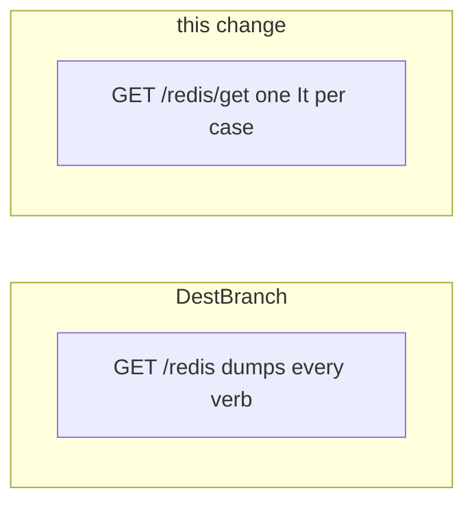

Developer review: ready for review — 2026-09-12T18:26:37Z

## What this changes
**Operators.** GitHub Actions now runs Integration Tests (reclaim), Integration Tests Redis, and Integration Tests Dragonfly instead of one combined Pester job.

**Admin users.** None.

**Developers.** The Traefik SimpleRedis probe maps each public verb to `/<engine>/<verb>` (200 + Redis body, 502 + `err.Error()`, terminal — no forward); Pester is split by domain with `-Suite`/`-Engine`; Expire/ExpireAt proofs assert TTL vs the Set baseline; compiled live adds Eval KEYS and future MSetEXAt; Yaegi live covers Get through MSetEXAt and Evals TTL after Expire.

**End users.** None.

## Motivation
On master, Traefik Pester still dumps every SimpleRedis verb onto one GET `/redis` or `/dragonfly`. A 502 cannot name the command; MSetEXAt runs with no header. Yaegi live omits MGet, IncrBy, Expire, ExpireAt, and MSetEXAt. Compiled Eval live is `return N` with nil keys while Traefik uses the Kong KEYS script. Compiled MSetEXAt live only proves a past-EXAT miss. One Integration Tests job mixes reclaim with both engines.

If we do not merge, a Traefik verb regression stays an undifferentiated 502, Yaegi never proves those verbs on live engines, and a Redis-only or Dragonfly-only Pester fail does not name the backend.

## Merge readiness
Code review landed on HEAD. CI succeeded. 0 items remain.

Priority: P3 — spec, docs, tests, or internal clarity — no current user or operator harm
Reviewed head: 021b556
Owner decision: Required. See Explore Decisions.

## Review scores
| Measure | Result | What it means |
| --- | --- | --- |
| Overall readiness | 6/6 | Apply and axis review landed; CI succeeded; no open PR comments |
| CI proof | 6/6 | succeeded https://github.com/david-garcia-garcia/traefik-middleware-utilities/actions/runs/34711031013 |
| Local tests proof | N/A | prHost is github; CI proof covers remote |
| Review resolution | 6/6 | OPEN PR has no comments |

## Verification
| Check | Result | Evidence |
| --- | --- | --- |
| Branch | 2026-09-12-command-e2e-and-integration-coverage pushed | git |
| OpenSpec | simpleredis-command-coverage | openspec/changes/simpleredis-command-coverage/ |
| Pull request | https://github.com/david-garcia-garcia/traefik-middleware-utilities/pull/43 | GitHub PR 43 |
| CI | build 34711031013 succeeded https://github.com/david-garcia-garcia/traefik-middleware-utilities/actions/runs/34711031013 | GitHub checks 8/8 success |
| Local tests | passed | handoff.yaml localTests |
| PR comments | no comments | no comments.md |

## Specs
- [std_go_simpleredis_live-e2e](https://github.com/david-garcia-garcia/traefik-middleware-utilities/blob/2026-09-12-command-e2e-and-integration-coverage/openspec/changes/simpleredis-command-coverage/proposal.md) — modified
- [std_go_simpleredis_resp-commands](https://github.com/david-garcia-garcia/traefik-middleware-utilities/blob/2026-09-12-command-e2e-and-integration-coverage/openspec/changes/simpleredis-command-coverage/proposal.md) — modified
- [std_go_simpleredis_tcp-session](https://github.com/david-garcia-garcia/traefik-middleware-utilities/blob/2026-09-12-command-e2e-and-integration-coverage/openspec/changes/simpleredis-command-coverage/proposal.md) — modified
- [std_go_ci_test-suites](https://github.com/david-garcia-garcia/traefik-middleware-utilities/blob/2026-09-12-command-e2e-and-integration-coverage/openspec/changes/simpleredis-command-coverage/proposal.md) — added

## Deviations from the ask
- taken: Traefik Pester proves every public command on one request with one header per verb → ServeHTTP maps each public verb to `/<engine>/<verb>`; Pester asserts status and body — `e2e/simpleredisprobe/plugin.go` — honouring the dump would keep adding headers to one handler whose failures are 502s with no isolated It. Requester: confirmed.
- taken: one result header per verb → success is HTTP 200 with the Redis payload in the body; command errors are 502 with `err.Error()` — `e2e/simpleredisprobe/plugin.go` — headers existed only because success forwarded to whoami. Requester: confirmed.
- taken: one It per engine or `-TestCases` redis/dragonfly in the same job → one SimpleRedis file; `INTEGRATION_ENGINE` selects the backend; CI is Integration Tests (reclaim), Integration Tests Redis, and Integration Tests Dragonfly — `.github/workflows/ci.yml` — Redis and Dragonfly are the same Traefik proof; Go E2E already splits engines. Requester: confirmed.

## Follow-up issues
None.

## How this fits together
Local ticket on branch `2026-09-12-command-e2e-and-integration-coverage` opened GitHub PR 43 into `master`. Code review is on `021b556`; CI run 34711031013 succeeded.

## Explore Decisions
| Question | Rank | Decision | By |
| --- | --- | --- | --- |
| Should Yaegi live LiveVerbs grow to the remaining public verbs (MGet, IncrBy, Expire, ExpireAt, MSetEXAt)? | additive asked | assumed — expand LiveVerbs and the Yaegi live spec line; leave fake-TCP Yaegi at the existing subset | explore |
| Should compiled TestLive_Eval add a KEYS/ARGV case matching the Traefik Kong snippet, not only return N with nil keys? | additive asked | assumed — add one compiled Eval KEYS case; keep integer / EVALSHA / FLUSH cases | explore |
| Should compiled TestLive_MSetEX add a future-EXAT landing (Get + positive TTL) in addition to past-miss? | additive asked | assumed — add msetexAtTTLLanded next to pastExatMiss | explore |

## Before merge
None.

## Findings
None.

## Axis review
[Standards](https://github.com/david-garcia-garcia/traefik-middleware-utilities/blob/2026-09-12-command-e2e-and-integration-coverage/devstate/2026/09/2026-09-12-command-e2e-and-integration-coverage/codereview_standards.md) — 4 total, 0 pending, 3 completed, 1 skipped
[Nitpicks](https://github.com/david-garcia-garcia/traefik-middleware-utilities/blob/2026-09-12-command-e2e-and-integration-coverage/devstate/2026/09/2026-09-12-command-e2e-and-integration-coverage/codereview_nitpicks.md) — 3 total, 0 pending, 3 completed
[Spec](https://github.com/david-garcia-garcia/traefik-middleware-utilities/blob/2026-09-12-command-e2e-and-integration-coverage/devstate/2026/09/2026-09-12-command-e2e-and-integration-coverage/codereview_spec.md) — 0 total, 0 pending, 0 completed
[Security](https://github.com/david-garcia-garcia/traefik-middleware-utilities/blob/2026-09-12-command-e2e-and-integration-coverage/devstate/2026/09/2026-09-12-command-e2e-and-integration-coverage/codereview_security.md) — 0 total, 0 pending, 0 completed
[Performance](https://github.com/david-garcia-garcia/traefik-middleware-utilities/blob/2026-09-12-command-e2e-and-integration-coverage/devstate/2026/09/2026-09-12-command-e2e-and-integration-coverage/codereview_performance.md) — 0 total, 0 pending, 0 completed
[Dead](https://github.com/david-garcia-garcia/traefik-middleware-utilities/blob/2026-09-12-command-e2e-and-integration-coverage/devstate/2026/09/2026-09-12-command-e2e-and-integration-coverage/codereview_dead.md) — 0 total, 0 pending, 0 completed
[Test coverage](https://github.com/david-garcia-garcia/traefik-middleware-utilities/blob/2026-09-12-command-e2e-and-integration-coverage/devstate/2026/09/2026-09-12-command-e2e-and-integration-coverage/codereview_coverage.md) — 2 total, 0 pending, 2 completed

## Agent review details

### Review metrics
| Metric | Value | Why it matters |
| --- | --- | --- |
| Specs in this PR | 1 added / 3 modified | Same list as ## Specs; do not paste diff --stat |
| Open reviewer comments walked | 0 FIX / 0 ANSWER / 0 open | Unanswered review is merge risk |
| Reviewed head | 021b55645936ab6c16692a5f1cba409151f4b7f8 | Card must match the branch you measured |

### Stored data model
None.

### Technical review
Best possible solution: map SimpleRedis verbs to HTTP paths so Pester owns sequences, split CI engines like Go E2E, and fill compiled/Yaegi live gaps versus the DestBranch dump.

Do we have a high-confidence way to reproduce? Yes, Go E2E Redis/Dragonfly plus the three Integration Tests jobs on run 34711031013.

Is this the best way to solve the issue? Yes — PathPrefix already matches subpaths; one job per engine names the failing backend.

### Evidence
What I checked:
- `go test -short -count=1 ./simpleredis/` passed (459a4a1)
- GitHub checks 8/8 success (build 34711031013)
- seven-axis files under the run root; hard items applied; Standards 4 skipped (judgement)

### Rank-up moves
None.
