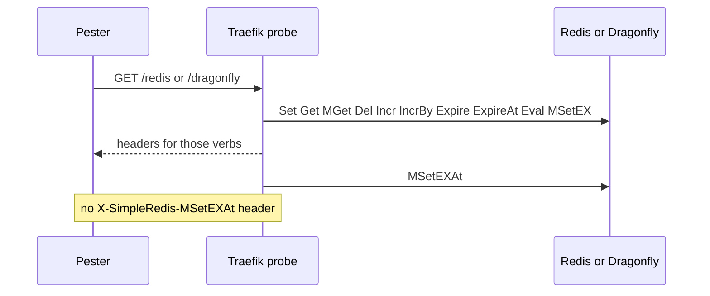

Developer review: in progress — 2026-09-12T16:49:18Z

## What this changes
**Operators.** None.

**Admin users.** None.

**Developers.** None.

**End users.** None.

## Motivation
On master, compiled live e2e already exercises Get, MGet, Set, Del, Incr, IncrBy, Expire, ExpireAt, Eval, MSetEX, and MSetEXAt against Redis and Dragonfly when the LIVE addrs are set. Yaegi live still only runs Set, Get, Del, Incr, Eval, and MSetEX. The Traefik probe on `/redis` and `/dragonfly` calls MSetEXAt after MSetEX, but it never sets a response header for that verb, and Pester never asserts it.

If we do not merge, a broken MSetEXAt under Yaegi/Traefik can 502 only when that call fails, and a silent success path stays unproven. Compiled Eval live still uses nil keys; the Traefik path is the Kong KEYS script.

## Merge readiness
Prepare grounded the ticket and opened the stub PR. Coverage gaps are not closed yet. 2 items remain.

Priority: P3 — spec, docs, tests, or internal clarity — no current user or operator harm
Reviewed head: 57c0fcf
Owner decision: None.

## Review scores
| Measure | Result | What it means |
| --- | --- | --- |
| Overall readiness | 1/6 | Stub PR is open; CI has not been measured |
| CI proof | 1/6 | pushed and still not seen |
| Local tests proof | N/A | prHost is github; localTests none |
| Review resolution | 6/6 | OPEN PR has no comments |

## Verification
| Check | Result | Evidence |
| --- | --- | --- |
| Branch | 2026-09-12-command-e2e-and-integration-coverage pushed | git |
| OpenSpec | none | openspec/ |
| Pull request | https://github.com/david-garcia-garcia/traefik-middleware-utilities/pull/43 | GitHub PR 43 |
| CI | not seen | pr-host CI |
| Local tests | none | handoff.yaml localTests |
| PR comments | no comments | no comments.md |

## Specs
None.

## Deviations from the ask
None.

## Follow-up issues
None.

## How this fits together
Local ticket on branch `2026-09-12-command-e2e-and-integration-coverage` opened GitHub PR 43 into `master`. CI has not been measured.

## Explore Decisions
None.

## Before merge
- [ ] Close compiled live e2e gaps so every public command is proven on Redis and Dragonfly [P3]
- [ ] Close the Traefik probe/Pester gap for MSetEXAt (header plus assert) [P3]

## Findings
None.

## Axis review
None.

## Agent review details

### Review metrics
| Metric | Value | Why it matters |
| --- | --- | --- |
| Specs in this PR | none | Same list as ## Specs; do not paste diff --stat |
| Open reviewer comments walked | 0 FIX / 0 ANSWER / 0 open | Unanswered review is merge risk |
| Reviewed head | 57c0fcf955256d6cb6693bf450cbe101b4d20b02 | Card must match the branch you measured |

### Stored data model
None.

### Technical review
Best possible solution: not applicable until apply; prepare only recorded gaps versus master.

Do we have a high-confidence way to reproduce? Yes, compiled `*_e2e_test.go` plus `Test-Integration.ps1` on `/redis` and `/dragonfly`.

Is this the best way to solve the issue? Not applicable until apply.

### Evidence
What I checked:
- Public verbs and live files (`simpleredis/commands.go`, `commands_eval.go`, `commands_msetex.go`, `commands_e2e_test.go`, `commands_eval_e2e_test.go`, `commands_msetex_e2e_test.go`, `yaegi_e2e_test.go`, SHA 57c0fcf)
- Traefik probe and Pester (`e2e/simpleredisprobe/plugin.go`, `scripts/integration-tests.Tests.ps1`)
- PR 43 OPEN, comment lists empty

### Rank-up moves
None.
