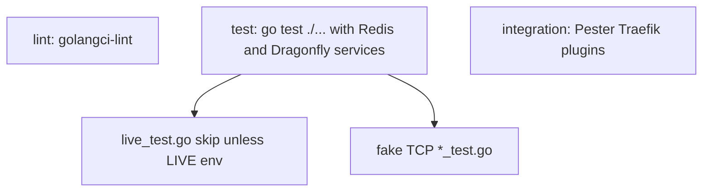

Developer review: in progress — 2026-09-12T11:15:01Z

## What this changes
**Operators.** None.

**Admin users.** None.

**Developers.** None.

**End users.** None.

## Motivation
On DestBranch, compiled Go tests that need a live Redis or Dragonfly sit inside the same CI `test` job as tests that talk only to an in-process fake. Pester (`Test-Integration.ps1`) is a third job: Traefik plus local plugins. There is no usage packet that names those jobs and what each one is for.

The failure is a proof gap, not a production outage. `simpleredis/live_test.go` proves pool wait, MSetEX TTL, past EXAT, and peer-close recovery. The rest of Get/Set/Del/MGet/Incr/Expire/Eval, pool, retry, and malformed RESP stay on fake TCP. Window-counter and token-bucket live files already table-drive both engines; SimpleRedis Yaegi does not. If we do not merge, CI keeps calling that mix “Test”, Dragonfly compatibility of the client stays a thin slice, and `knowledge/devdocs` still has no suite catalog.

## Merge readiness
Prepare grounded (`qualified-with-gaps`). Explore has not started. 3 items remain.

Priority: P3 — tests and docs; no current operator or user harm
Reviewed head: 897b6e1
Owner decision: None.

## Review scores
| Measure | Result | What it means |
| --- | --- | --- |
| Overall readiness | 3/6 | CI still in progress on the stub PR |
| CI proof | 3/6 | Lint and Test succeeded; Integration Tests in progress — [run 34690498510](https://github.com/david-garcia-garcia/traefik-middleware-utilities/actions/runs/34690498510) |
| Local tests proof | N/A | Before implement; remote CI is the proof axis |
| Review resolution | 6/6 | OPEN PR 26; no reviewer comments |

## Verification
| Check | Result | Evidence |
| --- | --- | --- |
| Branch | 2026-09-12-go-e2e-live-backends pushed | `git` / GitHub |
| OpenSpec | none | `openspec/` |
| Pull request | https://github.com/david-garcia-garcia/traefik-middleware-utilities/pull/26 | pr-host Create |
| CI | build 34690498510 in progress https://github.com/david-garcia-garcia/traefik-middleware-utilities/actions/runs/34690498510 | pr-host CI |
| Local tests | none | handoff.yaml localTests |
| PR comments | no comments | no `comments.md` |

## Specs
None.

## Deviations from the ask
None.

## Follow-up issues
None.

## How this fits together
Local ticket on branch `2026-09-12-go-e2e-live-backends` opened PR 26 against `master`. CI is still running on the empty start commit.

## Explore Decisions
None.

## Before merge
- [ ] Split compiled live Redis/Dragonfly Go tests out of the unit `test` job
- [ ] Expand that suite so every case runs on both Redis and Dragonfly
- [ ] Document lint, unit `go test`, Pester, and live Go suites in `knowledge/devdocs`
- [x] Stub PR 26 opened

## Findings
None.

## Axis review
None.

## Agent review details

### Review metrics
| Metric | Value | Why it matters |
| --- | --- | --- |
| Specs in this PR | none | No spec.md vs `master` yet |
| Open reviewer comments walked | 0 FIX / 0 ANSWER / 0 open | Unanswered review is merge risk |
| Reviewed head | 897b6e167351c2012b19a53cd227a9c99bf2d2f8 | Card must match the branch you measured |

### Stored data model
None.

### Technical review
Best possible solution: not applicable until explore and apply; DestBranch already has dual-engine `live_test.go` files inside the unit job.

Do we have a high-confidence way to reproduce? Yes — `.github/workflows/ci.yml` jobs plus skip rules on `simpleredis/live_test.go`, `windowcounter/live_test.go`, and `tokenbucket/live_test.go`.

Is this the best way to solve the issue? Not decided. Ticket wants a fourth suite and a docs catalog; dest already runs live files when CI sets `*_LIVE_*`.

### Evidence
What I checked:
- `.github/workflows/ci.yml` three jobs and LIVE env (worktree at 05129cfc, dest HEAD)
- `simpleredis/live_test.go`, `windowcounter/live_test.go`, `tokenbucket/live_test.go` skip and scenarios
- `simpleredis/yaegi_test.go` fake-only vs `TestYaegiLive_*` on windowcounter and tokenbucket
- `knowledge/devdocs/index.md` and `index_std_go.md` have no suite-catalog packet
- PR 26 created; check runs Lint success, Test success, Integration Tests in progress (run 34690498510)

### Rank-up moves
None.
