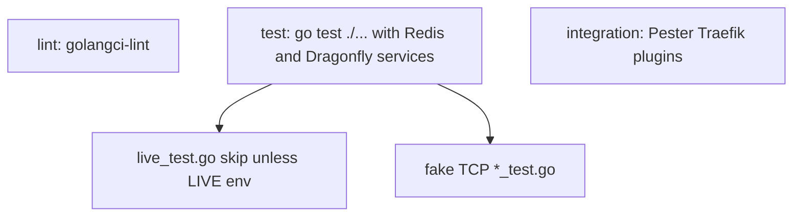

Developer review: in progress — 2026-09-12T11:21:11Z

## What this changes
**Operators.** None.

**Admin users.** None.

**Developers.** None.

**End users.** None.

## Motivation
On DestBranch, compiled Go tests that need a live Redis or Dragonfly sit inside the same CI `test` job as tests that talk only to an in-process fake. Pester (`Test-Integration.ps1`) is a third job: Traefik plus local plugins. There is no usage packet that names those jobs and what each one is for.

The failure is a proof gap, not a production outage. `simpleredis/live_test.go` proves pool wait, MSetEX TTL, past EXAT, and peer-close recovery. The rest of Get/Set/Del/MGet/Incr/Expire/Eval, pool, retry, and malformed RESP stay on fake TCP. Window-counter and token-bucket live files already table-drive both engines; SimpleRedis Yaegi does not. If we do not merge, CI keeps calling that mix “Test”, Dragonfly compatibility of the client stays a thin slice, and `knowledge/devdocs` still has no suite catalog.

## Merge readiness
Explore recorded (`assumed` on every open question). Propose has not started. 3 items remain.

Priority: P3 — tests and docs; no current operator or user harm
Reviewed head: 80649e3
Owner decision: None.

## Review scores
| Measure | Result | What it means |
| --- | --- | --- |
| Overall readiness | 3/6 | CI still in progress on the stub PR |
| CI proof | 3/6 | Lint, Test, and Integration Tests in progress — [run 34690805054](https://github.com/david-garcia-garcia/traefik-middleware-utilities/actions/runs/34690805054) |
| Local tests proof | N/A | Before implement; remote CI is the proof axis |
| Review resolution | 6/6 | OPEN PR 26; no reviewer comments |

## Verification
| Check | Result | Evidence |
| --- | --- | --- |
| Branch | 2026-09-12-go-e2e-live-backends pushed | `git` / GitHub |
| OpenSpec | none | `openspec/` |
| Pull request | https://github.com/david-garcia-garcia/traefik-middleware-utilities/pull/26 | pr-host |
| CI | build 34690805054 in progress https://github.com/david-garcia-garcia/traefik-middleware-utilities/actions/runs/34690805054 | pr-host CI get_check_runs |
| Local tests | none | handoff.yaml localTests |
| PR comments | no comments | no `comments.md` |

## Specs
None.

## Deviations from the ask
None.

## Follow-up issues
None.

## How this fits together
Local ticket on branch `2026-09-12-go-e2e-live-backends` opened PR 26 against `master`. Explore assumed a fourth `Go E2E` job, dual-engine live expansion, and `std_go_test-suites` docs.

## Explore Decisions
| Question | Rank | Decision | By |
| --- | --- | --- | --- |
| Fourth GitHub Actions job vs keeping live files inside `test`? | bounded asked | assumed — new job `e2e` (`Go E2E`) with dest’s Redis 7 and Dragonfly services + all `*_LIVE_*` env; `test` has no services and runs `go test -short`. | explore |
| Build tags (`//go:build live`) vs dest env-skip + `-short`? | additive asked | assumed — keep env-skip + `-short`. Unit job passes `-short`. Do not add build tags. | explore |
| How far does “cover as much as possible” go? | additive asked | assumed — live every engine-success path listed in Decisions; keep fake-TCP for peer-abuse, AUTH/SELECT, and constructor checks. Both engines on every live case. | explore |
| Is Yaegi live (`TestYaegiLive_*`) in the e2e suite or the unit job? | additive asked | assumed — Yaegi live belongs in Go E2E. Add SimpleRedis `TestYaegiLive_RedisAndDragonfly`. Unit `-short` skips them. | explore |
| Packet name/fold for the suite catalog? | additive asked | assumed — `knowledge/devdocs/std_go_test-suites.md` (3 parts, existing allowlist). Do not add `build` this run. | explore |
| Job display name “Go integration” vs existing Pester `Integration Tests`? | additive asked | assumed — GitHub job id `e2e`, name `Go E2E`. Leave Pester `integration` / `Integration Tests`. | explore |
| If CI sets only one of Redis/Dragonfly, skip the other engine or fail? | bounded asked | assumed — skip only when `-short` or both unset; exactly one addr set → fail that test. | explore |

## Before merge
- [ ] Split compiled live Redis/Dragonfly Go tests out of the unit `test` job into `e2e`
- [ ] Expand that suite so every engine-success case runs on both Redis and Dragonfly
- [ ] Document lint, unit `go test`, Pester, and Go E2E in `knowledge/devdocs/std_go_test-suites.md`
- [x] Stub PR 26 opened
- [x] Explore decisions recorded

## Findings
None.

## Axis review
None.

## Agent review details

### Review metrics
| Metric | Value | Why it matters |
| --- | --- | --- |
| Specs in this PR | none | No spec.md vs `master` yet |
| Open reviewer comments walked | 0 FIX / 0 ANSWER / 0 open | Unanswered review is merge risk |
| Reviewed head | 80649e3bc244375c9848ab2229bea0c98ebeac4d | Card must match the branch you measured |

### Stored data model
None.

### Technical review
Best possible solution: not applicable until propose and apply; DestBranch already has dual-engine `live_test.go` files inside the unit job.

Do we have a high-confidence way to reproduce? Yes — `go test ./simpleredis -run TestLive_` skips when LIVE env is unset (measured this explore); `.github/workflows/ci.yml` three jobs plus skip rules on the live files.

Is this the best way to solve the issue? Yes for the split: a fourth `Go E2E` job matches Desired 2 and 4 without renaming Pester. Coverage stays engine-success paths; fake-TCP keeps peer-abuse.

### Evidence
What I checked:
- `.github/workflows/ci.yml` three jobs and LIVE env (worktree at 80649e3, dest HEAD 05129cf)
- `go test ./simpleredis ./windowcounter ./tokenbucket ./reclaim` passed with no LIVE env; `TestLive_*` skipped
- `simpleredis/live_test.go`, `windowcounter/live_test.go`, `tokenbucket/live_test.go` skip and scenarios
- `simpleredis/yaegi_test.go` fake-only vs `TestYaegiLive_*` on windowcounter and tokenbucket
- `knowledge/devdocs/index.md` and `index_std_go.md` have no suite-catalog packet
- PR 26 check runs Lint, Test, Integration Tests in progress (run 34690805054)

### Rank-up moves
None.
