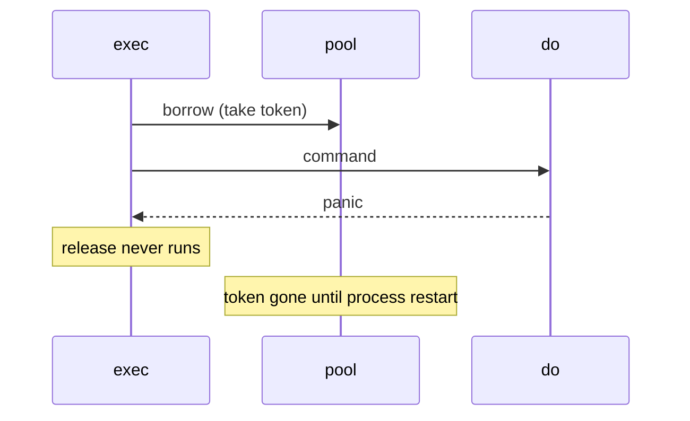

Developer review: in progress — 2026-09-12T12:35:17.417Z

## What this changes
**Operators.** None.

**Admin users.** None.

**Developers.** None.

**End users.** None.

## Motivation
SimpleRedis returns an in-use-turn token only by calling `release` after `do`. On DestBranch that call is not deferred. A panic inside `do` (SetDeadline, write, or RESP parse) skips `release`, so the token and the socket are gone for the life of the client.

After `PoolSize` panics (default 8) the semaphore is empty. Later commands wait the full `PoolTimeout` (default 200ms) and then return `redis:unreachable` even when Redis is healthy. There is no reaper and no refill. Restarting Redis does not recover it.

If this does not merge, `PoolSize` recovered panics convert a live client into a permanent outage or fail-open, depending on the limiter that calls it.

## Merge readiness
Prepare is on disk and the stub PR is open. Product code versus `master` has not changed. CI on the stub is still in progress.

Priority: P1 — production is unsafe today: PoolSize panics permanently brick the Redis client
Reviewed head: add00b0
Owner decision: None.

## Review scores
| Measure | Result | What it means |
| --- | --- | --- |
| Overall readiness | 3/6 | CI still in progress; no product apply yet |
| CI proof | 3/6 | build 34694021385 in progress |
| Local tests proof | N/A | before implement; remote CI is the proof axis |
| Review resolution | 6/6 | OPEN PR, no review comments |

## Verification
| Check | Result | Evidence |
| --- | --- | --- |
| Branch | 2026-09-12-simpleredis-bug-01-panic-leaks-pool-token pushed | `git` / GitHub |
| OpenSpec | none | `openspec/` |
| Pull request | https://github.com/david-garcia-garcia/traefik-middleware-utilities/pull/29 | pr-host Create |
| CI | build 34694021385 in progress https://github.com/david-garcia-garcia/traefik-middleware-utilities/actions/runs/34694021385 | GitHub check runs |
| Local tests | none | handoff.yaml localTests |
| PR comments | no comments | no comments.md |

## Specs
None.

## Deviations from the ask
None.

## Follow-up issues
None.

## How this fits together
Local finding → branch `2026-09-12-simpleredis-bug-01-panic-leaks-pool-token` → stub PR 29 → CI run 34694021385 still in progress.

## Explore Decisions
None.

## Before merge
- [ ] [P1] Return the in-use-turn token when `do` panics in `exec`
- [ ] [P1] Prove `len(inUseTurns) == cap(inUseTurns)` after that many recovered panics, and that a later borrow still succeeds

## Findings
None.

## Axis review
None.

## Agent review details

### Review metrics
| Metric | Value | Why it matters |
| --- | --- | --- |
| Specs in this PR | none | Same list as ## Specs |
| Open reviewer comments walked | 0 FIX / 0 ANSWER / 0 open | Unanswered review is merge risk |
| Reviewed head | add00b02fb7f20eda4072369d6246e2836152a6a | Card must match the branch you measured |

### Stored data model
None.

### Technical review
Best possible solution: not applied yet versus DestBranch. The ticket’s defer-release without recover is the bounded ask.

Do we have a high-confidence way to reproduce? Yes: `startStaticRedis` with a header that panics `make` (`*1000000000000000000\r\n` on 64-bit), `PoolSize` recovered calls, then `len(inUseTurns) == cap(inUseTurns)` and a later `borrow`.

Is this the best way to solve the issue? Yes versus DestBranch: return the token on unwind and leave panic sources to their own tickets. Do not recover in `exec`.

### Evidence
What I checked:
- `exec` calls `release` only after `do` with no defer (`simpleredis/commands_exec.go`, origin/master 0159cfc)
- `release` is the post-borrow path into `freeInUseTurn` (`simpleredis/pool.go`)
- `readReply` still `make`s from a parsed length (`simpleredis/resp.go`)
- OPEN PR 29, comment-id set empty (GitHub MCP get_comments / get_review_comments)
- Check runs on 34694021385: Lint success, Test success, Go E2E success, Integration Tests in_progress

### Rank-up moves
None.
