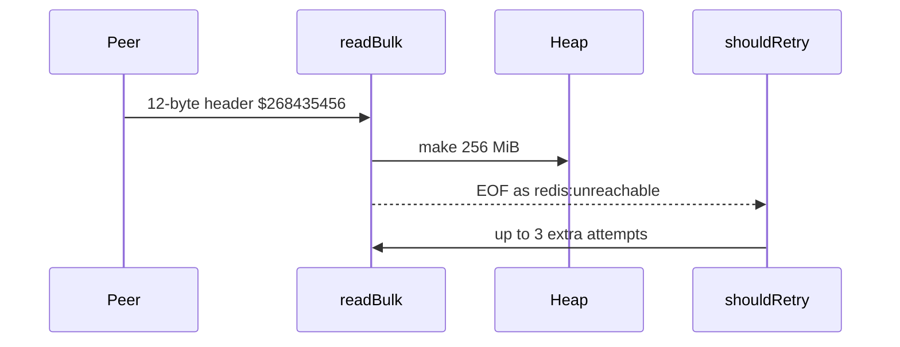

Developer review: ready for review — 2026-09-12T13:11:39Z

## What this changes
**Operators.** None.

**Admin users.** None.

**Developers.** `readBulk` and `readReply` reject a `$` length above 64 MiB and a `*` count above `1 << 20` as `redis:issue?` before `make`. Over-cap, MaxInt64, `$268435456`, and MGET-shaped array `$` tests prove it. Caps are in `std_go_simpleredis_resp-decode` and `std_go_simpleredis_resp-commands`.

**End users.** None.

## Motivation
On DestBranch, SimpleRedis sizes a heap slice from the `$` or `*` length in the reply header before any payload byte arrives. Lengths that fit in `int` are honoured. A 12-byte `$268435456` header allocates 256 MiB. Larger lengths panic in `make`. That panic is not this ticket’s pool-leak fix; the quieter case is the process-wide OOM.

The truncated ReadFull after that allocate is EOF, mapped to `redis:unreachable`, which retries (default three extra attempts). One Get can repeat a 256 MiB allocate. Wrong-port HTTP, a desynced socket, or a hostile Redis all reach the same parse. If we do not merge, that path stays a remote-triggerable Traefik process kill.

## Merge readiness
Ready for review. CI succeeded. 0 items remain.

Priority: P1 — a remote peer can size a heap allocation large enough to kill the Traefik process today
Reviewed head: 84f599c
Owner decision: Required. See Explore Decisions.

## Review scores
| Measure | Result | What it means |
| --- | --- | --- |
| Overall readiness | 6/6 | Open PR, CI succeeded, no open comments |
| CI proof | 6/6 | Lint, Test, Go E2E, Integration Tests success — [run 34695259370](https://github.com/david-garcia-garcia/traefik-middleware-utilities/actions/runs/34695259370) |
| Local tests proof | N/A | Remote CI is the proof axis |
| Review resolution | 6/6 | OPEN PR 34; no reviewer comments |

## Verification
| Check | Result | Evidence |
| --- | --- | --- |
| Branch | 2026-09-12-simpleredis-bug-02-unbounded-reply-allocation pushed | `git` / GitHub |
| OpenSpec | simpleredis-reply-alloc-caps (archived) | `openspec/changes/archive/2026-09-12-simpleredis-reply-alloc-caps/` |
| Pull request | https://github.com/david-garcia-garcia/traefik-middleware-utilities/pull/34 | pr-host |
| CI | build 34695259370 success https://github.com/david-garcia-garcia/traefik-middleware-utilities/actions/runs/34695259370 | GitHub check runs |
| Local tests | passed | handoff.yaml |
| PR comments | no comments | no `comments.md` |

## Specs
- [std_go_simpleredis_resp-decode](https://github.com/david-garcia-garcia/traefik-middleware-utilities/blob/2026-09-12-simpleredis-bug-02-unbounded-reply-allocation/openspec/changes/archive/2026-09-12-simpleredis-reply-alloc-caps/proposal.md) — modified
- [std_go_simpleredis_resp-commands](https://github.com/david-garcia-garcia/traefik-middleware-utilities/blob/2026-09-12-simpleredis-bug-02-unbounded-reply-allocation/openspec/changes/archive/2026-09-12-simpleredis-reply-alloc-caps/proposal.md) — modified

## Deviations from the ask
None.

## Follow-up issues
- [ ] [Cumulative array-reply decode budget](https://github.com/david-garcia-garcia/traefik-middleware-utilities/blob/2026-09-12-simpleredis-bug-02-unbounded-reply-allocation/knowledge/debt/2026-09-12-simpleredis-cumulative-array-reply-budget.md) — per-element and count caps still allow a huge total array reply.

## How this fits together
Local ticket on branch `2026-09-12-simpleredis-bug-02-unbounded-reply-allocation` opened PR 34 against `master`. Specs archived; CI succeeded.

## Explore Decisions
| Question | Rank | Decision | By |
| --- | --- | --- | --- |
| How to spell MaxInt64 / panic-length cases on 32-bit `int`? | additive asked | assumed — feed header digits from `strconv.FormatInt(math.MaxInt64, 10)`. On 32-bit, `parseLen` already returns false above `maxParseLen` (`errIssue`, `clean == false`) before the new cap. On 64-bit, `MaxInt` would panic in `make([]byte, length+2)` today (`length+2` wraps); the cap runs first. Do not skip the test. Do not pass `int(MaxInt64)` as a length on 32-bit. | explore |
| Who already owns client identity (address, user, tenant, Host, trust hop) for this change? | additive incidental | assumed — none. The cap classifies a RESP header; it does not set or rebuild a host fact. | explore |

## Before merge
None.

## Findings
None.

## Axis review
[Standards](https://github.com/david-garcia-garcia/traefik-middleware-utilities/blob/2026-09-12-simpleredis-bug-02-unbounded-reply-allocation/devstate/2026/09/2026-09-12-simpleredis-bug-02-unbounded-reply-allocation/codereview_standards.md) — 1 total, 0 pending, 1 completed
[Nitpicks](https://github.com/david-garcia-garcia/traefik-middleware-utilities/blob/2026-09-12-simpleredis-bug-02-unbounded-reply-allocation/devstate/2026/09/2026-09-12-simpleredis-bug-02-unbounded-reply-allocation/codereview_nitpicks.md) — 0 total, 0 pending, 0 completed
[Spec](https://github.com/david-garcia-garcia/traefik-middleware-utilities/blob/2026-09-12-simpleredis-bug-02-unbounded-reply-allocation/devstate/2026/09/2026-09-12-simpleredis-bug-02-unbounded-reply-allocation/codereview_spec.md) — 0 total, 0 pending, 0 completed
[Security](https://github.com/david-garcia-garcia/traefik-middleware-utilities/blob/2026-09-12-simpleredis-bug-02-unbounded-reply-allocation/devstate/2026/09/2026-09-12-simpleredis-bug-02-unbounded-reply-allocation/codereview_security.md) — 0 total, 0 pending, 0 completed
[Performance](https://github.com/david-garcia-garcia/traefik-middleware-utilities/blob/2026-09-12-simpleredis-bug-02-unbounded-reply-allocation/devstate/2026/09/2026-09-12-simpleredis-bug-02-unbounded-reply-allocation/codereview_performance.md) — 0 total, 0 pending, 0 completed
[Dead](https://github.com/david-garcia-garcia/traefik-middleware-utilities/blob/2026-09-12-simpleredis-bug-02-unbounded-reply-allocation/devstate/2026/09/2026-09-12-simpleredis-bug-02-unbounded-reply-allocation/codereview_dead.md) — 0 total, 0 pending, 0 completed
[Test coverage](https://github.com/david-garcia-garcia/traefik-middleware-utilities/blob/2026-09-12-simpleredis-bug-02-unbounded-reply-allocation/devstate/2026/09/2026-09-12-simpleredis-bug-02-unbounded-reply-allocation/codereview_coverage.md) — 0 total, 0 pending, 0 completed

## Agent review details

### Review metrics
| Metric | Value | Why it matters |
| --- | --- | --- |
| Specs in this PR | 0 added / 2 modified | Same list as ## Specs |
| Open reviewer comments walked | 0 FIX / 0 ANSWER / 0 open | Unanswered review is merge risk |
| Reviewed head | 84f599cdd1db1ecfa0c160a32aa0623395ae8a7f | Card must match the branch you measured |

### Stored data model
None.

### Technical review
Best possible solution: package consts in front of `make` so over-cap headers are `redis:issue?` and not retried, matching DestBranch error classes.

Do we have a high-confidence way to reproduce? Yes — `TestReadReply256MiBHeaderDoesNotAllocatePayload` and over-cap `readReply` cases in `simpleredis/resp_test.go`.

Is this the best way to solve the issue? Yes — ticket-named consts, not Config; Redis `proto-max-bulk-len` is 512 MiB and does not cap GET replies; go-redis has no reader cap.

### Evidence
What I checked:
- `go test ./simpleredis/...` passed locally
- CI Lint, Test, Go E2E, Integration Tests success on run 34695259370 (84f599c)
- Main specs synced; change archived
- PR 34 title `🐛 fix(simpleredis): reject oversized RESP reply headers`

### Rank-up moves
None.
