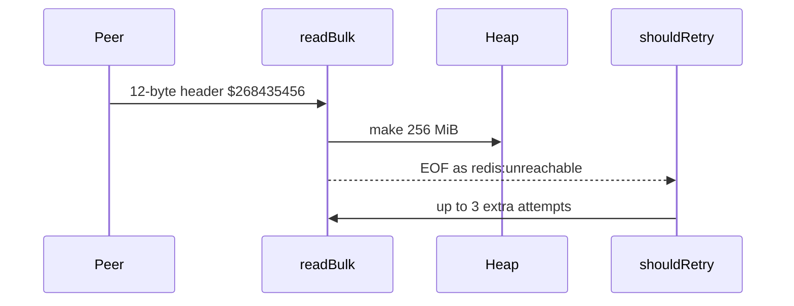

Developer review: in progress — 2026-09-12T12:36:02Z

## What this changes
**Operators.** None.

**Admin users.** None.

**Developers.** None.

**End users.** None.

## Motivation
On DestBranch, SimpleRedis sizes a heap slice from the `$` or `*` length in the reply header before any payload byte arrives. Lengths that fit in `int` are honoured. A 12-byte `$268435456` header allocates 256 MiB. Larger lengths panic in `make`. That panic is not this ticket’s pool-leak fix; the quieter case is the process-wide OOM.

The truncated ReadFull after that allocate is EOF, mapped to `redis:unreachable`, which retries (default three extra attempts). One Get can repeat a 256 MiB allocate. Wrong-port HTTP, a desynced socket, or a hostile Redis all reach the same parse. If we do not merge, that path stays a remote-triggerable Traefik process kill.

## Merge readiness
Prepare grounded (`qualified-with-gaps`). Explore has not started. 2 items remain.

Priority: P1 — a remote peer can size a heap allocation large enough to kill the Traefik process today
Reviewed head: 0176764
Owner decision: None.

## Review scores
| Measure | Result | What it means |
| --- | --- | --- |
| Overall readiness | 3/6 | CI still in progress on the stub PR |
| CI proof | 3/6 | Lint, Test, Integration Tests in progress; Go E2E queued — [run 34694063498](https://github.com/david-garcia-garcia/traefik-middleware-utilities/actions/runs/34694063498) |
| Local tests proof | N/A | Before implement; remote CI is the proof axis |
| Review resolution | 6/6 | OPEN PR 34; no reviewer comments |

## Verification
| Check | Result | Evidence |
| --- | --- | --- |
| Branch | 2026-09-12-simpleredis-bug-02-unbounded-reply-allocation pushed | `git` / GitHub |
| OpenSpec | none | `openspec/` |
| Pull request | https://github.com/david-garcia-garcia/traefik-middleware-utilities/pull/34 | pr-host Create |
| CI | build 34694063498 in progress https://github.com/david-garcia-garcia/traefik-middleware-utilities/actions/runs/34694063498 | pr-host CI |
| Local tests | none | handoff.yaml localTests |
| PR comments | no comments | no `comments.md` |

## Specs
None.

## Deviations from the ask
None.

## Follow-up issues
None.

## How this fits together
Local ticket on branch `2026-09-12-simpleredis-bug-02-unbounded-reply-allocation` opened PR 34 against `master`. CI is still running on the prepare commits.

## Explore Decisions
None.

## Before merge
- [ ] Cap `$` and `*` reply allocations at 64 MiB / `1 << 20` and return `redis:issue?` without the `make`
- [ ] Prove over-cap, panic-length, and `$268435456` allocation with `readReply` tests
- [x] Stub PR 34 opened

## Findings
None.

## Axis review
None.

## Agent review details

### Review metrics
| Metric | Value | Why it matters |
| --- | --- | --- |
| Specs in this PR | none | No spec.md vs `master` yet |
| Open reviewer comments walked | 0 FIX / 0 ANSWER / 0 open | Unanswered review is merge risk |
| Reviewed head | 0176764ad0f63299a162c4b0bdd8f60301a6f31f | Card must match the branch you measured |

### Stored data model
None.

### Technical review
Best possible solution: not applicable until explore and apply; DestBranch still `make`s from the announced `$`/`*` length with no ceiling.

Do we have a high-confidence way to reproduce? Yes — `readBulk` / `readReply` in `simpleredis/resp.go` plus `shouldRetry` on `errUnreachable`; no over-cap test exists today.

Is this the best way to solve the issue? Not decided. Ticket asks for const caps and `errIssue`; dest already rejects overflow via `parseLen`.

### Evidence
What I checked:
- `simpleredis/resp.go` `readBulk` `make([]byte, length+2)`, `readReply` `*` `make([][]byte, count)`, `parseLen` overflow, `ioError` (worktree at 0176764, dest `0159cfc`)
- `simpleredis/commands_exec.go` `shouldRetry` / `retryLimits` (3 extra retries)
- `simpleredis/resp_test.go` garbage length and truncated `$10`; no `$268435456` alloc guard
- `openspec/specs/std_go_simpleredis_resp-decode/spec.md` requires `make([]byte, length+2)` + `ReadFull`
- `knowledge/research/index_ext_redis.md` has no `proto-max-bulk-len` finding
- PR 34 created; checks in progress (run 34694063498)

### Rank-up moves
None.
