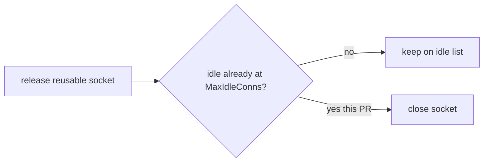

Developer review: ready for review — 2026-09-13T16:20:14Z

## What this changes
**Operators.** `Config.MaxIdleConns` now caps unused Redis sockets even when `PoolSize` is larger. Extra idle sockets are closed on return. At the defaults (`PoolSize` 8, `MaxIdleConns` 8) idle still caps at 8.

**Admin users.** None.

**Developers.** `release` trims on the idle list alone (`len(idleConns) >= maxIdleConns`), deleting the `inUse`/`live` arithmetic. `TestIdleCapAfterSequentialRelease` tables `8/2`, `16/1`, `2/8`, `8/8` plus omitted-knob defaults. `TestConcurrentGetsQuiesceAtMaxIdleConns` replaces the old keep-above-cap test. Live spec `std_go_simpleredis_tcp-session` is synced; change archived as `2026-09-12-simpleredis-enforce-maxidleconns`.

**End users.** None.

## Motivation
`Config.MaxIdleConns` is the knob for how many unused Redis sockets SimpleRedis should keep. On `master`, `release` only closed when the idle list was already at that cap **and** idle plus in-use was at `PoolSize`. The socket still held its in-use turn during that check, so the trim almost never fired when `MaxIdleConns` was smaller than `PoolSize`.

If we do not merge, an operator who sets a small idle cap under a larger `PoolSize` keeps nearly a full pool of resting sockets against Redis.

## Merge readiness
Ready for review. 0 items remain.

Priority: P2 — operators who set MaxIdleConns below PoolSize kept extra idle sockets
Reviewed head: d485e74
Owner decision: Required. See Explore Decisions.

## Review scores
| Measure | Result | What it means |
| --- | --- | --- |
| Overall readiness | 6/6 | Merged master, re-proved idle-cap, CI success, out of Draft |
| CI proof | 6/6 | All eight checks success on run 34768150616 |
| Local tests proof | N/A | `localTests: passed`; remote CI covers proof |
| Review resolution | 6/6 | No OPEN PR comments |

## Verification
| Check | Result | Evidence |
| --- | --- | --- |
| Branch | 2026-09-12-simpleredis-bug-03-maxidleconns-not-enforced pushed | git push origin HEAD d485e74 |
| OpenSpec | simpleredis-enforce-maxidleconns archived | openspec/changes/archive/2026-09-12-simpleredis-enforce-maxidleconns |
| Pull request | https://github.com/david-garcia-garcia/traefik-middleware-utilities/pull/27 | pr 27 |
| CI | Lint success https://github.com/david-garcia-garcia/traefik-middleware-utilities/actions/runs/34768150616/job/103752742070; Unit success https://github.com/david-garcia-garcia/traefik-middleware-utilities/actions/runs/34768150616/job/103752741776; Unit race success https://github.com/david-garcia-garcia/traefik-middleware-utilities/actions/runs/34768150616/job/103752741944; Go E2E Redis success https://github.com/david-garcia-garcia/traefik-middleware-utilities/actions/runs/34768150616/job/103752741945; Go E2E Dragonfly success https://github.com/david-garcia-garcia/traefik-middleware-utilities/actions/runs/34768150616/job/103752741991; Integration Tests success https://github.com/david-garcia-garcia/traefik-middleware-utilities/actions/runs/34768150616/job/103752741949; Integration Tests Redis success https://github.com/david-garcia-garcia/traefik-middleware-utilities/actions/runs/34768150616/job/103752742007; Integration Tests Dragonfly success https://github.com/david-garcia-garcia/traefik-middleware-utilities/actions/runs/34768150616/job/103752741868 | GitHub check runs |
| Local tests | passed | `go test -short ./...`; Yaegi `TestYaegi`; pool idle-cap `-count=5`; `go vet` |
| PR comments | no comments | comments: none |

## Specs
- [std_go_simpleredis_tcp-session](https://github.com/david-garcia-garcia/traefik-middleware-utilities/blob/2026-09-12-simpleredis-bug-03-maxidleconns-not-enforced/openspec/changes/archive/2026-09-12-simpleredis-enforce-maxidleconns/proposal.md) — modified

## Deviations from the ask
None.

## Follow-up issues
None.

## How this fits together
Local ticket 2026-09-12-simpleredis-bug-03-maxidleconns-not-enforced is on the branch of the same name, OPEN PR 27 titled 🐛 fix(simpleredis): honour MaxIdleConns on unused sockets. `origin/master` `c230315` was merged in (no textual conflicts). CI on head `d485e74` succeeded. Landing this first deletes the `inUse`/`live` count in `release`, so `freeInUseTurn()` no longer has to run last for that live count. In-flight `2026-09-13-simpleredis-idle-mutex-defer` was told to preserve that arithmetic under an `idleConnsMu` defer; after this lands that constraint is gone and the mutex refactor can park/close without counting live sockets.

## Explore Decisions
| Question | Rank | Decision | By |
| --- | --- | --- | --- |
| How to prove peak idle during a concurrent run, not only after quiesce, without the missing audit-harness sampler? | additive asked | assumed — sequential table records idle after each release; concurrent path asserts after Wait plus waitOpenSocketsEqual. Do not import the external harness. Confirmed on the merged tree. | explore |
| Is fake live-socket proof openSockets() or connections()-hangupCount() after close is asynchronous? | additive asked | assumed — use existing waitOpenSocketsEqual. hangupCount can increment before open drops; connections()-hangupCount is not still-open. Confirmed: dest-condition 8/2 throwaway had idle 7 with open 8. | explore |

## Before merge
- [x] Merged origin/master `c230315` and re-proved idle-cap on the merged tree

## Findings
None.

## Axis review
[Standards](https://github.com/david-garcia-garcia/traefik-middleware-utilities/blob/2026-09-12-simpleredis-bug-03-maxidleconns-not-enforced/devstate/2026/09/2026-09-12-simpleredis-bug-03-maxidleconns-not-enforced/codereview_standards.md) — 0 total, 0 pending, 0 completed
[Nitpicks](https://github.com/david-garcia-garcia/traefik-middleware-utilities/blob/2026-09-12-simpleredis-bug-03-maxidleconns-not-enforced/devstate/2026/09/2026-09-12-simpleredis-bug-03-maxidleconns-not-enforced/codereview_nitpicks.md) — 0 total, 0 pending, 0 completed
[Spec](https://github.com/david-garcia-garcia/traefik-middleware-utilities/blob/2026-09-12-simpleredis-bug-03-maxidleconns-not-enforced/devstate/2026/09/2026-09-12-simpleredis-bug-03-maxidleconns-not-enforced/codereview_spec.md) — 0 total, 0 pending, 0 completed
[Security](https://github.com/david-garcia-garcia/traefik-middleware-utilities/blob/2026-09-12-simpleredis-bug-03-maxidleconns-not-enforced/devstate/2026/09/2026-09-12-simpleredis-bug-03-maxidleconns-not-enforced/codereview_security.md) — 0 total, 0 pending, 0 completed
[Performance](https://github.com/david-garcia-garcia/traefik-middleware-utilities/blob/2026-09-12-simpleredis-bug-03-maxidleconns-not-enforced/devstate/2026/09/2026-09-12-simpleredis-bug-03-maxidleconns-not-enforced/codereview_performance.md) — 0 total, 0 pending, 0 completed
[Dead](https://github.com/david-garcia-garcia/traefik-middleware-utilities/blob/2026-09-12-simpleredis-bug-03-maxidleconns-not-enforced/devstate/2026/09/2026-09-12-simpleredis-bug-03-maxidleconns-not-enforced/codereview_dead.md) — 0 total, 0 pending, 0 completed
[Test coverage](https://github.com/david-garcia-garcia/traefik-middleware-utilities/blob/2026-09-12-simpleredis-bug-03-maxidleconns-not-enforced/devstate/2026/09/2026-09-12-simpleredis-bug-03-maxidleconns-not-enforced/codereview_coverage.md) — 0 total, 0 pending, 0 completed

## Agent review details

### Review metrics
| Metric | Value | Why it matters |
| --- | --- | --- |
| Specs in this PR | 0 added / 1 modified | Same list as ## Specs |
| Open reviewer comments walked | 0 FIX / 0 ANSWER / 0 open | Unanswered review is merge risk |
| Reviewed head | d485e74ca827b96fbfd2d0e2ea7275e62e78e51b | Card must match the branch you measured |

### Stored data model
None.

### Technical review
Best possible solution: idle-only trim on `release` matching go-redis `Put` when MaxIdleConns is set, plus same-package table and still-open proof. Composes with #71 deferred `release` (`runOnConn`) and #69 leftover-RESP destroy (happy-path GET still reaches the idle-cap path).

Do we have a high-confidence way to reproduce? Yes — on the merged tree, master's close condition printed idleTrace `[1 2 2 3 4 5 6 7]` final idle 7 want 2, and `TestIdleCapAfterSequentialRelease/poolSize=8_maxIdleConns=2` failed idle 3 after release 4. After the fix those tests pass, including omitted-knob defaults idle 8.

Is this the best way to solve the issue? Yes — fix `release`, do not clamp MaxIdleConns or add a reaper.

### Evidence
What I checked:
- One OPEN PR 27; title 🐛 fix(simpleredis): honour MaxIdleConns on unused sockets
- comments: none
- Merge `origin/master` `c230315` auto-merged with no conflicted hunks. Kept this PR's idle-only close and master's `handshakeFailed` / `handedOff` / named results. Test `borrow` was still two-valued; adapted to three values after merge (not a git conflict).
- Dest-condition 8/2: idleTrace `[1 2 2 3 4 5 6 7]`, final idle 7 want 2. Defaults `8/8` and omitted-knob `New(Config{Host})` still idle 8 on both sides.
- Dial churn, 5 bursts of 8 overlapping Gets, `PoolSize` 8 `MaxIdleConns` 2: dest condition 17 dials (idle 5-7); this PR 32 dials (idle 2). Acceptable: that is the idle-cap contract, not a silent regression. Defaults 8/8 unchanged.
- CI run 34768150616: all eight checks success
- #72: new helper `assertIdleCapAfterSequentialRelease` calls `t.Helper()`. No new thelper/gocritic hit on this PR's tests. Windows `gofmt` CRLF noise is host-local; Ubuntu Lint succeeded.

### Rank-up moves
- Dial churn at low `MaxIdleConns`: 5 bursts x 8 concurrent Gets is 17 dials on dest vs 32 after this PR. Operators who set `MaxIdleConns` below `PoolSize` trade resting sockets for redials. Defaults 8/8 are unchanged. Not a merge blocker.
