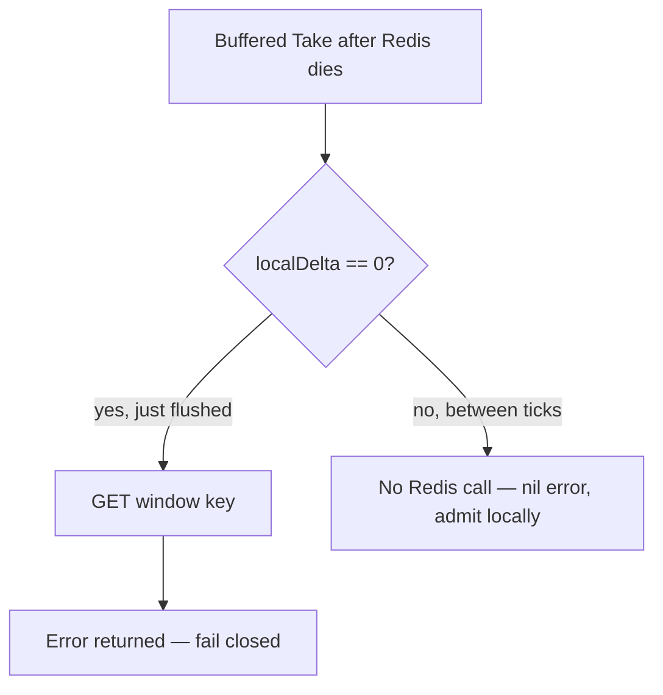

Developer review: in progress — 2026-09-12T13:10:24.399Z

## What this changes
**Operators.** None.

**Admin users.** None.

**Developers.** Buffered `windowcounter` Take/Peek return a retained flush error (or a probe after one missed `sync_rate`) instead of a silent nil. Exact mode is unchanged. `parseEvalInt` wraps the conversion cause. The Window counter usage packet names that exact vs buffered failure contract.

**End users.** None.

## Motivation
Buffered `Take` is supposed to share one Redis integer across instances, flushing local hits on `sync_rate`. On `master` that flush error is thrown away. While a delta is still local, the next `Take` never talks to Redis, so a dead server looks like a healthy admit.

Kill Redis after one buffered hit and the following Takes return a nil error. Each process still stops at its own `limit`; N processes therefore admit about `limit × N`. Exact mode (`sync_rate` 0) already returns `redis:unreachable`. The performance knob is also the failure-contract knob, and neither `New` nor the README says so.

Leaving this unmerged keeps a rate limiter that looks up from the middleware while the global cap is gone — worst on the hottest key, which almost always has a pending delta.

## Merge readiness
Usage packet `std_go_windowcounter` already names the buffered flush-error contract. CI on this head is still queued. 1 item remains.

Priority: P1 — production is serving a wrong public contract today: buffered Take admits without an error while Redis is down, so the shared limit does not hold.

Reviewed head: 4abdc19
Owner decision: Required. See Explore Decisions.

## Review scores
| Measure | Result | What it means |
| --- | --- | --- |
| Overall readiness | 3/6 | CI queued after the code-review card commit |
| CI proof | 3/6 | run 34695665222 queued |
| Local tests proof | N/A | prHost remote; CI covers remote |
| Review resolution | 6/6 | OPEN PR, no comments |

## Verification
| Check | Result | Evidence |
| --- | --- | --- |
| Branch | 2026-09-12-simpleredis-bug-05-windowcounter-hides-outage pushed | `git` / origin |
| OpenSpec | windowcounter-buffered-flush-error | `openspec/changes/windowcounter-buffered-flush-error/` |
| Pull request | https://github.com/david-garcia-garcia/traefik-middleware-utilities/pull/30 | pr-host List/Create |
| CI | build 34695665222 in progress https://github.com/david-garcia-garcia/traefik-middleware-utilities/actions/runs/34695665222 | Lint queued, Test queued, Go E2E queued, Integration Tests queued |
| Local tests | passed | handoff.yaml localTests |
| PR comments | no comments | none |

## Specs
- [std_go_windowcounter_sliding-take](https://github.com/david-garcia-garcia/traefik-middleware-utilities/blob/2026-09-12-simpleredis-bug-05-windowcounter-hides-outage/openspec/changes/windowcounter-buffered-flush-error/proposal.md) — modified
- [std_go_windowcounter_sync-flush](https://github.com/david-garcia-garcia/traefik-middleware-utilities/blob/2026-09-12-simpleredis-bug-05-windowcounter-hides-outage/openspec/changes/windowcounter-buffered-flush-error/proposal.md) — modified

## Deviations from the ask
None.

## Follow-up issues
None.

## How this fits together
Branch `2026-09-12-simpleredis-bug-05-windowcounter-hides-outage`, PR #30, OpenSpec change still live as `windowcounter-buffered-flush-error`, usage packet caught up, CI run 34695665222 queued.

## Explore Decisions
| Question | Rank | Decision | By |
| --- | --- | --- | --- |
| Which of the three error surfaces does this run ship (Take error, LastFlushError/Stale poll, or staleness deadline)? | bounded asked | assumed — staleness k=1 plus return lastFlushErr from Take and Peek on the existing (bool, float64, error) slot; store lastFlushErr / flushFailedAt / lastRedisOK; probe with flushPending when stale; do not add LastFlushError or a fourth return; do not GET every buffered Take. | explore |
| What is the staleness multiplier k? | additive asked | assumed — k = 1 (one missed sync_rate interval). now.Sub(lastRedisOK) >= syncRate triggers one flushPending probe. | explore |
| Must buffered Peek with a pending delta surface the same error as Take? | bounded asked | assumed — Peek returns the same lastFlushErr / staleness error as Take. Do not leave Peek as a silent sibling. | explore |
| Is a third Take return value acceptable under Yaegi and existing callers? | additive asked | assumed — keep (bool, float64, error). Put the flush/staleness error in the existing error slot. Do not add a fourth return. Yaegi callers already unpack three values. | explore |
| What does Kong Advanced / OSS do when a buffered flush fails? | additive incidental | assumed — do not clone Kong for flush-fail; follow std_go_windowcounter_sliding-take Redis-errors-propagate. Kong sync_rate remains the accuracy knob only. | explore |

## Before merge
- [x] [P1] Land staleness k=1 so buffered Take/Peek return lastFlushErr on Redis outage
- [x] Seven-axis review (nitpicks done, coverage tests landed, unused flushFailedAt skipped)
- [x] Window counter usage packet names buffered flush-error
- [ ] Wait for CI success on PR #30

## Findings
None.

## Axis review
[Standards](https://github.com/david-garcia-garcia/traefik-middleware-utilities/blob/2026-09-12-simpleredis-bug-05-windowcounter-hides-outage/devstate/2026/09/2026-09-12-simpleredis-bug-05-windowcounter-hides-outage/codereview_standards.md) — 0 total, 0 pending, 0 completed
[Nitpicks](https://github.com/david-garcia-garcia/traefik-middleware-utilities/blob/2026-09-12-simpleredis-bug-05-windowcounter-hides-outage/devstate/2026/09/2026-09-12-simpleredis-bug-05-windowcounter-hides-outage/codereview_nitpicks.md) — 1 total, 0 pending, 1 completed
[Spec](https://github.com/david-garcia-garcia/traefik-middleware-utilities/blob/2026-09-12-simpleredis-bug-05-windowcounter-hides-outage/devstate/2026/09/2026-09-12-simpleredis-bug-05-windowcounter-hides-outage/codereview_spec.md) — 0 total, 0 pending, 0 completed
[Security](https://github.com/david-garcia-garcia/traefik-middleware-utilities/blob/2026-09-12-simpleredis-bug-05-windowcounter-hides-outage/devstate/2026/09/2026-09-12-simpleredis-bug-05-windowcounter-hides-outage/codereview_security.md) — 0 total, 0 pending, 0 completed
[Performance](https://github.com/david-garcia-garcia/traefik-middleware-utilities/blob/2026-09-12-simpleredis-bug-05-windowcounter-hides-outage/devstate/2026/09/2026-09-12-simpleredis-bug-05-windowcounter-hides-outage/codereview_performance.md) — 0 total, 0 pending, 0 completed
[Dead](https://github.com/david-garcia-garcia/traefik-middleware-utilities/blob/2026-09-12-simpleredis-bug-05-windowcounter-hides-outage/devstate/2026/09/2026-09-12-simpleredis-bug-05-windowcounter-hides-outage/codereview_dead.md) — 1 total, 0 pending, 0 completed, 1 skipped
[Test coverage](https://github.com/david-garcia-garcia/traefik-middleware-utilities/blob/2026-09-12-simpleredis-bug-05-windowcounter-hides-outage/devstate/2026/09/2026-09-12-simpleredis-bug-05-windowcounter-hides-outage/codereview_coverage.md) — 2 total, 0 pending, 2 completed

## Agent review details

### Review metrics
| Metric | Value | Why it matters |
| --- | --- | --- |
| Specs in this PR | 0 added / 2 modified | Same list as ## Specs |
| Open reviewer comments walked | 0 FIX / 0 ANSWER / 0 open | Unanswered review is merge risk |
| Reviewed head | 4abdc190f62271c27643c0ad9d362499c40d1503 | Card must match the branch you measured |

### Stored data model
None.

### Technical review
Best possible solution: versus `master`, return the retained flush error from Take and Peek after one missed sync_rate, instead of discarding it and admitting locally.

Do we have a high-confidence way to reproduce? Yes: `TestTake_BufferedPendingDeltaOutage` kills the fake after one buffered hit and asserts a non-nil error after advancing one `sync_rate`.

Is this the best way to solve the issue? Yes versus `master`: it matches sliding-take error propagation without GET-on-every-Take or a poll API the middleware can ignore.

### Evidence
What I checked:
- `knowledge/devdocs/std_go_windowcounter.md` Language `sync_rate`, How-to, and Gotcha name buffered flush-error
- `devdocs-impact.md` stale-usage produced
- PR #30 OPEN; CI run 34695665222 queued

### Rank-up moves
None.
