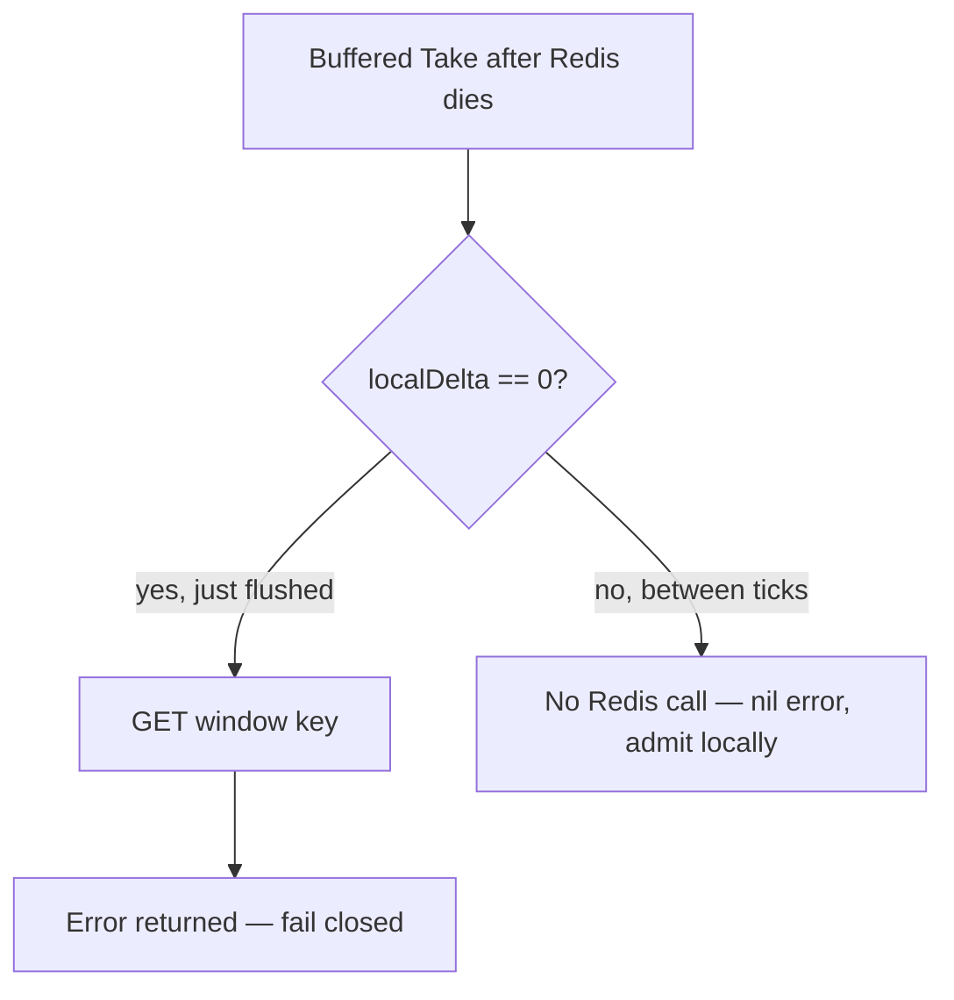

Developer review: in progress — 2026-09-12T12:35:57.960Z

## What this changes
**Operators.** None.

**Admin users.** None.

**Developers.** None.

**End users.** None.

## Motivation
Buffered `Take` is supposed to share one Redis integer across instances, flushing local hits on `sync_rate`. On `master` that flush error is thrown away. While a delta is still local, the next `Take` never talks to Redis, so a dead server looks like a healthy admit.

Kill Redis after one buffered hit and the following Takes return a nil error. Each process still stops at its own `limit`; N processes therefore admit about `limit × N`. Exact mode (`sync_rate` 0) already returns `redis:unreachable`. The performance knob is also the failure-contract knob, and neither `New` nor the README says so.

Leaving this unmerged keeps a rate limiter that looks up from the middleware while the global cap is gone — worst on the hottest key, which almost always has a pending delta.

## Merge readiness
Prepare grounded the outage gap; product code has not landed. 7 items remain.

Priority: P1 — production is serving a wrong public contract today: buffered Take admits without an error while Redis is down, so the shared limit does not hold.

Reviewed head: 2db7e12
Owner decision: None.

## Review scores
| Measure | Result | What it means |
| --- | --- | --- |
| Overall readiness | 3/6 | CI still running; no product fix yet |
| CI proof | 3/6 | run 34694043647 in progress |
| Local tests proof | N/A | before implement |
| Review resolution | 6/6 | OPEN PR, no comments |

## Verification
| Check | Result | Evidence |
| --- | --- | --- |
| Branch | 2026-09-12-simpleredis-bug-05-windowcounter-hides-outage pushed | `git` / origin |
| OpenSpec | none | `openspec/` |
| Pull request | https://github.com/david-garcia-garcia/traefik-middleware-utilities/pull/30 | pr-host List/Create |
| CI | build 34694043647 in progress https://github.com/david-garcia-garcia/traefik-middleware-utilities/actions/runs/34694043647 | pr-host CI |
| Local tests | none | handoff.yaml localTests |
| PR comments | no comments | none |

## Specs
None.

## Deviations from the ask
None.

## Follow-up issues
None.

## How this fits together
Local dump of this window-counter outage finding, branch `2026-09-12-simpleredis-bug-05-windowcounter-hides-outage`, stub PR #30, CI run 34694043647 still in progress.

## Explore Decisions
None.

## Before merge
- [ ] [P1] Ship one flush-error surface so buffered Take cannot hide a Redis outage
- [x] Stub PR #30 opened
- [x] Requirement written and qualified-with-gaps

## Findings
None.

## Axis review
None.

## Agent review details

### Review metrics
| Metric | Value | Why it matters |
| --- | --- | --- |
| Specs in this PR | none | Same list as ## Specs; do not paste diff --stat |
| Open reviewer comments walked | 0 FIX / 0 ANSWER / 0 open | Unanswered review is merge risk |
| Reviewed head | 2db7e1239ca7261ac09ef17c327e465a047dc18a | Card must match the branch you measured |

### Stored data model
None.

### Technical review
Best possible solution: not implemented versus `master`; DestBranch still discards `flushPending` errors and admits from `localDelta` while Redis is down.

Do we have a high-confidence way to reproduce? Yes, the ticket measured it: after one buffered hit with Redis killed, 11/11 Takes returned a nil error. DestBranch tests only cover exact-mode unreachable (`TestTake_Unreachable`).

Is this the best way to solve the issue? Not chosen yet — three surfaces are still open for explore.

### Evidence
What I checked:
- `windowcounter/limiter.go` flushLoop/Sleep/Close discard `flushPending`; `windowLocked` GETs only when `localDelta == 0` (path, 0159cfc)
- `takeExact` propagates Incr/Expire errors (path, 0159cfc)
- `std_go_windowcounter_sliding-take` requires unreachable to surface; `std_go_windowcounter_sync-flush` is silent on failed flush (path, 0159cfc)
- `TestTake_Unreachable` / `TestPeek_Unreachable` use `syncRate == 0`; fake has no kill-all-sockets (path, 0159cfc)
- PR #30 OPEN; CI run 34694043647 Lint and Test succeeded, Go E2E and Integration Tests in progress

### Rank-up moves
None.
