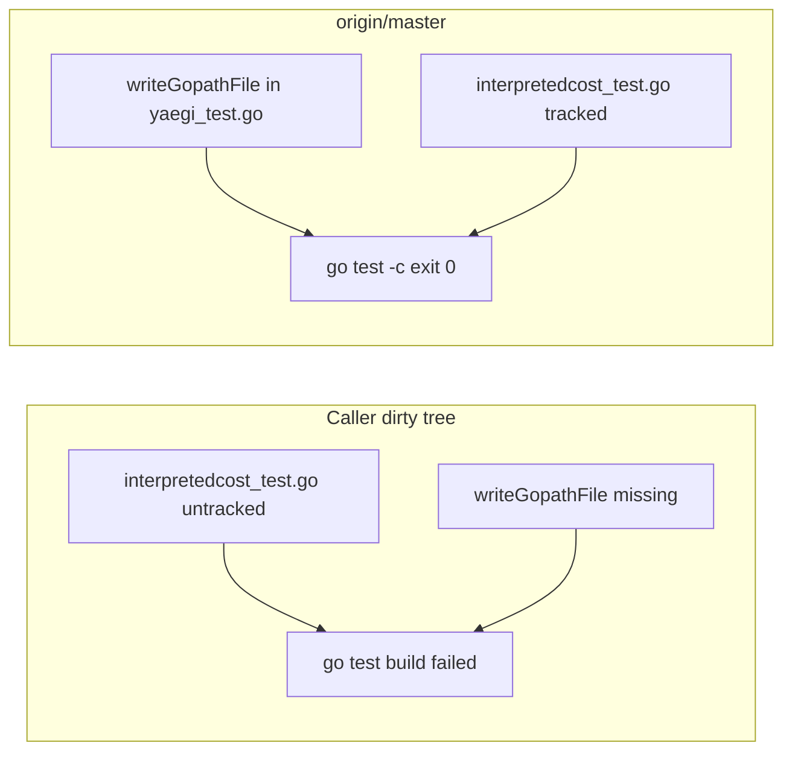

Developer review: in progress — 2026-09-12T12:36:52.902Z

## What this changes
**Operators.** None.

**Admin users.** None.

**Developers.** None.

**End users.** None.

## Motivation
This ticket is about the `simpleredis` test binary: `interpretedcost_test.go` calls `writeGopathFile` to materialise a temp GOPATH for Yaegi. If that helper is missing, `go test ./simpleredis/` fails to compile and CI `go test ./...` would go red on commit, masking every other test in the package.

On `origin/master` that helper already lives in `simpleredis/yaegi_test.go`, dest already tracks `interpretedcost_test.go` and `bench_test.go`, and `go test -c ./simpleredis/` exits 0. The compile break the ticket measured is the caller’s dirty working tree at an older HEAD, not dest. Cost of not keeping that pairing: landing tests that call `writeGopathFile` without the helper would take down the whole package test binary.

## Merge readiness
Prepare grounded; dest already compiles. Explore and later phases remain. 1 item remains.

Priority: P3 — tests and internal clarity; dest is not failing today
Reviewed head: 1dd3838
Owner decision: None.

## Review scores
| Measure | Result | What it means |
| --- | --- | --- |
| Overall readiness | 3/6 | CI still in progress; no product delta versus master |
| CI proof | 3/6 | Lint and Test succeeded; Go E2E in progress; Integration Tests queued. https://github.com/david-garcia-garcia/traefik-middleware-utilities/actions/runs/34694072769 |
| Local tests proof | N/A | `localTests: none` — before implement; remote CI covers this host |
| Review resolution | 6/6 | OPEN PR 37; comment inventory empty |

## Verification
| Check | Result | Evidence |
| --- | --- | --- |
| Branch | 2026-09-12-simpleredis-build-01-test-binary-does-not-build pushed | `git` / GitHub |
| OpenSpec | none | `openspec/` |
| Pull request | https://github.com/david-garcia-garcia/traefik-middleware-utilities/pull/37 | pr-host Create |
| CI | build 34694072769 in progress https://github.com/david-garcia-garcia/traefik-middleware-utilities/actions/runs/34694072769 | GitHub check runs |
| Local tests | none | handoff.yaml localTests |
| PR comments | no comments | no comments.md |

## Specs
None.

## Deviations from the ask
None.

## Follow-up issues
None.

## How this fits together
Local spec `simpleredisfixes2/build-01-test-binary-does-not-build.md` is grounded on branch `2026-09-12-simpleredis-build-01-test-binary-does-not-build` and stub PR 37. CI run 34694072769 is still in progress.

## Explore Decisions
None.

## Before merge
- [ ] Keep dest `simpleredis` test binary green; do not land tests that call `writeGopathFile` without that helper.

## Findings
None.

## Axis review
None.

## Agent review details

### Review metrics
| Metric | Value | Why it matters |
| --- | --- | --- |
| Specs in this PR | none | Same list as ## Specs; do not paste diff --stat |
| Open reviewer comments walked | 0 FIX / 0 ANSWER / 0 open | Unanswered review is merge risk |
| Reviewed head | 1dd3838b6ce96f68eef02821fee3a4ec5c65b07b | Card must match the branch you measured |

### Stored data model
None.

### Technical review
Best possible solution: dest already has `writeGopathFile` next to the four call sites; later phases should not re-import the caller’s divergent untracked copies.

Do we have a high-confidence way to reproduce? Yes, dest `go test -c ./simpleredis/` exit 0; caller `yaegi_test.go` still lacks `writeGopathFile`.

Is this the best way to solve the issue? Yes — keep the dest helper; bound the ask to this finding.

### Evidence
What I checked:
- Dest compile (`go test -c -o NUL ./simpleredis/`, exit 0, worktree HEAD 1dd3838, dest master 0159cfc)
- `writeGopathFile` in dest `simpleredis/yaegi_test.go:138`
- Four call sites in dest `simpleredis/interpretedcost_test.go`
- GitHub check runs on PR 37 (Lint success, Test success, Go E2E in progress, Integration Tests queued)
- PR 37 comment inventory empty

### Rank-up moves
None.
