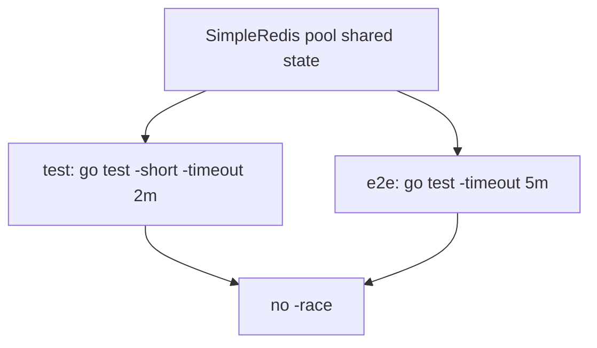

Developer review: in progress — 2026-09-12T12:35:11Z

## What this changes
**Operators.** None.

**Admin users.** None.

**Developers.** None.

**End users.** None.

## Motivation
DestBranch CI compiles SimpleRedis on Ubuntu without `go test -race`. The pool shares `idleConns`, a closed flag, an in-use semaphore, and a capability cache across goroutines. Windows without gcc cannot run the detector locally, so those accesses are never checked.

The unit job is `go test -short -timeout 2m`. The Go E2E job is `go test -timeout 5m`. Neither passes `-race`. Concurrent Get and one in-flight Close test exist; they do not run under the detector. If we do not merge, a race in borrow, release, or Close can ship while CI stays green.

## Merge readiness
Prepare grounded (`qualified-with-gaps`). Explore has not started. 1 item remains.

Priority: P3 — tests and CI proof; no current operator or user harm
Reviewed head: 2f08836
Owner decision: None.

## Review scores
| Measure | Result | What it means |
| --- | --- | --- |
| Overall readiness | 3/6 | CI on the stub PR is still queued |
| CI proof | 3/6 | Lint, Test, Go E2E, Integration Tests queued — [run 34694068502](https://github.com/david-garcia-garcia/traefik-middleware-utilities/actions/runs/34694068502) |
| Local tests proof | N/A | Before implement; remote CI is the proof axis |
| Review resolution | 6/6 | Open PR, no review comments |

## Verification
| Check | Result | Evidence |
| --- | --- | --- |
| Branch | 2026-09-12-simpleredis-ci-01-no-race-detector-in-ci pushed | `git push` origin |
| OpenSpec | none | `openspec/` |
| Pull request | https://github.com/david-garcia-garcia/traefik-middleware-utilities/pull/36 | GitHub PR 36 |
| CI | build 34694068502 queued https://github.com/david-garcia-garcia/traefik-middleware-utilities/actions/runs/34694068502 | GitHub check runs |
| Local tests | none | handoff.yaml localTests |
| PR comments | no comments | inventory empty |

## Specs
None.

## Deviations from the ask
None.

## Follow-up issues
None.

## How this fits together
Local finding ci-01 is grounded on branch `2026-09-12-simpleredis-ci-01-no-race-detector-in-ci`. Stub PR 36 is the durable card. Dest CI is queued on that PR and does not pass `-race` yet.

## Explore Decisions
None.

## Before merge
- [ ] Decide which Ubuntu job runs `-race` and raise its timeout so Yaegi and live jobs do not look like a hang
- [x] Stub PR opened

## Findings
None.

## Axis review
None.

## Agent review details

### Review metrics
| Metric | Value | Why it matters |
| --- | --- | --- |
| Specs in this PR | none | Same list as ## Specs |
| Open reviewer comments walked | 0 FIX / 0 ANSWER / 0 open | Unanswered review is merge risk |
| Reviewed head | 2f0883662629d5b056247edb1d19752214375f62 | Card must match the branch you measured |

### Stored data model
None.

### Technical review
Best possible solution: not applicable until explore; DestBranch already split unit and e2e, and neither job has `-race`.

Do we have a high-confidence way to reproduce? Yes — `.github/workflows/ci.yml` `test` and `e2e` `go test` lines have no `-race`.

Is this the best way to solve the issue? Not decided. Ticket assumed one test step at 2m; dest has unit 2m and e2e 5m, Ubuntu only.

### Evidence
What I checked:
- `.github/workflows/ci.yml` jobs `test` (line 38) and `e2e` (line 100) have no `-race` (HEAD 0159cfc)
- `simpleredis/simpleredis.go:48-57` pool shared state
- `simpleredis/pool_test.go` `TestConcurrentCommandsStayWithinPool`; `simpleredis_test.go` `TestCloseDuringInFlightCommandClosesSocketOnRelease`
- `openspec/specs/std_go_ci_test-suites/spec.md` does not require `-race`
- PR 36 created; check runs queued (run 34694068502)

### Rank-up moves
None.
