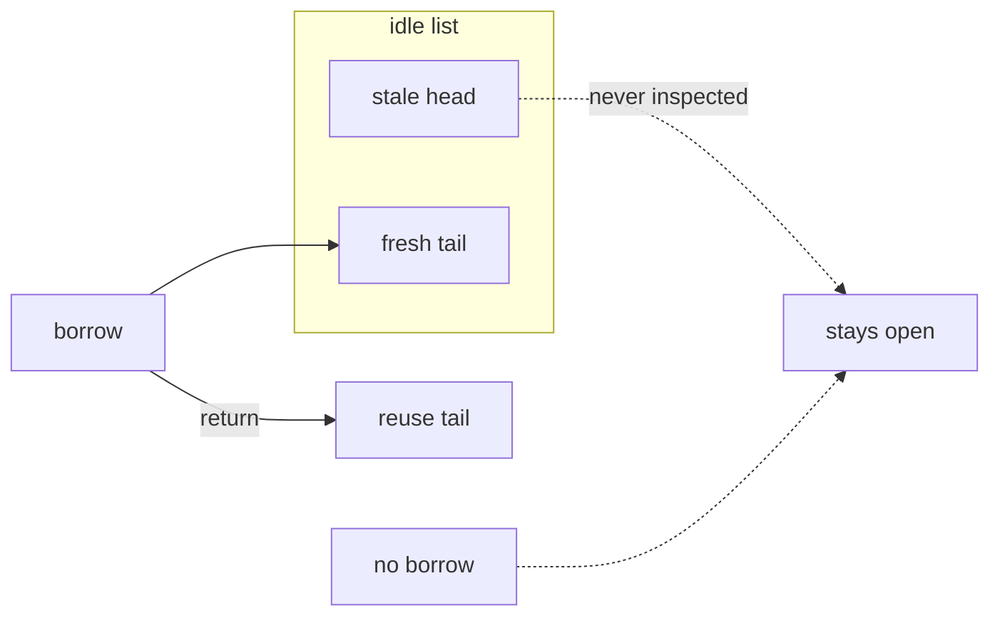

Developer review: in progress — 2026-09-12T12:35:05Z

## What this changes
**Operators.** None.

**Admin users.** None.

**Developers.** None.

**End users.** None.

## Motivation
SimpleRedis keeps unused sockets in a LIFO idle list. On DestBranch, `IdleTimeout` is only a reuse gate: `takeIdleConn` pops the newest socket and stops when that one is still young, so older sockets at the head stay established. `New` starts no goroutine, so a client that goes quiet never closes those sockets at all.

That leaves up to `PoolSize` TCP sessions per client (client buffers plus a Redis or Dragonfly `maxclients` slot). After a quiet period the next command often reuses a socket the server already dropped, so that request pays a failed attempt plus a redial. Not merging leaves that resting footprint and burst-redial in every Traefik worker that holds a SimpleRedis client.

## Merge readiness
Prepare grounded the ticket. Apply has not started. 2 items remain.

Priority: P2 — real operator pain with limited blast radius (at most PoolSize leftover sockets per client; burst-time redial)
Reviewed head: b43bd89
Owner decision: None.

## Review scores
| Measure | Result | What it means |
| --- | --- | --- |
| Overall readiness | 3/6 | Stub PR is open; CI still in progress; no product apply yet. |
| CI proof | 3/6 | Lint and Test in progress; Go E2E and Integration Tests queued — [run 34694061485](https://github.com/david-garcia-garcia/traefik-middleware-utilities/actions/runs/34694061485) |
| Local tests proof | N/A | Before implement; remote CI is the proof axis. |
| Review resolution | 6/6 | OPEN PR; no review comments. |

## Verification
| Check | Result | Evidence |
| --- | --- | --- |
| Branch | 2026-09-12-simpleredis-risk-02-no-idle-reaper pushed | git / pr-host |
| OpenSpec | none | `openspec/` |
| Pull request | https://github.com/david-garcia-garcia/traefik-middleware-utilities/pull/33 | pr-host Create |
| CI | build 34694061485 in progress https://github.com/david-garcia-garcia/traefik-middleware-utilities/actions/runs/34694061485 | pr-host CI |
| Local tests | none | handoff.yaml localTests |
| PR comments | no comments | no comments.md |

## Specs
None.

## Deviations from the ask
None.

## Follow-up issues
None.

## How this fits together
Local spec risk-02 is on branch 2026-09-12-simpleredis-risk-02-no-idle-reaper into [PR 33](https://github.com/david-garcia-garcia/traefik-middleware-utilities/pull/33) against master. Related OPEN PR 12 (peel-on-release) is inventoried and not this apply. CI on the stub is in progress.

## Explore Decisions
None.

## Before merge
- [ ] Choose sweep-on-borrow versus OPEN PR 12 peel-on-release, and whether a fully idle client needs a reclaim-owned reaper
- [ ] Apply, prove fake `openSockets` after quiet time and a two-age head close

## Findings
None.

## Axis review
None.

## Agent review details

### Review metrics
| Metric | Value | Why it matters |
| --- | --- | --- |
| Specs in this PR | none | Same list as ## Specs |
| Open reviewer comments walked | 0 FIX / 0 ANSWER / 0 open | Unanswered review is merge risk |
| Reviewed head | b43bd893fe6ca2c0761aaf5d7d00c6e33999312b | Card must match the branch you measured |

### Stored data model
None.

### Technical review
Best possible solution: not applied. DestBranch still has tail-only `takeIdleConn` and no reaper.

Do we have a high-confidence way to reproduce? Yes: pool several sockets on the fake, stop traffic past `IdleTimeout`, `openSockets()` stays at n; a young tail plus aged head still reuses the tail.

Is this the best way to solve the issue? Not chosen. Ticket prefers full-list sweep on borrow; OPEN PR 12 peels stale heads on `release`; a reaper needs reclaim `Close`. Explore picks.

### Evidence
What I checked:
- Pin `origin/master` `0159cfc93a8b8b3abfdb6c1ec58f42052f4775b5` (`simpleredis/` present)
- `takeIdleConn` tail-return (`simpleredis/pool.go`); `New` has no goroutine (`simpleredis/simpleredis.go`)
- `TestIdleTimeoutOpensANewConnection` is a one-entry tail case (`simpleredis/pool_test.go`)
- `Limiter.Close` does not close SimpleRedis (`windowcounter/limiter.go`); probe never calls `Close`
- Related OPEN PR 12 comment-list empty (issue comments and review threads)
- This IssueKey OPEN PR 33; comment-list empty
- Whoami `David` `<deivid.garcia.garcia@gmail.com>` (`login=david-garcia-garcia`)
- `handoff.yaml` `src` `82d0289de3a0169a2584e65d4e1fc93aacaec70714a4ee203451eafb5d0e10a1`

### Rank-up moves
None.
