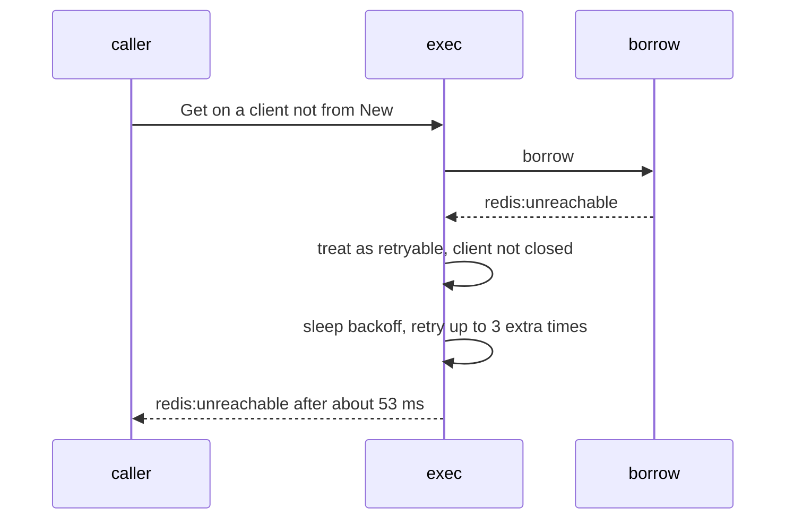

Developer review: in progress — 2026-09-12T12:36:37Z

## What this changes
**Operators.** None.

**Admin users.** None.

**Developers.** None.

**End users.** None.

## Motivation
A SimpleRedis client must come from `New`. DestBranch still lets `&SimpleRedis{}` compile: the in-use-turn channel stays nil, `borrow` returns the same `redis:unreachable` identity that command retry treats as a transient network miss, and `exec` only skips that ladder after `Close`.

On DestBranch a zero-value `Get` therefore sleeps the default retry ladder (3 extra attempts, 8 ms / 512 ms backoff) and comes back as `redis:unreachable` after about 53 ms. An operator who hits that path starts at Redis and the firewall, not at construction.

In-repo limiters already inject a `New` client, so this is a guardrail, not a live outage. Leaving DestBranch as-is keeps a programming error classified as a retryable outage.

## Merge readiness
Prepare grounded the ask on DestBranch. 2 items remain.

Priority: P3 — no current user or operator harm; in-repo callers already inject New
Reviewed head: 5daf0e9
Owner decision: None.

## Review scores
| Measure | Result | What it means |
| --- | --- | --- |
| Overall readiness | 3/6 | CI is still queued; no product change versus DestBranch yet |
| CI proof | 3/6 | queued — [run 34694138778](https://github.com/david-garcia-garcia/traefik-middleware-utilities/actions/runs/34694138778) |
| Local tests proof | N/A | before implement |
| Review resolution | 6/6 | OPEN PR, no review comments |

## Verification
| Check | Result | Evidence |
| --- | --- | --- |
| Branch | 2026-09-12-simpleredis-risk-06-zero-value-client-spins-retries pushed | `git` `5daf0e9` |
| OpenSpec | none | `openspec/` |
| Pull request | https://github.com/david-garcia-garcia/traefik-middleware-utilities/pull/32 | pr-host List/Create |
| CI | build 34694138778 queued https://github.com/david-garcia-garcia/traefik-middleware-utilities/actions/runs/34694138778 | pr-host CI |
| Local tests | none | handoff.yaml localTests |
| PR comments | no comments | no comments.md |

## Specs
None.

## Deviations from the ask
None.

## Follow-up issues
None.

## How this fits together
Local risk-06 spec → branch `2026-09-12-simpleredis-risk-06-zero-value-client-spins-retries` → [PR 32](https://github.com/david-garcia-garcia/traefik-middleware-utilities/pull/32) → CI run 34694138778 queued.

## Explore Decisions
None.

## Before merge
- [ ] Fail a SimpleRedis that did not come from New on the first command, without the retry ladder [P3]
- [ ] Prove that path: latency under one backoff interval, `redis:unreachable`, no panic on exported methods including Close twice, and `cap(inUseTurns)==0`

## Findings
None.

## Axis review
None.

## Agent review details

### Review metrics
| Metric | Value | Why it matters |
| --- | --- | --- |
| Specs in this PR | none | Same list as ## Specs; do not paste diff --stat |
| Open reviewer comments walked | 0 FIX / 0 ANSWER / 0 open | Unanswered review is merge risk |
| Reviewed head | 5daf0e9930807fa6dba87c22a48b8a3fe250304d | Card must match the branch you measured |

### Stored data model
None.

### Technical review
Best possible solution: return a distinct identity that still prints `redis:unreachable` from `borrow`'s nil-semaphore check, matching DestBranch `errPoolWait`.

Do we have a high-confidence way to reproduce? Yes, `&SimpleRedis{}` then `Get` (DestBranch `borrow` + `exec` retry).

Is this the best way to solve the issue? Yes — DestBranch already splits pool-wait from unreachable by identity; the not-from-New case is the same job.

### Evidence
What I checked:
- `simpleredis/pool.go` nil `inUseTurns` returns `errUnreachable`; `ensureInUseTurns` is only called from `New` (`simpleredis.go`)
- `simpleredis/commands_exec.go` retries `errUnreachable` unless `isClosed()`; `errPoolWait` is already non-retryable (`commands_exec_test.go`)
- In-repo callers inject `*SimpleRedis` from `New` (`tokenbucket/redis.go`, `windowcounter/limiter.go`)
- CI run 34694138778 queued (Lint, Test, Go E2E, Integration Tests)

### Rank-up moves
- Reject empty `Host` in `New` (adjacent hole; not this ask).
