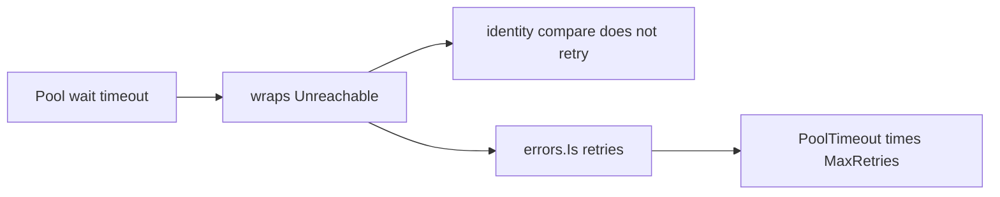

Developer review: in progress — 2026-09-13T15:48:49Z

## What this changes
**Operators.** None.

**Admin users.** None.

**Developers.** CI lint is pinned to golangci-lint v1.63.4. `.golangci.yml` enables the dest-zero linters plus `gocritic` (`unnamedResult`, `checkExported: false`), `thelper`, `revive`, `dupword`, `prealloc`, `stylecheck`, `errname`, `forcetypeassert` (production only), and `errorlint`. `borrow`/`dial` now name `handshakeFailed`. Identity `==` on SimpleRedis sentinels stays `==` with `//nolint:errorlint`. `testpackage`, `goimports`, and `gofumpt` stay off.

**End users.** None.

## Motivation
Dest lint was ten linters and CI `version: latest`. Named results, `t.Helper()`, and identity error compares that the SimpleRedis retry spec requires were unguarded. A future golangci-lint v2 release would reject this config schema and turn unrelated PRs red.

Cost of not merging: later PRs can land unnamed `handshakeFailed`, rewrite retry onto `errors.Is(err, ErrUnreachable)` (which retries pool wait and multiplies `PoolTimeout` by `MaxRetries`), and CI can jump to a linter that does not parse this file.

## Merge readiness
Apply landed. CI run 34766624338 succeeded. Remaining phases: code review, usage-doc impact, archive, pullrequest title. 2 items remain.

Priority: P3 — spec, docs, tests, or internal clarity, no current user or operator harm
Reviewed head: 8c2ec1d
Owner decision: None.

## Review scores
| Measure | Result | What it means |
| --- | --- | --- |
| Overall readiness | 4/6 | Apply and CI are green; remaining workflow phases and a WIP title |
| CI proof | 6/6 | build 34766624338 succeeded https://github.com/david-garcia-garcia/traefik-middleware-utilities/actions/runs/34766624338 |
| Local tests proof | N/A | remote PR; CI is the proof axis |
| Review resolution | 6/6 | OPEN PR, no review comments |

## Verification
| Check | Result | Evidence |
| --- | --- | --- |
| Branch | 2026-09-13-golangci-lint-harden pushed | git / origin 8c2ec1d |
| OpenSpec | harden-golangci-lint | `openspec/changes/harden-golangci-lint/` |
| Pull request | https://github.com/david-garcia-garcia/traefik-middleware-utilities/pull/72 | pr-host |
| CI | build 34766624338 succeeded https://github.com/david-garcia-garcia/traefik-middleware-utilities/actions/runs/34766624338 | pr-host CI |
| Local tests | passed | handoff.yaml localTests; `go test -short ./...` plus Yaegi |
| PR comments | no comments | no comments.md |

## Specs
- [std_go_ci_test-suites](https://github.com/david-garcia-garcia/traefik-middleware-utilities/blob/2026-09-13-golangci-lint-harden/openspec/changes/harden-golangci-lint/proposal.md) — modified

## Deviations from the ask
None.

## Follow-up issues
None.

## How this fits together
Ticket is local spec → branch `2026-09-13-golangci-lint-harden` → PR 72 → change `harden-golangci-lint`. Merge after remaining in-flight SimpleRedis branches: `2026-09-13-simpleredis-lost-turn-recovery`, `2026-09-13-simpleredis-desync-boundary-check`, `2026-09-13-simpleredis-close-abandoned-socket`, `2026-09-13-simpleredis-resilience-test-coverage`. `2026-09-13-simpleredis-panic-safe-release` is already on master. Deferred: reorder `borrow`/`dial` so `error` is last (naming is call-site compatible; reordering would collide with those PRs).

## Explore Decisions
None.

## Before merge
- [ ] Merge after remaining in-flight SimpleRedis PRs that rewrite `simpleredis/commands_exec.go`, `pool.go`, and `resp.go`
- [ ] Drop WIP title in pullrequest
- [x] Land Tasks 1–6 with no runtime behavior change
- [x] CI green on 8c2ec1d (lint included)

## Findings
None.

## Axis review
None.

## Agent review details

### Review metrics
| Metric | Value | Why it matters |
| --- | --- | --- |
| Specs in this PR | 0 added / 1 modified | Same list as ## Specs |
| Open reviewer comments walked | 0 FIX / 0 ANSWER / 0 open | Unanswered review is merge risk |
| Reviewed head | 8c2ec1d66e4fcf457adc8f9d3e5f29f9e1fbf6f5 | Card must match the branch you measured |

### Stored data model
None.

### Technical review
Best possible solution: pin v1.63.4, enable dest-measured linters, name results without reordering, keep identity `==` with site-specific nolint.

Do we have a high-confidence way to reproduce? Yes — dest counts in explore.md; CI lint succeeded on Ubuntu.

Is this the best way to solve the issue? Yes vs dest: config plus mechanical fixes, no runtime change.

### Evidence
What I checked:
- `golangci-lint run` v1.63.4: non-gofmt 0 on this Windows host; Ubuntu CI Lint succeeded
- `go test -short ./...` passed (backendbackoff, reclaim, simpleredis, tokenbucket, windowcounter)
- CI run 34766624338: Lint, Unit, Unit race, Go E2E Redis/Dragonfly, Integration Tests Redis/Dragonfly all success
- Converted zero errorlint sites to `errors.Is`

### Rank-up moves
- Reorder `borrow`/`dial` results so `error` is last after the in-flight SimpleRedis PRs land.

[sgsi-dev-ticket-status:2026-09-13-golangci-lint-harden]
