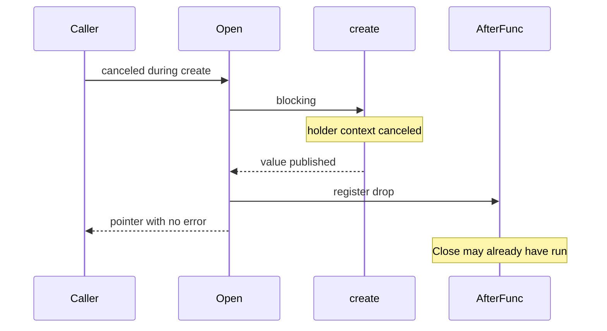

Developer review: ready for review — 2026-09-13T08:18:10Z

## What this changes
**Operators.** None.

**Admin users.** None.

**Developers.** `Table.Open` returns `(nil, ctx.Err())` when the holder context is already done at bind, instead of a pointer whose Close may already have run. Tests in `reclaim/table_canceled_bind_test.go`. Usage packet `knowledge/devdocs/std_go_reclaim.md` and spec `std_go_reclaim_context-lease` match.

**End users.** None.

## Motivation
On dest, `Table.Open` is the call that both creates (or rebinds) a keyed value and attaches the caller’s holder context. `(value, nil)` is how callers know they own a live pointer.

At zero grace, canceling that holder context before `Open` returns can run Close via `AfterFunc` while `Open` still returns the pointer. The reproduced path is cancel during a blocking `create`; the same bind-then-drop race exists on an already-awake bind and on reclaim. A caller that type-asserts and uses that pointer is talking to an incarnation that already ended.

If this stays unmerged, a host that cancels during a slow create (or opens with an already-done context) can observe a closed value with no error.

## Merge readiness
Product apply, archive, and CI on this head succeeded. Ready for review. GitHub still shows the stub draft flag: the PAT cannot set `draft: false`. 0 items remain.

Priority: P1 — serving a wrong public contract today
Reviewed head: 821a8b7
Owner decision: None.

## Review scores
| Measure | Result | What it means |
| --- | --- | --- |
| Overall readiness | 6/6 | CI succeeded; checklist empty |
| CI proof | 6/6 | CI succeeded https://github.com/david-garcia-garcia/traefik-middleware-utilities/actions/runs/34747225967 |
| Local tests proof | N/A | Remote PR: CI proof covers remote |
| Review resolution | 6/6 | OPEN PR, no review comments |

## Verification
| Check | Result | Evidence |
| --- | --- | --- |
| Branch | 2026-09-13-reclaim-bug-canceled-open-close pushed | `git push` `821a8b7` |
| OpenSpec | reclaim-canceled-bind | archived `openspec/changes/archive/2026-09-13-reclaim-canceled-bind/` |
| Pull request | https://github.com/david-garcia-garcia/traefik-middleware-utilities/pull/51 | pr-host Create |
| CI | build 34747225967 success https://github.com/david-garcia-garcia/traefik-middleware-utilities/actions/runs/34747225967 | pr-host CI |
| Local tests | passed | `go test -short ./...` ok after master merge |
| PR comments | no comments | inventory empty |

## Specs
- [std_go_reclaim_context-lease](https://github.com/david-garcia-garcia/traefik-middleware-utilities/blob/2026-09-13-reclaim-bug-canceled-open-close/openspec/changes/archive/2026-09-13-reclaim-canceled-bind/proposal.md) — modified

## Deviations from the ask
- taken: call `drop` on this stack including dest’s grace wait → holder decrement, sleep, and zero-grace close stay on this stack; the positive-grace timer runs in `waitGraceOrWake` — `reclaim/table.go` `drop` — dest already waited in an AfterFunc goroutine, not in Open. Requester: not asked.

## Follow-up issues
None.

## How this fits together
Local ticket, branch `2026-09-13-reclaim-bug-canceled-open-close` from `origin/master`. PR #51. Spec archived; CI green on `821a8b7` after merging master (including `EnforceCloseBeforeOpen`).

## Explore Decisions
| Question | Rank | Decision | By |
| --- | --- | --- | --- |
| Where do the new product tests live? | additive asked | assumed — `reclaim/table_canceled_bind_test.go` | explore |
| Do awake-bind and reclaimLocked tests use only `NewTable(0)`? | additive asked | assumed — create-cancel and awake bind use zero grace; reclaimLocked uses positive grace | explore |
| Does `reclaimLocked` grow an error return or does Open check after it? | bounded asked | assumed — `reclaimLocked` returns `(any, error)` | explore |
| Does implement also add the optional pre-create `ctx.Err()` check? | additive asked | assumed — do not abort `put` before `create` (would starve waiters) | implement |
| How do we cover waiters that still get the live value without a flake? | additive asked | assumed — waiter table uses positive grace so a lost awake-bind race still reclaims the same pointer | implement |

## Before merge
None.

## Findings
None.

## Axis review
[Standards](https://github.com/david-garcia-garcia/traefik-middleware-utilities/blob/2026-09-13-reclaim-bug-canceled-open-close/devstate/2026/09/2026-09-13-reclaim-bug-canceled-open-close/codereview_standards.md) — 1 total, 0 pending, 1 completed
[Nitpicks](https://github.com/david-garcia-garcia/traefik-middleware-utilities/blob/2026-09-13-reclaim-bug-canceled-open-close/devstate/2026/09/2026-09-13-reclaim-bug-canceled-open-close/codereview_nitpicks.md) — 0 total, 0 pending, 0 completed
[Spec](https://github.com/david-garcia-garcia/traefik-middleware-utilities/blob/2026-09-13-reclaim-bug-canceled-open-close/devstate/2026/09/2026-09-13-reclaim-bug-canceled-open-close/codereview_spec.md) — 0 total, 0 pending, 0 completed
[Security](https://github.com/david-garcia-garcia/traefik-middleware-utilities/blob/2026-09-13-reclaim-bug-canceled-open-close/devstate/2026/09/2026-09-13-reclaim-bug-canceled-open-close/codereview_security.md) — 0 total, 0 pending, 0 completed
[Performance](https://github.com/david-garcia-garcia/traefik-middleware-utilities/blob/2026-09-13-reclaim-bug-canceled-open-close/devstate/2026/09/2026-09-13-reclaim-bug-canceled-open-close/codereview_performance.md) — 0 total, 0 pending, 0 completed
[Dead](https://github.com/david-garcia-garcia/traefik-middleware-utilities/blob/2026-09-13-reclaim-bug-canceled-open-close/devstate/2026/09/2026-09-13-reclaim-bug-canceled-open-close/codereview_dead.md) — 0 total, 0 pending, 0 completed
[Test coverage](https://github.com/david-garcia-garcia/traefik-middleware-utilities/blob/2026-09-13-reclaim-bug-canceled-open-close/devstate/2026/09/2026-09-13-reclaim-bug-canceled-open-close/codereview_coverage.md) — 0 total, 0 pending, 0 completed

## Agent review details

### Review metrics
| Metric | Value | Why it matters |
| --- | --- | --- |
| Specs in this PR | 0 added / 1 modified | Same list as ## Specs |
| Open reviewer comments walked | 0 FIX / 0 ANSWER / 0 open | Unanswered review is merge risk |
| Reviewed head | 821a8b70f00e363c7a84680a0dd6c393d382fa0e | Card must match the branch you measured |

### Stored data model
None.

### Technical review
Best possible solution: bind-time `ctx.Err()` then `drop` on this stack at put, awake bind, and reclaimLocked.

Do we have a high-confidence way to reproduce? Yes — new tests failed on dest and on CI `897685c`, then passed after the fix (`2fe3c6d` and later heads including `821a8b7`).

Is this the best way to solve the issue? Yes — delaying AfterFunc still hands out the pointer; aborting `put` before create would starve waiters.

### Evidence
What I checked:
- `go test -short ./...` after merging `origin/master` (including `EnforceCloseBeforeOpen`): ok
- CI run 34746895001 Go E2E Dragonfly failed on `3ce3959` (job logs not readable here); retrigger 34747225967 success on `821a8b7`
- Qualify: qualified-with-gaps

### Rank-up moves
None.
