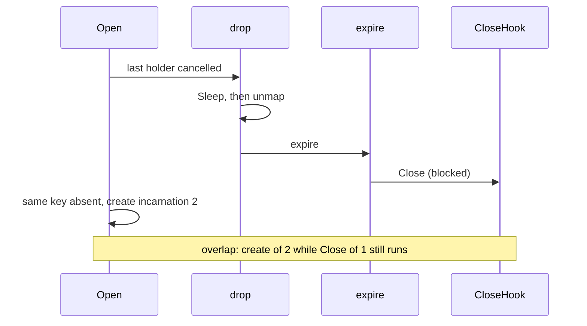

Developer review: ready for review — 2026-09-13T06:49:26Z

## What this changes
**Operators.** None.

**Admin users.** None.

**Developers.** `reclaim` keeps the key mapped `slotBusy` for the whole Close (outside the table mutex), then unmaps via `unmapAfterClose` and closes `ready`. A later `Open` of the same key waits until Close returns, then creates. Overlap tests fail on dest and pass after the fix. Live specs `std_go_reclaim_value-lifecycle` and `std_go_reclaim_context-lease`, plus `knowledge/devdocs/std_go_reclaim.md`, require that wait. Change archived as `openspec/changes/archive/2026-09-13-reclaim-close-before-unmap/`.

**End users.** None.

## Motivation
The reclaim table stores one value per key and is supposed to Close that incarnation before a later Open creates the next one. On dest, zero grace (and expire after a positive grace) deletes the map entry first, then runs Close outside the table mutex. A concurrent Open sees the key gone and create()s while the previous Close hook is still running. Traefik reload is that sequence: the last New ctx is cancelled, then the next New Opens the same key.

Cost of not merging: two values for one key overlap — the old Close still in flight and a new create already started. A slow Close (database, file, Redis) can tear down the previous value after the next incarnation is live.

## Merge readiness
Ready for review. 0 items remain.

Priority: P1 — dest unmaps then Closes, so a reload Open can create the next value while the previous Close is still running
Reviewed head: 9b6466c
Owner decision: None.

## Review scores
| Measure | Result | What it means |
| --- | --- | --- |
| Overall readiness | 6/6 | CI succeeded; no open review comments |
| CI proof | 6/6 | all required checks succeeded https://github.com/david-garcia-garcia/traefik-middleware-utilities/actions/runs/34743786210 |
| Local tests proof | N/A | remote PR; localTests: passed |
| Review resolution | 6/6 | OPEN PR, no review comments |

## Verification
| Check | Result | Evidence |
| --- | --- | --- |
| Branch | 2026-09-13-reclaim-bug-unmap-before-close pushed | git / origin |
| OpenSpec | reclaim-close-before-unmap archived | `openspec/changes/archive/2026-09-13-reclaim-close-before-unmap/` |
| Pull request | https://github.com/david-garcia-garcia/traefik-middleware-utilities/pull/50 | pr-host List |
| CI | build 34743786210 succeeded https://github.com/david-garcia-garcia/traefik-middleware-utilities/actions/runs/34743786210 | pr-host CI |
| Local tests | passed | handoff.yaml localTests |
| PR comments | no comments | none OPEN |

## Specs
- [std_go_reclaim_value-lifecycle](https://github.com/david-garcia-garcia/traefik-middleware-utilities/blob/2026-09-13-reclaim-bug-unmap-before-close/openspec/changes/archive/2026-09-13-reclaim-close-before-unmap/proposal.md) — modified
- [std_go_reclaim_context-lease](https://github.com/david-garcia-garcia/traefik-middleware-utilities/blob/2026-09-13-reclaim-bug-unmap-before-close/openspec/changes/archive/2026-09-13-reclaim-close-before-unmap/proposal.md) — modified

## Deviations from the ask
- taken: ticket example `TestZeroGraceCreateStartsWhilePreviousCloseBlocked` → `TestTable_ZeroGraceCreateWaitsUntilPreviousCloseReturns` (and expire sibling) — `reclaim/table_test.go` — existing tests already use `TestTable_`; the passing invariant is wait-until-Close. Requester: not asked.

## Follow-up issues
None.

## How this fits together
Local ticket `2026-09-13-reclaim-bug-unmap-before-close` is on that branch against `master`, PR #50. Close-before-unmap landed; specs archived; CI succeeded.

## Explore Decisions
| Question | Rank | Decision | By |
| --- | --- | --- | --- |
| Should tests-only Reset use the same Close-before-unmap ordering? | bounded asked | assumed — skip. Reset already replaces t.items then Sleep/Close; existing Reset tests require leaving a busy drop to its owner. Reordering is not cheap. Production never calls Reset. | explore |
| Land an expire-after-positive-grace overlap test next to the zero-grace test? | additive asked | assumed — land it. Same Close-hook-blocks pattern after grace elapsed. | explore |
| Test function names and wait budget? | additive asked | assumed — TestTable_ZeroGraceCreateWaitsUntilPreviousCloseReturns and expire sibling; 200ms wait while Close is blocked. | explore |

## Before merge
None.

## Findings
None.

## Axis review
[Standards](https://github.com/david-garcia-garcia/traefik-middleware-utilities/blob/2026-09-13-reclaim-bug-unmap-before-close/devstate/2026/09/2026-09-13-reclaim-bug-unmap-before-close/codereview_standards.md) — 2 total, 0 pending, 2 completed
[Nitpicks](https://github.com/david-garcia-garcia/traefik-middleware-utilities/blob/2026-09-13-reclaim-bug-unmap-before-close/devstate/2026/09/2026-09-13-reclaim-bug-unmap-before-close/codereview_nitpicks.md) — 0 total, 0 pending, 0 completed
[Spec](https://github.com/david-garcia-garcia/traefik-middleware-utilities/blob/2026-09-13-reclaim-bug-unmap-before-close/devstate/2026/09/2026-09-13-reclaim-bug-unmap-before-close/codereview_spec.md) — 1 total, 0 pending, 1 completed
[Security](https://github.com/david-garcia-garcia/traefik-middleware-utilities/blob/2026-09-13-reclaim-bug-unmap-before-close/devstate/2026/09/2026-09-13-reclaim-bug-unmap-before-close/codereview_security.md) — 0 total, 0 pending, 0 completed
[Performance](https://github.com/david-garcia-garcia/traefik-middleware-utilities/blob/2026-09-13-reclaim-bug-unmap-before-close/devstate/2026/09/2026-09-13-reclaim-bug-unmap-before-close/codereview_performance.md) — 0 total, 0 pending, 0 completed
[Dead](https://github.com/david-garcia-garcia/traefik-middleware-utilities/blob/2026-09-13-reclaim-bug-unmap-before-close/devstate/2026/09/2026-09-13-reclaim-bug-unmap-before-close/codereview_dead.md) — 1 total, 0 pending, 1 completed
[Test coverage](https://github.com/david-garcia-garcia/traefik-middleware-utilities/blob/2026-09-13-reclaim-bug-unmap-before-close/devstate/2026/09/2026-09-13-reclaim-bug-unmap-before-close/codereview_coverage.md) — 0 total, 0 pending, 0 completed

## Agent review details

### Review metrics
| Metric | Value | Why it matters |
| --- | --- | --- |
| Specs in this PR | 0 added / 2 modified | Same list as ## Specs |
| Open reviewer comments walked | 0 FIX / 0 ANSWER / 0 open | Unanswered review is merge risk |
| Reviewed head | 9b6466c6db3e5687c58300c48fb41b8fe96a9b65 | Card must match the branch you measured |

### Stored data model
None.

### Technical review
Best possible solution: keep the key mapped `slotBusy` for the whole Close, then unmap and close(ready) so a racing Open waits instead of creating.

Do we have a high-confidence way to reproduce? Yes — `TestTable_ZeroGraceCreateWaitsUntilPreviousCloseReturns` and `TestTable_ExpireCreateWaitsUntilPreviousCloseReturns` failed on dest (`97f62f3`) then passed after `2e50b37` / `80328a9`.

Is this the best way to solve the issue? Yes — Open already waits on `slotBusy`; Close stays outside `t.mu`; zero grace still has no sleeping window.

### Evidence
What I checked:
- Fail-then-pass: `97f62f3` overlap tests FAIL (`create of incarnation 2 ran while Close of 1 was blocked`); `2e50b37` / `80328a9` PASS; `go test ./reclaim/...` ok
- `unmapAfterClose` deletes under `t.mu` then logs dispose then `close(ready)` outside the mutex (`reclaim/table.go`)
- Zero-grace `drop` stays `slotBusy` through Close; `expire` claims `slotBusy` before Close
- Tests-only `Reset` still unmaps first (existing Reset tests)
- Did not fix canceled-ctx disposed return or hook-panic bricks key
- CI run 34743786210: Lint, Unit, Unit race, Go E2E Redis, Go E2E Dragonfly, Integration Tests, Integration Tests Redis, Integration Tests Dragonfly — all success

### Rank-up moves
None.
