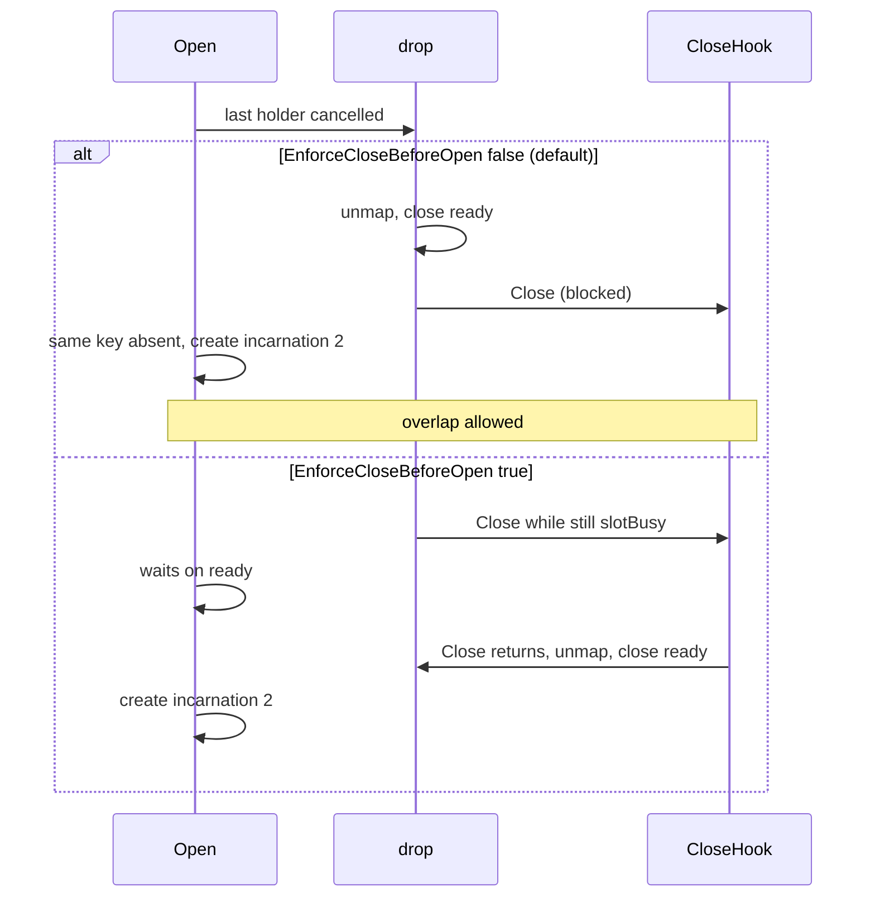

Developer review: ready for review — 2026-09-13T07:58:00Z

## What this changes
**Operators.** None.

**Admin users.** None.

**Developers.** Close-before-create is opt-in per incarnation via `Hooks.EnforceCloseBeforeOpen` (default false). The zero value keeps dest behaviour: unmap, then Close, so a concurrent `Open` may create while Close is still in flight. When the stored flag is true, the key stays mapped `slotBusy` across Close (outside the table mutex), then `unmapAfterClose` closes `ready` and the next `Open` creates. The flag is read from the ending incarnation's stored hooks, not from a later `Open`. Close still runs only through master's `dispose`/`runHook`, so a panicking Close cannot escape on `AfterFunc` in either flag state. Live specs and `knowledge/devdocs/std_go_reclaim.md` state the default-off and the opt-in. Change archived as `openspec/changes/archive/2026-09-13-reclaim-close-before-unmap/`. Merged `origin/master` (PR #49 hook-panic recovery) via merge commit `ef27e48`.

**End users.** None.

## Motivation
The reclaim table stores one value per key. Dest unmaps then Closes, so a Traefik reload `Open` can create the next value while the previous Close is still running. That overlap is the default: production callers use `reclaim.Open` / `Default()` and have no table-level knob. Callers whose value owns something exclusive (mmap, file lock, listening port, connection) set `Hooks.EnforceCloseBeforeOpen` on the incarnation that owns it. The cost of the flag is that a slow Close delays the next `create` for that key (a config reload on the Traefik path).

## Merge readiness
Ready for review. 0 items remain.

Priority: P2 — default still allows overlap; callers of exclusive resources opt in per incarnation
Reviewed head: b414ba0
Owner decision: opt-in via `Hooks.EnforceCloseBeforeOpen`, default off; merge origin/master (PR #49) first.

## Review scores
| Measure | Result | What it means |
| --- | --- | --- |
| Overall readiness | 6/6 | CI succeeded; no open review comments |
| CI proof | 6/6 | all required checks succeeded https://github.com/david-garcia-garcia/traefik-middleware-utilities/actions/runs/34746447877 |
| Local tests proof | N/A | remote PR; localTests: passed |
| Review resolution | 6/6 | OPEN PR, no review comments |

## Verification
| Check | Result | Evidence |
| --- | --- | --- |
| Branch | 2026-09-13-reclaim-bug-unmap-before-close pushed | git / origin |
| OpenSpec | reclaim-close-before-unmap archived; deltas match opt-in | `openspec/changes/archive/2026-09-13-reclaim-close-before-unmap/` |
| Pull request | https://github.com/david-garcia-garcia/traefik-middleware-utilities/pull/50 | pr-host List |
| CI | build 34746447877 succeeded https://github.com/david-garcia-garcia/traefik-middleware-utilities/actions/runs/34746447877 | pr-host CI on b414ba0 |
| Local tests | passed | `go vet ./...`; `go test -short -timeout 5m -count=1 ./...` |
| PR comments | no comments | none OPEN |

## Specs
- [std_go_reclaim_value-lifecycle](https://github.com/david-garcia-garcia/traefik-middleware-utilities/blob/2026-09-13-reclaim-bug-unmap-before-close/openspec/changes/archive/2026-09-13-reclaim-close-before-unmap/proposal.md) — modified
- [std_go_reclaim_context-lease](https://github.com/david-garcia-garcia/traefik-middleware-utilities/blob/2026-09-13-reclaim-bug-unmap-before-close/openspec/changes/archive/2026-09-13-reclaim-close-before-unmap/proposal.md) — modified

## Deviations from the ask
- taken: ticket example `TestZeroGraceCreateStartsWhilePreviousCloseBlocked` → `TestTable_ZeroGraceCreateWaitsUntilPreviousCloseReturns` (and expire sibling) — `reclaim/table_test.go` — existing tests already use `TestTable_`; those tests now set `EnforceCloseBeforeOpen: true`. Requester: not asked.
- taken: owner later made the wait opt-in default-off — implemented as specified on `Hooks`, not on `Table`/`NewTable`.

## Follow-up issues
None.

## How this fits together
Local ticket `2026-09-13-reclaim-bug-unmap-before-close` is on that branch against `master`, PR #50. Origin/master (PR #49) was merged; Close-before-create is opt-in; specs archived; CI succeeded on b414ba0.

## Explore Decisions
| Question | Rank | Decision | By |
| --- | --- | --- | --- |
| Should tests-only Reset use the same Close-before-unmap ordering? | bounded asked | assumed — skip. Reset already replaces t.items then Sleep/Close; existing Reset tests require leaving a busy drop to its owner. Reordering is not cheap. Production never calls Reset. | explore |
| Land an expire-after-positive-grace overlap test next to the zero-grace test? | additive asked | assumed — land it. Same Close-hook-blocks pattern after grace elapsed. Flag-on. | explore |
| Test function names and wait budget? | additive asked | assumed — TestTable_ZeroGraceCreateWaitsUntilPreviousCloseReturns and expire sibling; 200ms wait while Close is blocked. Default-off sibling: TestTable_ZeroGraceCreateDoesNotWaitForClose. | explore |
| Wait unconditional or opt-in? | asked | owner — opt-in `Hooks.EnforceCloseBeforeOpen`, default off | owner |
| Merge origin/master after PR #49 landed? | asked | owner — merge commit, keep Close panic recovery on both flag paths | owner |

## Before merge
None.

## Findings
None.

## Axis review
[Standards](https://github.com/david-garcia-garcia/traefik-middleware-utilities/blob/2026-09-13-reclaim-bug-unmap-before-close/devstate/2026/09/2026-09-13-reclaim-bug-unmap-before-close/codereview_standards.md) — 2 total, 0 pending, 2 completed
[Nitpicks](https://github.com/david-garcia-garcia/traefik-middleware-utilities/blob/2026-09-13-reclaim-bug-unmap-before-close/devstate/2026/09/2026-09-13-reclaim-bug-unmap-before-close/codereview_nitpicks.md) — 0 total, 0 pending, 0 completed
[Spec](https://github.com/david-garcia-garcia/traefik-middleware-utilities/blob/2026-09-13-reclaim-bug-unmap-before-close/devstate/2026/09/2026-09-13-reclaim-bug-unmap-before-close/codereview_spec.md) — 1 total, 0 pending, 1 completed
[Security](https://github.com/david-garcia-garcia/traefik-middleware-utilities/blob/2026-09-13-reclaim-bug-unmap-before-close/devstate/2026/09/2026-09-13-reclaim-bug-unmap-before-close/codereview_security.md) — 0 total, 0 pending, 0 completed
[Performance](https://github.com/david-garcia-garcia/traefik-middleware-utilities/blob/2026-09-13-reclaim-bug-unmap-before-close/devstate/2026/09/2026-09-13-reclaim-bug-unmap-before-close/codereview_performance.md) — 0 total, 0 pending, 0 completed
[Dead](https://github.com/david-garcia-garcia/traefik-middleware-utilities/blob/2026-09-13-reclaim-bug-unmap-before-close/devstate/2026/09/2026-09-13-reclaim-bug-unmap-before-close/codereview_dead.md) — 1 total, 0 pending, 1 completed
[Test coverage](https://github.com/david-garcia-garcia/traefik-middleware-utilities/blob/2026-09-13-reclaim-bug-unmap-before-close/devstate/2026/09/2026-09-13-reclaim-bug-unmap-before-close/codereview_coverage.md) — 0 total, 0 pending, 0 completed

## Agent review details

### Review metrics
| Metric | Value | Why it matters |
| --- | --- | --- |
| Specs in this PR | 0 added / 2 modified | Same list as ## Specs |
| Open reviewer comments walked | 0 FIX / 0 ANSWER / 0 open | Unanswered review is merge risk |
| Reviewed head | b414ba0d719159ea02116d7701e5d31e2ab3074c | Card must match the branch you measured |

### Stored data model
None.

### Technical review
Best possible solution: opt-in on stored `Hooks`, default dest overlap. Close only via `dispose`/`runHook` so AfterFunc cannot kill Traefik on either branch.

Do we have a high-confidence way to reproduce? Yes — `TestTable_ZeroGraceCreateDoesNotWaitForClose` proves default Open returns while Close is blocked; `TestTable_ZeroGraceCreateWaitsUntilPreviousCloseReturns` and the expire sibling prove the flag waits; Close panic tests pass with the flag off and on.

Is this the best way to solve the issue? Yes — production `reclaim.Open` has no table config; the incarnation that owns the exclusive resource sets the flag.

### Evidence
What I checked:
- Merge commit `ef27e48` kept ours on `reclaim/table.go`, `knowledge/devdocs/std_go_reclaim.md`, `openspec/specs/std_go_reclaim_value-lifecycle/spec.md`
- Close is invoked only inside `dispose` via `runHook`; both flag branches call `dispose`
- `go vet ./...` and `go test -short -timeout 5m -count=1 ./...` passed after the merge
- Lint failed on `fe982e7` (goconst `"first"`/`"second"`); fixed with `firstIncarnation`/`nextIncarnation`; not a Redis flake
- CI run 34746447877 on b414ba0: Lint, Unit, Unit race, Go E2E Redis, Go E2E Dragonfly, Integration Tests, Integration Tests Redis, Integration Tests Dragonfly — all success
- Yaegi `Hooks` literal with `EnforceCloseBeforeOpen: true` is in `TestYaegi_OpenHooksRunSleepWakeClose` and that test ran in the local `./reclaim` suite
- Did not merge or close the PR

### Rank-up moves
None.
